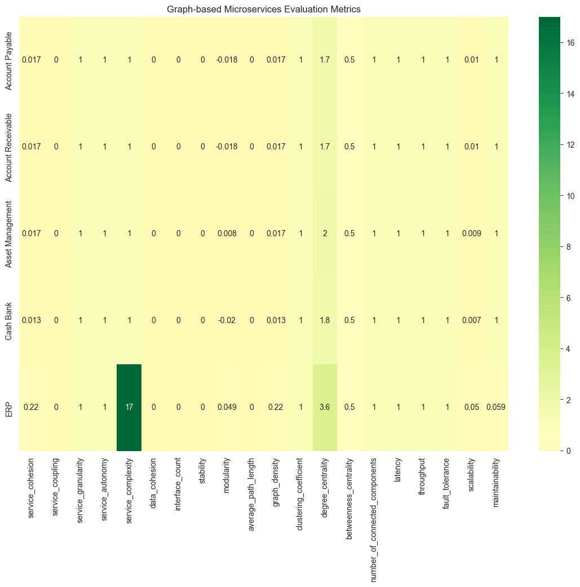
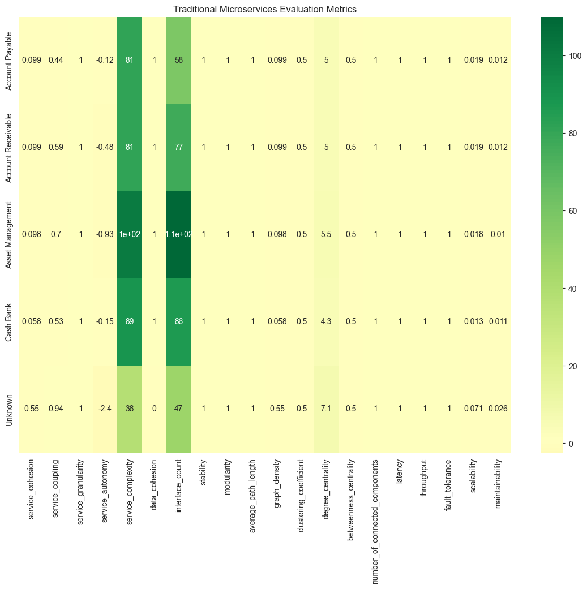
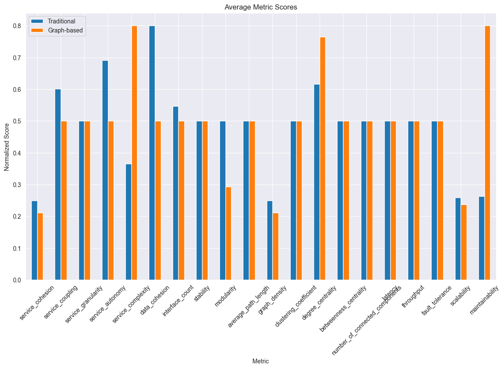

# Leveraging Neo4j for Service Identification and Microservices Partitioning in Business Process Systems

# 1. Import Libraries

Import all necessary libraries for XML parsing, Neo4j interaction, GPU detection, and concurrent processing.


```python
# Import Libraries
import os
import re
import xml.etree.ElementTree as ET
import html
import uuid
import pandas as pd
from neo4j import GraphDatabase
from pyvis.network import Network
import torch
from concurrent.futures import ThreadPoolExecutor
```

# 2. Check CUDA Availability

Detect whether CUDA (GPU) is available on your system. This information will be printed at the beginning of the notebook.


```python
print(f"CUDA available: {torch.cuda.is_available()}")
print(f"CUDA version: {torch.version.cuda}")
device = torch.device("cuda" if torch.cuda.is_available() else "cpu")
print(f"Using device: {device}")
```

    CUDA available: False
    CUDA version: None
    Using device: cpu
    


```python
# Function to check CUDA availability
def check_cuda():
    if torch.cuda.is_available():
        print("CUDA is available. GPU will be used if applicable.")
        print(f"Device Name: {torch.cuda.get_device_name(0)}")
    else:
        print("CUDA is not available. Using CPU.")

# Execute Cuda
check_cuda()
```

    CUDA is not available. Using CPU.
    

# 3. Define Connection to Neo4j


```python
# Neo4j connection details
uri = "bolt://localhost:7687"
username = "neo4j"
password = "170202Kcf"

# Create a driver instance
driver = GraphDatabase.driver(uri, auth=(username, password))
```


```python
def test_connection():
    try:
        with driver.session(database="erpbpmn") as session:
            result = session.run("RETURN 1 AS test")
            for record in result:
                print(f"Connection successful, test query result: {record['test']}")
    except Exception as e:
        print(f"Failed to connect to Neo4j: {e}")

test_connection()
```

    Connection successful, test query result: 1
    

# 4. Define Functions to Create Nodes and Relationships


```python
def get_node_color(node_type, level):
    color_map = {
        'Task': {
            0: '#FFD700',  # Gold
            1: '#FFFACD',  # LemonChiffon
            2: '#FAFAD2',  # LightGoldenrodYellow
            3: '#FFFFE0'   # LightYellow
        },
        'StartEvent': {
            0: '#90EE90',  # LightGreen
            1: '#98FB98',  # PaleGreen
            2: '#8FBC8F',  # DarkSeaGreen
            3: '#3CB371'   # MediumSeaGreen
        },
        'EndEvent': {
            0: '#FF6347',  # Tomato
            1: '#FF4500',  # OrangeRed
            2: '#FF0000',  # Red
            3: '#DC143C'   # Crimson
        }
    }
    default_color = '#D3D3D3'
    return color_map.get(node_type, {}).get(level, default_color)

def create_node(tx, label, properties):
    # Check if node already exists
    check_query = (
        f"MATCH (n:{label} {{id: $properties.id}}) RETURN n"
    )
    existing = tx.run(check_query, properties=properties).single()
    if existing:
        return existing[0]
    
    color = get_node_color(label, properties.get('level', 0))
    query = (
        f"CREATE (n:{label} {{id: $properties.id}}) "
        "SET n += $properties, n.color = $color "
        "RETURN n"
    )
    result = tx.run(query, properties=properties, color=color)
    return result.single()[0]

def create_relationship_with_id(tx, source_id, target_id, rel_type, properties):
    # Check if relationship already exists
    check_query = """
    MATCH (a {id: $source_id})-[r]->(b {id: $target_id})
    WHERE type(r) = $rel_type
    RETURN r
    """
    existing = tx.run(check_query, 
                     source_id=source_id, 
                     target_id=target_id,
                     rel_type=rel_type).single()
    if existing:
        return existing[0]
    
    rel_color_map = {
        'SEQUENCE_FLOW': '#A9A9A9',
        'XOR_SPLIT': '#FF69B4',
        'XOR_JOIN': '#4169E1',
        'OR_SPLIT': '#FFD700',
        'OR_JOIN': '#00CED1'
    }
    color = rel_color_map.get(rel_type, '#696969')
    
    query = (
        f"MATCH (a {{id: $source_id}}), (b {{id: $target_id}}) "
        f"CREATE (a)-[r:{rel_type} {{id: $properties.id}}]->(b) "
        "SET r += $properties, r.color = $color "
        "RETURN r"
    )
    result = tx.run(query, source_id=source_id, target_id=target_id, properties=properties, color=color)
    record = result.single()
    if record:
        return record[0]
    else:
        print(f"Warning: Could not create relationship {rel_type} between {source_id} and {target_id}.")
        return None

def create_invisible_task(tx, source_id, target_id, gateway_type, level, module, activity=None):
    """Create invisible task node for gateway connections"""
    invisible_task_id = f"invisible_task_{str(uuid.uuid4())[:8]}"
    
    task_properties = {
        'id': invisible_task_id,
        'name': f"Invisible Task {gateway_type}",
        'level': level,
        'module': module,
        'activity': activity,
        'invisible': True
    }
    
    # Create invisible task
    task = create_node(tx, 'Task', task_properties)
    
    # Create relationships
    in_rel = create_relationship_with_id(
        tx,
        source_id,
        invisible_task_id,
        'SEQUENCE_FLOW',
        {'id': str(uuid.uuid4())}
    )
    
    out_rel = create_relationship_with_id(
        tx,
        invisible_task_id,
        target_id,
        'SEQUENCE_FLOW',
        {'id': str(uuid.uuid4())}
    )
    
    return task, in_rel, out_rel
```

# 5. Parse BPMN XML Files and Load into Neo4j


```python
# Define functions to parse BPMN XML files
def clean_name(name):
    if not name:
        return ''
    name = re.sub('<[^<]+?>', '', str(name))
    name = html.unescape(name)
    return name.strip()
```


```python
def parse_bpmn_xml(file_path, level, module, activity=None):
    tree = ET.parse(file_path)
    root = tree.getroot()

    elements = {
        'Task': [],
        'StartEvent': [],
        'EndEvent': []
    }
    flows = []
    gateways = {}

    def clean_id(raw_id, prefix):
        return f"{prefix}{raw_id}"

    # Set prefix for IDs
    id_prefix = f"{module}_{'_'.join(filter(None, [activity, str(level)]))}_"

    # Find root element containing process elements
    process_root = root.find('.//root') if root.find('.//root') is not None else root

    # Process all mxCell elements
    for cell in process_root.findall('.//mxCell'):
        cell_id = cell.get('id')
        if not cell_id or cell_id in ['0', '1']:  # Skip container cells
            continue

        style = cell.get('style', '')
        vertex = cell.get('vertex')
        edge = cell.get('edge')
        value = clean_name(cell.get('value', ''))

        if vertex == '1':  # Handle nodes
            clean_cell_id = clean_id(cell_id, id_prefix)
            
            if 'shape=mxgraph.bpmn.task' in style:
                elements['Task'].append({
                    'id': clean_cell_id,
                    'name': value if value else f"Task_{cell_id}",
                    'level': level,
                    'module': module,
                    'activity': activity
                })
            
            elif 'shape=mxgraph.bpmn.gateway2' in style:
                gateway_type = 'XOR'  # Default gateway type
                if 'gwType=parallel' in style:
                    gateway_type = 'AND'
                elif 'gwType=inclusive' in style:
                    gateway_type = 'OR'

                gateways[cell_id] = {
                    'id': clean_cell_id,
                    'type': gateway_type,
                    'level': level,
                    'module': module,
                    'activity': activity,
                    'incoming': [],
                    'outgoing': []
                }

            elif 'shape=mxgraph.bpmn.event' in style:
                event_type = 'StartEvent' if ('fillColor=#60a917' in style or 'symbol=general' in style) else 'EndEvent'
                elements[event_type].append({
                    'id': clean_cell_id,
                    'name': value if value else event_type,
                    'level': level,
                    'module': module,
                    'activity': activity
                })

        elif edge == '1':  # Handle edges/flows
            source = cell.get('source')
            target = cell.get('target')
            if source and target:
                flow = {
                    'id': clean_id(cell_id, id_prefix),
                    'sourceRef': clean_id(source, id_prefix),
                    'targetRef': clean_id(target, id_prefix),
                    'name': value if value else 'Sequence Flow',
                    'level': level,
                    'module': module,
                    'activity': activity
                }
                flows.append(flow)

                # Track gateway connections
                if source in gateways:
                    gateways[source]['outgoing'].append(flow)
                if target in gateways:
                    gateways[target]['incoming'].append(flow)
                    
        data_objects = {}
    associations = []

    # Process all elements
    for elem in root.iter():
        tag = elem.tag.lower()
        if 'dataobject' in tag or 'dataobjectreference' in tag:
            data_object_id = clean_id(elem.get('id'), id_prefix)
            data_objects[data_object_id] = {
                'id': data_object_id,
                'name': clean_name(elem.get('name', 'DataObject')),
                'level': level,
                'module': module,
                'activity': activity
            }
        elif 'association' in tag:
            source_ref = clean_id(elem.get('sourceRef'), id_prefix)
            target_ref = clean_id(elem.get('targetRef'), id_prefix)
            associations.append({
                'sourceRef': source_ref,
                'targetRef': target_ref
            })

    return elements, flows, gateways, data_objects, associations
```


```python
def process_gateways_and_flows(session, elements, flows, gateways):
    """
    Process gateways and create appropriate relationships in Neo4j with proper gateway handling
    """
    processed_flows = set()  # Track processed flows to avoid duplicates
    
    def create_flow(source_id, target_id, flow_type, properties):
        flow_key = f"{source_id}->{target_id}"
        if flow_key not in processed_flows:
            processed_flows.add(flow_key)
            session.execute_write(
                create_relationship_with_id,
                source_id,
                target_id,
                flow_type,
                properties
            )

    def handle_gateway(gateway, incoming_flows, outgoing_flows):
        gateway_type = gateway['type']  # XOR or OR
        gateway_id = gateway['id']
        
        if len(incoming_flows) == 1 and len(outgoing_flows) > 1:
            # Split pattern
            flow_type = f"{gateway_type}_SPLIT"
            source_id = incoming_flows[0]['sourceRef']
            
            # Create invisible task
            invisible_task_id = f"invisible_task_{gateway_id}"
            task_props = {
                'id': invisible_task_id,
                'name': f"Invisible {flow_type}",
                'level': gateway['level'],
                'module': gateway['module'],
                'activity': gateway['activity'],
                'invisible': True
            }
            
            session.execute_write(create_node, 'Task', task_props)
            
            # Connect incoming -> invisible -> outgoing
            create_flow(source_id, invisible_task_id, 'SEQUENCE_FLOW',
                       {'id': str(uuid.uuid4())})
            
            for out_flow in outgoing_flows:
                create_flow(invisible_task_id, out_flow['targetRef'],
                          flow_type, {'id': str(uuid.uuid4())})
                
        elif len(incoming_flows) > 1 and len(outgoing_flows) == 1:
            # Join pattern
            flow_type = f"{gateway_type}_JOIN"
            target_id = outgoing_flows[0]['targetRef']
            
            # Create invisible task
            invisible_task_id = f"invisible_task_{gateway_id}"
            task_props = {
                'id': invisible_task_id,
                'name': f"Invisible {flow_type}",
                'level': gateway['level'],
                'module': gateway['module'],
                'activity': gateway['activity'],
                'invisible': True
            }
            
            session.execute_write(create_node, 'Task', task_props)
            
            # Connect incoming -> invisible -> target
            for in_flow in incoming_flows:
                create_flow(in_flow['sourceRef'], invisible_task_id,
                          flow_type, {'id': str(uuid.uuid4())})
                
            create_flow(invisible_task_id, target_id, 'SEQUENCE_FLOW',
                       {'id': str(uuid.uuid4())})

    # Process regular sequence flows first
    non_gateway_flows = [
        flow for flow in flows
        if not any(gw['id'] in (flow['sourceRef'], flow['targetRef'])
                  for gw in gateways.values())
    ]

    for flow in non_gateway_flows:
        create_flow(flow['sourceRef'], flow['targetRef'], 'SEQUENCE_FLOW', flow)

    # Process gateways
    for gw_id, gateway in gateways.items():
        incoming = [f for f in flows if f['targetRef'] == gateway['id']]
        outgoing = [f for f in flows if f['sourceRef'] == gateway['id']]
        handle_gateway(gateway, incoming, outgoing)

    # Connect any disconnected nodes with invisible tasks
    def connect_disconnected_nodes():
        query = """
        MATCH (n) 
        WHERE NOT EXISTS((n)--())
        RETURN n.id AS id, labels(n)[0] as type,
               n.level as level, n.module as module
        """
        disconnected = session.run(query).data()
        
        for node in disconnected:
            # Find suitable connection
            connect_query = """
            MATCH (other)
            WHERE other.level = $level AND other.module = $module 
            AND NOT other.id = $id
            AND (other:Task OR 
                (other:StartEvent AND $type <> 'StartEvent') OR
                (other:EndEvent AND $type <> 'EndEvent'))
            RETURN other.id as target_id
            LIMIT 1
            """
            
            target = session.run(connect_query, 
                               level=node['level'],
                               module=node['module'],
                               id=node['id'],
                               type=node['type']).single()
            
            if target:
                session.execute_write(
                    create_invisible_task,
                    node['id'],
                    target['target_id'],
                    'SEQUENCE_FLOW',
                    node['level'],
                    node['module']
                )

    connect_disconnected_nodes()
```


```python
def clear_database(session):
    """Clear database and set up constraints"""
    session.run("MATCH (n) DETACH DELETE n")
    
    # Create constraints for node uniqueness
    constraints = [
        "CREATE CONSTRAINT IF NOT EXISTS FOR (n:StartEvent) REQUIRE n.id IS UNIQUE",
        "CREATE CONSTRAINT IF NOT EXISTS FOR (n:EndEvent) REQUIRE n.id IS UNIQUE",
        "CREATE CONSTRAINT IF NOT EXISTS FOR (n:Task) REQUIRE n.id IS UNIQUE"
    ]
    
    for constraint in constraints:
        try:
            session.run(constraint)
        except Exception as e:
            print(f"Warning: Constraint creation failed - {e}")

def verify_process_integrity(session):
    """Verify the integrity of the converted BPMN process"""
    integrity_checks = [
        # Check for disconnected nodes
        """
        MATCH (n)
        WHERE NOT EXISTS((n)--())
        RETURN n.id AS node_id, labels(n) AS type, n.level AS level, n.module AS module
        """,
        
        # Check for duplicate start events
        """
        MATCH (s:StartEvent)
        WITH s.level AS level, s.module AS module, collect(s) AS starts
        WHERE size(starts) > 1
        RETURN level, module, [s in starts | s.id] AS duplicate_starts
        """,
        
        # Check for duplicate end events
        """
        MATCH (e:EndEvent)
        WITH e.level AS level, e.module AS module, collect(e) AS ends
        WHERE size(ends) > 1
        RETURN level, module, [e in ends | e.id] AS duplicate_ends
        """,
        
        # Check for improper gateway connections
        """
        MATCH (n)-[r:XOR_SPLIT]->(m)
        WITH n, count(r) AS split_count
        WHERE split_count < 2
        RETURN n.id AS invalid_split_gateway, split_count
        """,
        
        """
        MATCH (n)-[r:XOR_JOIN]->(m)
        WITH m, count(r) AS join_count
        WHERE join_count < 2
        RETURN m.id AS invalid_join_gateway, join_count
        """
    ]
    
    results = {}
    for check in integrity_checks:
        result = session.run(check)
        records = result.data()
        if records:
            results[check] = records
    
    return results

def process_bpmn_file(session, filename, file_path, level, module, activity):
    print(f"\nProcessing {filename} at Level {level}...")
    
    # Parse and process BPMN file
    elements, flows, gateways, data_objects, associations = parse_bpmn_xml(file_path, level, module, activity)
    print(f"Found {sum(len(v) for v in elements.values())} elements, {len(flows)} flows, and {len(gateways)} gateways")
    
    for data_object in data_objects.values():
        try:
            session.execute_write(create_node, 'DataObject', data_object)
            print(f"Created DataObject: {data_object['id']}")
        except Exception as e:
            print(f"Error creating DataObject: {data_object['id']} - {e}")
    
     # Create USES relationships
    for assoc in associations:
        source_id = assoc['sourceRef']
        target_id = assoc['targetRef']
        try:
            session.execute_write(
                create_relationship_with_id,
                source_id,
                target_id,
                'USES',
                {'id': str(uuid.uuid4())}
            )
            print(f"Created USES relationship from {source_id} to {target_id}")
        except Exception as e:
            print(f"Error creating USES relationship from {source_id} to {target_id} - {e}")
    
    # Create nodes
    for element_type, element_list in elements.items():
        for element in element_list:
            try:
                session.execute_write(create_node, element_type, element)
                print(f"Created {element_type}: {element['id']}")
            except Exception as e:
                print(f"Error creating {element_type}: {element['id']} - {e}")
    
    # Process gateways and create relationships
    try:
        process_gateways_and_flows(session, elements, flows, gateways)
    except Exception as e:
        print(f"Error processing flows and gateways: {e}")
    
    # Clean duplicate relationships
    try:
        session.run("""
        MATCH (a)-[r]->(b)
        WITH a, b, type(r) as type, collect(r) as rels
        WHERE size(rels) > 1
        WITH a, b, type, rels[0] as kept, rels[1..] as duplicates
        UNWIND duplicates as dupe
        DELETE dupe
        """)
    except Exception as e:
        print(f"Error cleaning duplicates: {e}")
    
    # Verify process integrity
    issues = verify_process_integrity(session)
    if issues:
        print("\nProcess integrity issues found:")
        for check, records in issues.items():
            print(f"\nCheck results:")
            for record in records:
                print(record)
```

# 6. Main Execution


```python
def validate_bpmn_structure(session):
    """Validate the complete BPMN structure after import"""
    validation_queries = [
        # Check for disconnected nodes
        """
        MATCH (n)
        WHERE NOT EXISTS((n)--())
        RETURN n.id AS disconnected_node, labels(n) AS node_type
        """,
        
        # Validate gateway patterns
        """
        MATCH p=(n)-[r:XOR_SPLIT|OR_SPLIT]->(m)
        WITH n, count(r) as outgoing
        WHERE outgoing < 2
        RETURN n.id as node_id, 'Invalid split pattern' as issue, outgoing
        """,
        
        """
        MATCH p=(n)-[r:XOR_JOIN|OR_JOIN]->(m)
        WITH m, count(r) as incoming
        WHERE incoming < 2
        RETURN m.id as node_id, 'Invalid join pattern' as issue, incoming
        """,
        
        # Check for single start/end
        """
        MATCH (s:StartEvent)
        WITH s.level as level, s.module as module, count(s) as start_count
        WHERE start_count > 1
        RETURN level, module, start_count, 'Multiple start events' as issue
        """,
        
        """
        MATCH (e:EndEvent)
        WITH e.level as level, e.module as module, count(e) as end_count
        WHERE end_count > 1
        RETURN level, module, end_count, 'Multiple end events' as issue
        """
    ]
    
    validation_results = {}
    for query in validation_queries:
        result = session.run(query)
        records = result.data()
        if records:
            validation_results[query] = records
            
    return validation_results
```


```python
def main():
    with driver.session(database="erpbpmn") as session:
        # Clear database and set up constraints
        clear_database(session)
        
        # Process BPMN files
        bpmn_dir = './assets'
        filenames = sorted([f for f in os.listdir(bpmn_dir) if f.endswith('.xml')])
        
        for filename in filenames:
            file_path = os.path.join(bpmn_dir, filename)
            
            # Parse filename for metadata
            if filename == "BPMN Level 0.xml":
                level = 0
                module = "ERP"
                activity = None
            else:
                match = re.match(r'BPMN\s+(.+?)\s+Level\s+(\d+)(?:\s+-\s+(.+))?\.xml', filename)
                if match:
                    module = match.group(1).strip()
                    level = int(match.group(2))
                    activity = match.group(3).strip() if match.group(3) else None
                else:
                    print(f"Skipping file {filename} - doesn't match naming pattern")
                    continue
            
            try:
                process_bpmn_file(session, filename, file_path, level, module, activity)
            except Exception as e:
                print(f"Error processing {filename}: {e}")
        
        # Validate final structure
        print("\nValidating final BPMN structure...")
        validation_results = validate_bpmn_structure(session)
        if validation_results:
            print("\nValidation issues found:")
            for query, issues in validation_results.items():
                print("\nIssue type:", query)
                for issue in issues:
                    print(issue)
        else:
            print("All validations passed successfully!")

if __name__ == "__main__":
    main()
```


```python
def verify_data_import():
    with driver.session(database="erpbpmn") as session:
        result = session.run("MATCH (n) RETURN labels(n) AS Label, count(n) AS Count ORDER BY Count DESC")
        print("Node counts by label:")
        for record in result:
            print(f"{record['Label']}: {record['Count']}")

        result = session.run("MATCH ()-[r]->() RETURN type(r) AS RelationType, count(r) AS Count ORDER BY Count DESC")
        print("\nRelationship counts by type:")
        for record in result:
            print(f"{record['RelationType']}: {record['Count']}")

        result = session.run("MATCH (n) RETURN n.level AS Level, count(n) AS Count ORDER BY Level")
        print("\nNode counts by level:")
        for record in result:
            print(f"Level {record['Level']}: {record['Count']} nodes")
```

# 7. Execute Main Function


```python
def run():
    main()
    verify_data_import()

if __name__ == "__main__":
    run()
```

    
    Processing BPMN Account Payable Level 1.xml at Level 1...
    Found 3 elements, 2 flows, and 0 gateways
    Created Task: Account Payable_1_5
    Created StartEvent: Account Payable_1_3
    Created EndEvent: Account Payable_1_7
    
    Processing BPMN Account Payable Level 2.xml at Level 2...
    Found 23 elements, 39 flows, and 11 gateways
    Created Task: Account Payable_2_24
    Created Task: Account Payable_2_25
    Created Task: Account Payable_2_26
    Created Task: Account Payable_2_28
    Created Task: Account Payable_2_29
    Created Task: Account Payable_2_30
    Created Task: Account Payable_2_31
    Created Task: Account Payable_2_32
    Created Task: Account Payable_2_33
    Created Task: Account Payable_2_43
    Created Task: Account Payable_2_46
    Created Task: Account Payable_2_48
    Created Task: Account Payable_2_50
    Created Task: Account Payable_2_52
    Created Task: Account Payable_2_57
    Created Task: Account Payable_2_64
    Created Task: Account Payable_2_65
    Created Task: Account Payable_2_68
    Created Task: Account Payable_2_72
    Created Task: Account Payable_2_76
    Created Task: Account Payable_2_78
    Created StartEvent: Account Payable_2_80
    Created EndEvent: Account Payable_2_22
    Warning: Could not create relationship SEQUENCE_FLOW between Account Payable_2_81 and invisible_task_Account Payable_2_12.
    Warning: Could not create relationship XOR_SPLIT between invisible_task_Account Payable_2_12 and Account Payable_2_15.
    Warning: Could not create relationship SEQUENCE_FLOW between Account Payable_2_12 and invisible_task_Account Payable_2_15.
    Warning: Could not create relationship XOR_SPLIT between invisible_task_Account Payable_2_15 and Account Payable_2_16.
    Warning: Could not create relationship SEQUENCE_FLOW between Account Payable_2_15 and invisible_task_Account Payable_2_16.
    Warning: Could not create relationship XOR_SPLIT between invisible_task_Account Payable_2_16 and Account Payable_2_18.
    Warning: Could not create relationship SEQUENCE_FLOW between Account Payable_2_81 and invisible_task_Account Payable_2_42.
    Warning: Could not create relationship XOR_SPLIT between invisible_task_Account Payable_2_42 and Account Payable_2_45.
    Warning: Could not create relationship XOR_SPLIT between invisible_task_Account Payable_2_55 and Account Payable_2_60.
    Warning: Could not create relationship XOR_SPLIT between invisible_task_Account Payable_2_67 and Account Payable_2_73.
    Warning: Could not create relationship XOR_SPLIT between invisible_task_Account Payable_2_81 and Account Payable_2_12.
    Warning: Could not create relationship XOR_SPLIT between invisible_task_Account Payable_2_81 and Account Payable_2_42.
    
    Process integrity issues found:
    
    Check results:
    {'invalid_split_gateway': 'invisible_task_Account Payable_2_12', 'split_count': 1}
    {'invalid_split_gateway': 'invisible_task_Account Payable_2_15', 'split_count': 1}
    {'invalid_split_gateway': 'invisible_task_Account Payable_2_16', 'split_count': 1}
    {'invalid_split_gateway': 'invisible_task_Account Payable_2_42', 'split_count': 1}
    {'invalid_split_gateway': 'invisible_task_Account Payable_2_55', 'split_count': 1}
    {'invalid_split_gateway': 'invisible_task_Account Payable_2_67', 'split_count': 1}
    
    Processing BPMN Account Payable Level 3 - Creating the Purchase DP Invoice.xml at Level 3...
    Found 8 elements, 17 flows, and 3 gateways
    Created Task: Account Payable_Creating the Purchase DP Invoice_3_5
    Created Task: Account Payable_Creating the Purchase DP Invoice_3_6
    Created Task: Account Payable_Creating the Purchase DP Invoice_3_14
    Created Task: Account Payable_Creating the Purchase DP Invoice_3_16
    Created Task: Account Payable_Creating the Purchase DP Invoice_3_29
    Created Task: Account Payable_Creating the Purchase DP Invoice_3_30
    Created StartEvent: Account Payable_Creating the Purchase DP Invoice_3_4
    Created EndEvent: Account Payable_Creating the Purchase DP Invoice_3_35
    Warning: Could not create relationship SEQUENCE_FLOW between Account Payable_Creating the Purchase DP Invoice_3_22 and Account Payable_Creating the Purchase DP Invoice_3_5.
    Warning: Could not create relationship SEQUENCE_FLOW between Account Payable_Creating the Purchase DP Invoice_3_21 and Account Payable_Creating the Purchase DP Invoice_3_22.
    Warning: Could not create relationship SEQUENCE_FLOW between Account Payable_Creating the Purchase DP Invoice_3_26 and Account Payable_Creating the Purchase DP Invoice_3_6.
    Warning: Could not create relationship SEQUENCE_FLOW between Account Payable_Creating the Purchase DP Invoice_3_24 and Account Payable_Creating the Purchase DP Invoice_3_26.
    Warning: Could not create relationship SEQUENCE_FLOW between Account Payable_Creating the Purchase DP Invoice_3_32 and Account Payable_Creating the Purchase DP Invoice_3_34.
    Warning: Could not create relationship SEQUENCE_FLOW between Account Payable_Creating the Purchase DP Invoice_3_30 and Account Payable_Creating the Purchase DP Invoice_3_32.
    Warning: Could not create relationship XOR_SPLIT between invisible_task_Account Payable_Creating the Purchase DP Invoice_3_11 and Account Payable_Creating the Purchase DP Invoice_3_17.
    
    Process integrity issues found:
    
    Check results:
    {'invalid_split_gateway': 'invisible_task_Account Payable_2_12', 'split_count': 1}
    {'invalid_split_gateway': 'invisible_task_Account Payable_2_15', 'split_count': 1}
    {'invalid_split_gateway': 'invisible_task_Account Payable_2_16', 'split_count': 1}
    {'invalid_split_gateway': 'invisible_task_Account Payable_2_42', 'split_count': 1}
    {'invalid_split_gateway': 'invisible_task_Account Payable_2_55', 'split_count': 1}
    {'invalid_split_gateway': 'invisible_task_Account Payable_2_67', 'split_count': 1}
    {'invalid_split_gateway': 'invisible_task_Account Payable_Creating the Purchase DP Invoice_3_11', 'split_count': 1}
    
    Processing BPMN Account Payable Level 3 - Creating the Purchase Invoice.xml at Level 3...
    Found 8 elements, 17 flows, and 3 gateways
    Created Task: Account Payable_Creating the Purchase Invoice_3_5
    Created Task: Account Payable_Creating the Purchase Invoice_3_6
    Created Task: Account Payable_Creating the Purchase Invoice_3_14
    Created Task: Account Payable_Creating the Purchase Invoice_3_16
    Created Task: Account Payable_Creating the Purchase Invoice_3_29
    Created Task: Account Payable_Creating the Purchase Invoice_3_30
    Created StartEvent: Account Payable_Creating the Purchase Invoice_3_4
    Created EndEvent: Account Payable_Creating the Purchase Invoice_3_35
    Warning: Could not create relationship SEQUENCE_FLOW between Account Payable_Creating the Purchase Invoice_3_22 and Account Payable_Creating the Purchase Invoice_3_5.
    Warning: Could not create relationship SEQUENCE_FLOW between Account Payable_Creating the Purchase Invoice_3_21 and Account Payable_Creating the Purchase Invoice_3_22.
    Warning: Could not create relationship SEQUENCE_FLOW between Account Payable_Creating the Purchase Invoice_3_26 and Account Payable_Creating the Purchase Invoice_3_6.
    Warning: Could not create relationship SEQUENCE_FLOW between Account Payable_Creating the Purchase Invoice_3_24 and Account Payable_Creating the Purchase Invoice_3_26.
    Warning: Could not create relationship SEQUENCE_FLOW between Account Payable_Creating the Purchase Invoice_3_32 and Account Payable_Creating the Purchase Invoice_3_34.
    Warning: Could not create relationship SEQUENCE_FLOW between Account Payable_Creating the Purchase Invoice_3_30 and Account Payable_Creating the Purchase Invoice_3_32.
    Warning: Could not create relationship XOR_SPLIT between invisible_task_Account Payable_Creating the Purchase Invoice_3_11 and Account Payable_Creating the Purchase Invoice_3_17.
    
    Process integrity issues found:
    
    Check results:
    {'level': 3, 'module': 'Account Payable', 'duplicate_starts': ['Account Payable_Creating the Purchase DP Invoice_3_4', 'Account Payable_Creating the Purchase Invoice_3_4']}
    
    Check results:
    {'level': 3, 'module': 'Account Payable', 'duplicate_ends': ['Account Payable_Creating the Purchase DP Invoice_3_35', 'Account Payable_Creating the Purchase Invoice_3_35']}
    
    Check results:
    {'invalid_split_gateway': 'invisible_task_Account Payable_2_12', 'split_count': 1}
    {'invalid_split_gateway': 'invisible_task_Account Payable_2_15', 'split_count': 1}
    {'invalid_split_gateway': 'invisible_task_Account Payable_2_16', 'split_count': 1}
    {'invalid_split_gateway': 'invisible_task_Account Payable_2_42', 'split_count': 1}
    {'invalid_split_gateway': 'invisible_task_Account Payable_2_55', 'split_count': 1}
    {'invalid_split_gateway': 'invisible_task_Account Payable_2_67', 'split_count': 1}
    {'invalid_split_gateway': 'invisible_task_Account Payable_Creating the Purchase DP Invoice_3_11', 'split_count': 1}
    {'invalid_split_gateway': 'invisible_task_Account Payable_Creating the Purchase Invoice_3_11', 'split_count': 1}
    
    Processing BPMN Account Payable Level 3 - Finalizing Purchase DP Invoice Document.xml at Level 3...
    Found 5 elements, 8 flows, and 0 gateways
    Created Task: Account Payable_Finalizing Purchase DP Invoice Document_3_5
    Created Task: Account Payable_Finalizing Purchase DP Invoice Document_3_7
    Created Task: Account Payable_Finalizing Purchase DP Invoice Document_3_17
    Created StartEvent: Account Payable_Finalizing Purchase DP Invoice Document_3_4
    Created EndEvent: Account Payable_Finalizing Purchase DP Invoice Document_3_15
    Warning: Could not create relationship SEQUENCE_FLOW between Account Payable_Finalizing Purchase DP Invoice Document_3_10 and Account Payable_Finalizing Purchase DP Invoice Document_3_5.
    Warning: Could not create relationship SEQUENCE_FLOW between Account Payable_Finalizing Purchase DP Invoice Document_3_9 and Account Payable_Finalizing Purchase DP Invoice Document_3_10.
    Warning: Could not create relationship SEQUENCE_FLOW between Account Payable_Finalizing Purchase DP Invoice Document_3_13 and Account Payable_Finalizing Purchase DP Invoice Document_3_14.
    Warning: Could not create relationship SEQUENCE_FLOW between Account Payable_Finalizing Purchase DP Invoice Document_3_17 and Account Payable_Finalizing Purchase DP Invoice Document_3_13.
    
    Process integrity issues found:
    
    Check results:
    {'level': 3, 'module': 'Account Payable', 'duplicate_starts': ['Account Payable_Creating the Purchase DP Invoice_3_4', 'Account Payable_Creating the Purchase Invoice_3_4', 'Account Payable_Finalizing Purchase DP Invoice Document_3_4']}
    
    Check results:
    {'level': 3, 'module': 'Account Payable', 'duplicate_ends': ['Account Payable_Creating the Purchase DP Invoice_3_35', 'Account Payable_Creating the Purchase Invoice_3_35', 'Account Payable_Finalizing Purchase DP Invoice Document_3_15']}
    
    Check results:
    {'invalid_split_gateway': 'invisible_task_Account Payable_2_12', 'split_count': 1}
    {'invalid_split_gateway': 'invisible_task_Account Payable_2_15', 'split_count': 1}
    {'invalid_split_gateway': 'invisible_task_Account Payable_2_16', 'split_count': 1}
    {'invalid_split_gateway': 'invisible_task_Account Payable_2_42', 'split_count': 1}
    {'invalid_split_gateway': 'invisible_task_Account Payable_2_55', 'split_count': 1}
    {'invalid_split_gateway': 'invisible_task_Account Payable_2_67', 'split_count': 1}
    {'invalid_split_gateway': 'invisible_task_Account Payable_Creating the Purchase DP Invoice_3_11', 'split_count': 1}
    {'invalid_split_gateway': 'invisible_task_Account Payable_Creating the Purchase Invoice_3_11', 'split_count': 1}
    
    Processing BPMN Account Payable Level 3 - Finalizing Purchase Invoice Document.xml at Level 3...
    Found 5 elements, 8 flows, and 0 gateways
    Created Task: Account Payable_Finalizing Purchase Invoice Document_3_5
    Created Task: Account Payable_Finalizing Purchase Invoice Document_3_7
    Created Task: Account Payable_Finalizing Purchase Invoice Document_3_17
    Created StartEvent: Account Payable_Finalizing Purchase Invoice Document_3_4
    Created EndEvent: Account Payable_Finalizing Purchase Invoice Document_3_15
    Warning: Could not create relationship SEQUENCE_FLOW between Account Payable_Finalizing Purchase Invoice Document_3_10 and Account Payable_Finalizing Purchase Invoice Document_3_5.
    Warning: Could not create relationship SEQUENCE_FLOW between Account Payable_Finalizing Purchase Invoice Document_3_9 and Account Payable_Finalizing Purchase Invoice Document_3_10.
    Warning: Could not create relationship SEQUENCE_FLOW between Account Payable_Finalizing Purchase Invoice Document_3_13 and Account Payable_Finalizing Purchase Invoice Document_3_14.
    Warning: Could not create relationship SEQUENCE_FLOW between Account Payable_Finalizing Purchase Invoice Document_3_17 and Account Payable_Finalizing Purchase Invoice Document_3_13.
    
    Process integrity issues found:
    
    Check results:
    {'level': 3, 'module': 'Account Payable', 'duplicate_starts': ['Account Payable_Creating the Purchase DP Invoice_3_4', 'Account Payable_Creating the Purchase Invoice_3_4', 'Account Payable_Finalizing Purchase DP Invoice Document_3_4', 'Account Payable_Finalizing Purchase Invoice Document_3_4']}
    
    Check results:
    {'level': 3, 'module': 'Account Payable', 'duplicate_ends': ['Account Payable_Creating the Purchase DP Invoice_3_35', 'Account Payable_Creating the Purchase Invoice_3_35', 'Account Payable_Finalizing Purchase DP Invoice Document_3_15', 'Account Payable_Finalizing Purchase Invoice Document_3_15']}
    
    Check results:
    {'invalid_split_gateway': 'invisible_task_Account Payable_2_12', 'split_count': 1}
    {'invalid_split_gateway': 'invisible_task_Account Payable_2_15', 'split_count': 1}
    {'invalid_split_gateway': 'invisible_task_Account Payable_2_16', 'split_count': 1}
    {'invalid_split_gateway': 'invisible_task_Account Payable_2_42', 'split_count': 1}
    {'invalid_split_gateway': 'invisible_task_Account Payable_2_55', 'split_count': 1}
    {'invalid_split_gateway': 'invisible_task_Account Payable_2_67', 'split_count': 1}
    {'invalid_split_gateway': 'invisible_task_Account Payable_Creating the Purchase DP Invoice_3_11', 'split_count': 1}
    {'invalid_split_gateway': 'invisible_task_Account Payable_Creating the Purchase Invoice_3_11', 'split_count': 1}
    
    Processing BPMN Account Payable Level 3 - Reviewing Purchase DP Invoice.xml at Level 3...
    Found 6 elements, 13 flows, and 3 gateways
    Created Task: Account Payable_Reviewing Purchase DP Invoice_3_5
    Created Task: Account Payable_Reviewing Purchase DP Invoice_3_6
    Created Task: Account Payable_Reviewing Purchase DP Invoice_3_16
    Created Task: Account Payable_Reviewing Purchase DP Invoice_3_23
    Created StartEvent: Account Payable_Reviewing Purchase DP Invoice_3_4
    Created EndEvent: Account Payable_Reviewing Purchase DP Invoice_3_14
    Warning: Could not create relationship SEQUENCE_FLOW between Account Payable_Reviewing Purchase DP Invoice_3_9 and Account Payable_Reviewing Purchase DP Invoice_3_5.
    Warning: Could not create relationship SEQUENCE_FLOW between Account Payable_Reviewing Purchase DP Invoice_3_8 and Account Payable_Reviewing Purchase DP Invoice_3_9.
    Warning: Could not create relationship SEQUENCE_FLOW between Account Payable_Reviewing Purchase DP Invoice_3_12 and Account Payable_Reviewing Purchase DP Invoice_3_13.
    Warning: Could not create relationship SEQUENCE_FLOW between Account Payable_Reviewing Purchase DP Invoice_3_23 and Account Payable_Reviewing Purchase DP Invoice_3_12.
    Warning: Could not create relationship XOR_SPLIT between invisible_task_Account Payable_Reviewing Purchase DP Invoice_3_19 and Account Payable_Reviewing Purchase DP Invoice_3_20.
    
    Process integrity issues found:
    
    Check results:
    {'level': 3, 'module': 'Account Payable', 'duplicate_starts': ['Account Payable_Creating the Purchase DP Invoice_3_4', 'Account Payable_Creating the Purchase Invoice_3_4', 'Account Payable_Finalizing Purchase DP Invoice Document_3_4', 'Account Payable_Finalizing Purchase Invoice Document_3_4', 'Account Payable_Reviewing Purchase DP Invoice_3_4']}
    
    Check results:
    {'level': 3, 'module': 'Account Payable', 'duplicate_ends': ['Account Payable_Creating the Purchase DP Invoice_3_35', 'Account Payable_Creating the Purchase Invoice_3_35', 'Account Payable_Finalizing Purchase DP Invoice Document_3_15', 'Account Payable_Finalizing Purchase Invoice Document_3_15', 'Account Payable_Reviewing Purchase DP Invoice_3_14']}
    
    Check results:
    {'invalid_split_gateway': 'invisible_task_Account Payable_2_12', 'split_count': 1}
    {'invalid_split_gateway': 'invisible_task_Account Payable_2_15', 'split_count': 1}
    {'invalid_split_gateway': 'invisible_task_Account Payable_2_16', 'split_count': 1}
    {'invalid_split_gateway': 'invisible_task_Account Payable_2_42', 'split_count': 1}
    {'invalid_split_gateway': 'invisible_task_Account Payable_2_55', 'split_count': 1}
    {'invalid_split_gateway': 'invisible_task_Account Payable_2_67', 'split_count': 1}
    {'invalid_split_gateway': 'invisible_task_Account Payable_Creating the Purchase DP Invoice_3_11', 'split_count': 1}
    {'invalid_split_gateway': 'invisible_task_Account Payable_Creating the Purchase Invoice_3_11', 'split_count': 1}
    {'invalid_split_gateway': 'invisible_task_Account Payable_Reviewing Purchase DP Invoice_3_19', 'split_count': 1}
    
    Processing BPMN Account Payable Level 3 - Reviewing Purchase Invoice.xml at Level 3...
    Found 6 elements, 13 flows, and 3 gateways
    Created Task: Account Payable_Reviewing Purchase Invoice_3_5
    Created Task: Account Payable_Reviewing Purchase Invoice_3_6
    Created Task: Account Payable_Reviewing Purchase Invoice_3_16
    Created Task: Account Payable_Reviewing Purchase Invoice_3_23
    Created StartEvent: Account Payable_Reviewing Purchase Invoice_3_4
    Created EndEvent: Account Payable_Reviewing Purchase Invoice_3_14
    Warning: Could not create relationship SEQUENCE_FLOW between Account Payable_Reviewing Purchase Invoice_3_9 and Account Payable_Reviewing Purchase Invoice_3_5.
    Warning: Could not create relationship SEQUENCE_FLOW between Account Payable_Reviewing Purchase Invoice_3_8 and Account Payable_Reviewing Purchase Invoice_3_9.
    Warning: Could not create relationship SEQUENCE_FLOW between Account Payable_Reviewing Purchase Invoice_3_12 and Account Payable_Reviewing Purchase Invoice_3_13.
    Warning: Could not create relationship SEQUENCE_FLOW between Account Payable_Reviewing Purchase Invoice_3_23 and Account Payable_Reviewing Purchase Invoice_3_12.
    Warning: Could not create relationship XOR_SPLIT between invisible_task_Account Payable_Reviewing Purchase Invoice_3_19 and Account Payable_Reviewing Purchase Invoice_3_20.
    
    Process integrity issues found:
    
    Check results:
    {'level': 3, 'module': 'Account Payable', 'duplicate_starts': ['Account Payable_Creating the Purchase DP Invoice_3_4', 'Account Payable_Creating the Purchase Invoice_3_4', 'Account Payable_Finalizing Purchase DP Invoice Document_3_4', 'Account Payable_Finalizing Purchase Invoice Document_3_4', 'Account Payable_Reviewing Purchase DP Invoice_3_4', 'Account Payable_Reviewing Purchase Invoice_3_4']}
    
    Check results:
    {'level': 3, 'module': 'Account Payable', 'duplicate_ends': ['Account Payable_Creating the Purchase DP Invoice_3_35', 'Account Payable_Creating the Purchase Invoice_3_35', 'Account Payable_Finalizing Purchase DP Invoice Document_3_15', 'Account Payable_Finalizing Purchase Invoice Document_3_15', 'Account Payable_Reviewing Purchase DP Invoice_3_14', 'Account Payable_Reviewing Purchase Invoice_3_14']}
    
    Check results:
    {'invalid_split_gateway': 'invisible_task_Account Payable_2_12', 'split_count': 1}
    {'invalid_split_gateway': 'invisible_task_Account Payable_2_15', 'split_count': 1}
    {'invalid_split_gateway': 'invisible_task_Account Payable_2_16', 'split_count': 1}
    {'invalid_split_gateway': 'invisible_task_Account Payable_2_42', 'split_count': 1}
    {'invalid_split_gateway': 'invisible_task_Account Payable_2_55', 'split_count': 1}
    {'invalid_split_gateway': 'invisible_task_Account Payable_2_67', 'split_count': 1}
    {'invalid_split_gateway': 'invisible_task_Account Payable_Creating the Purchase DP Invoice_3_11', 'split_count': 1}
    {'invalid_split_gateway': 'invisible_task_Account Payable_Creating the Purchase Invoice_3_11', 'split_count': 1}
    {'invalid_split_gateway': 'invisible_task_Account Payable_Reviewing Purchase DP Invoice_3_19', 'split_count': 1}
    {'invalid_split_gateway': 'invisible_task_Account Payable_Reviewing Purchase Invoice_3_19', 'split_count': 1}
    
    Processing BPMN Account Payable Level 3 - Updating Purchase DP Invoice Data.xml at Level 3...
    Found 4 elements, 7 flows, and 0 gateways
    Created Task: Account Payable_Updating Purchase DP Invoice Data_3_5
    Created Task: Account Payable_Updating Purchase DP Invoice Data_3_7
    Created StartEvent: Account Payable_Updating Purchase DP Invoice Data_3_4
    Created EndEvent: Account Payable_Updating Purchase DP Invoice Data_3_15
    Warning: Could not create relationship SEQUENCE_FLOW between Account Payable_Updating Purchase DP Invoice Data_3_7 and Account Payable_Updating Purchase DP Invoice Data_3_13.
    Warning: Could not create relationship SEQUENCE_FLOW between Account Payable_Updating Purchase DP Invoice Data_3_10 and Account Payable_Updating Purchase DP Invoice Data_3_5.
    Warning: Could not create relationship SEQUENCE_FLOW between Account Payable_Updating Purchase DP Invoice Data_3_9 and Account Payable_Updating Purchase DP Invoice Data_3_10.
    Warning: Could not create relationship SEQUENCE_FLOW between Account Payable_Updating Purchase DP Invoice Data_3_13 and Account Payable_Updating Purchase DP Invoice Data_3_14.
    
    Process integrity issues found:
    
    Check results:
    {'level': 3, 'module': 'Account Payable', 'duplicate_starts': ['Account Payable_Creating the Purchase DP Invoice_3_4', 'Account Payable_Creating the Purchase Invoice_3_4', 'Account Payable_Finalizing Purchase DP Invoice Document_3_4', 'Account Payable_Finalizing Purchase Invoice Document_3_4', 'Account Payable_Reviewing Purchase DP Invoice_3_4', 'Account Payable_Reviewing Purchase Invoice_3_4', 'Account Payable_Updating Purchase DP Invoice Data_3_4']}
    
    Check results:
    {'level': 3, 'module': 'Account Payable', 'duplicate_ends': ['Account Payable_Creating the Purchase DP Invoice_3_35', 'Account Payable_Creating the Purchase Invoice_3_35', 'Account Payable_Finalizing Purchase DP Invoice Document_3_15', 'Account Payable_Finalizing Purchase Invoice Document_3_15', 'Account Payable_Reviewing Purchase DP Invoice_3_14', 'Account Payable_Reviewing Purchase Invoice_3_14', 'Account Payable_Updating Purchase DP Invoice Data_3_15']}
    
    Check results:
    {'invalid_split_gateway': 'invisible_task_Account Payable_2_12', 'split_count': 1}
    {'invalid_split_gateway': 'invisible_task_Account Payable_2_15', 'split_count': 1}
    {'invalid_split_gateway': 'invisible_task_Account Payable_2_16', 'split_count': 1}
    {'invalid_split_gateway': 'invisible_task_Account Payable_2_42', 'split_count': 1}
    {'invalid_split_gateway': 'invisible_task_Account Payable_2_55', 'split_count': 1}
    {'invalid_split_gateway': 'invisible_task_Account Payable_2_67', 'split_count': 1}
    {'invalid_split_gateway': 'invisible_task_Account Payable_Creating the Purchase DP Invoice_3_11', 'split_count': 1}
    {'invalid_split_gateway': 'invisible_task_Account Payable_Creating the Purchase Invoice_3_11', 'split_count': 1}
    {'invalid_split_gateway': 'invisible_task_Account Payable_Reviewing Purchase DP Invoice_3_19', 'split_count': 1}
    {'invalid_split_gateway': 'invisible_task_Account Payable_Reviewing Purchase Invoice_3_19', 'split_count': 1}
    
    Processing BPMN Account Payable Level 3 - Updating Purchase Invoice Data.xml at Level 3...
    Found 4 elements, 7 flows, and 0 gateways
    Created Task: Account Payable_Updating Purchase Invoice Data_3_5
    Created Task: Account Payable_Updating Purchase Invoice Data_3_7
    Created StartEvent: Account Payable_Updating Purchase Invoice Data_3_4
    Created EndEvent: Account Payable_Updating Purchase Invoice Data_3_15
    Warning: Could not create relationship SEQUENCE_FLOW between Account Payable_Updating Purchase Invoice Data_3_7 and Account Payable_Updating Purchase Invoice Data_3_13.
    Warning: Could not create relationship SEQUENCE_FLOW between Account Payable_Updating Purchase Invoice Data_3_10 and Account Payable_Updating Purchase Invoice Data_3_5.
    Warning: Could not create relationship SEQUENCE_FLOW between Account Payable_Updating Purchase Invoice Data_3_9 and Account Payable_Updating Purchase Invoice Data_3_10.
    Warning: Could not create relationship SEQUENCE_FLOW between Account Payable_Updating Purchase Invoice Data_3_13 and Account Payable_Updating Purchase Invoice Data_3_14.
    
    Process integrity issues found:
    
    Check results:
    {'level': 3, 'module': 'Account Payable', 'duplicate_starts': ['Account Payable_Creating the Purchase DP Invoice_3_4', 'Account Payable_Creating the Purchase Invoice_3_4', 'Account Payable_Finalizing Purchase DP Invoice Document_3_4', 'Account Payable_Finalizing Purchase Invoice Document_3_4', 'Account Payable_Reviewing Purchase DP Invoice_3_4', 'Account Payable_Reviewing Purchase Invoice_3_4', 'Account Payable_Updating Purchase DP Invoice Data_3_4', 'Account Payable_Updating Purchase Invoice Data_3_4']}
    
    Check results:
    {'level': 3, 'module': 'Account Payable', 'duplicate_ends': ['Account Payable_Creating the Purchase DP Invoice_3_35', 'Account Payable_Creating the Purchase Invoice_3_35', 'Account Payable_Finalizing Purchase DP Invoice Document_3_15', 'Account Payable_Finalizing Purchase Invoice Document_3_15', 'Account Payable_Reviewing Purchase DP Invoice_3_14', 'Account Payable_Reviewing Purchase Invoice_3_14', 'Account Payable_Updating Purchase DP Invoice Data_3_15', 'Account Payable_Updating Purchase Invoice Data_3_15']}
    
    Check results:
    {'invalid_split_gateway': 'invisible_task_Account Payable_2_12', 'split_count': 1}
    {'invalid_split_gateway': 'invisible_task_Account Payable_2_15', 'split_count': 1}
    {'invalid_split_gateway': 'invisible_task_Account Payable_2_16', 'split_count': 1}
    {'invalid_split_gateway': 'invisible_task_Account Payable_2_42', 'split_count': 1}
    {'invalid_split_gateway': 'invisible_task_Account Payable_2_55', 'split_count': 1}
    {'invalid_split_gateway': 'invisible_task_Account Payable_2_67', 'split_count': 1}
    {'invalid_split_gateway': 'invisible_task_Account Payable_Creating the Purchase DP Invoice_3_11', 'split_count': 1}
    {'invalid_split_gateway': 'invisible_task_Account Payable_Creating the Purchase Invoice_3_11', 'split_count': 1}
    {'invalid_split_gateway': 'invisible_task_Account Payable_Reviewing Purchase DP Invoice_3_19', 'split_count': 1}
    {'invalid_split_gateway': 'invisible_task_Account Payable_Reviewing Purchase Invoice_3_19', 'split_count': 1}
    
    Processing BPMN Account Receivable Level 1.xml at Level 1...
    Found 3 elements, 2 flows, and 0 gateways
    Created Task: Account Receivable_1_5
    Created StartEvent: Account Receivable_1_3
    Created EndEvent: Account Receivable_1_7
    
    Process integrity issues found:
    
    Check results:
    {'level': 3, 'module': 'Account Payable', 'duplicate_starts': ['Account Payable_Creating the Purchase DP Invoice_3_4', 'Account Payable_Creating the Purchase Invoice_3_4', 'Account Payable_Finalizing Purchase DP Invoice Document_3_4', 'Account Payable_Finalizing Purchase Invoice Document_3_4', 'Account Payable_Reviewing Purchase DP Invoice_3_4', 'Account Payable_Reviewing Purchase Invoice_3_4', 'Account Payable_Updating Purchase DP Invoice Data_3_4', 'Account Payable_Updating Purchase Invoice Data_3_4']}
    
    Check results:
    {'level': 3, 'module': 'Account Payable', 'duplicate_ends': ['Account Payable_Creating the Purchase DP Invoice_3_35', 'Account Payable_Creating the Purchase Invoice_3_35', 'Account Payable_Finalizing Purchase DP Invoice Document_3_15', 'Account Payable_Finalizing Purchase Invoice Document_3_15', 'Account Payable_Reviewing Purchase DP Invoice_3_14', 'Account Payable_Reviewing Purchase Invoice_3_14', 'Account Payable_Updating Purchase DP Invoice Data_3_15', 'Account Payable_Updating Purchase Invoice Data_3_15']}
    
    Check results:
    {'invalid_split_gateway': 'invisible_task_Account Payable_2_12', 'split_count': 1}
    {'invalid_split_gateway': 'invisible_task_Account Payable_2_15', 'split_count': 1}
    {'invalid_split_gateway': 'invisible_task_Account Payable_2_16', 'split_count': 1}
    {'invalid_split_gateway': 'invisible_task_Account Payable_2_42', 'split_count': 1}
    {'invalid_split_gateway': 'invisible_task_Account Payable_2_55', 'split_count': 1}
    {'invalid_split_gateway': 'invisible_task_Account Payable_2_67', 'split_count': 1}
    {'invalid_split_gateway': 'invisible_task_Account Payable_Creating the Purchase DP Invoice_3_11', 'split_count': 1}
    {'invalid_split_gateway': 'invisible_task_Account Payable_Creating the Purchase Invoice_3_11', 'split_count': 1}
    {'invalid_split_gateway': 'invisible_task_Account Payable_Reviewing Purchase DP Invoice_3_19', 'split_count': 1}
    {'invalid_split_gateway': 'invisible_task_Account Payable_Reviewing Purchase Invoice_3_19', 'split_count': 1}
    
    Processing BPMN Account Receivable Level 2.xml at Level 2...
    Found 23 elements, 39 flows, and 11 gateways
    Created Task: Account Receivable_2_24
    Created Task: Account Receivable_2_25
    Created Task: Account Receivable_2_26
    Created Task: Account Receivable_2_28
    Created Task: Account Receivable_2_29
    Created Task: Account Receivable_2_30
    Created Task: Account Receivable_2_31
    Created Task: Account Receivable_2_32
    Created Task: Account Receivable_2_33
    Created Task: Account Receivable_2_43
    Created Task: Account Receivable_2_46
    Created Task: Account Receivable_2_48
    Created Task: Account Receivable_2_50
    Created Task: Account Receivable_2_52
    Created Task: Account Receivable_2_57
    Created Task: Account Receivable_2_64
    Created Task: Account Receivable_2_65
    Created Task: Account Receivable_2_68
    Created Task: Account Receivable_2_72
    Created Task: Account Receivable_2_76
    Created Task: Account Receivable_2_78
    Created StartEvent: Account Receivable_2_80
    Created EndEvent: Account Receivable_2_22
    Warning: Could not create relationship SEQUENCE_FLOW between Account Receivable_2_81 and invisible_task_Account Receivable_2_12.
    Warning: Could not create relationship XOR_SPLIT between invisible_task_Account Receivable_2_12 and Account Receivable_2_15.
    Warning: Could not create relationship SEQUENCE_FLOW between Account Receivable_2_12 and invisible_task_Account Receivable_2_15.
    Warning: Could not create relationship XOR_SPLIT between invisible_task_Account Receivable_2_15 and Account Receivable_2_16.
    Warning: Could not create relationship SEQUENCE_FLOW between Account Receivable_2_15 and invisible_task_Account Receivable_2_16.
    Warning: Could not create relationship XOR_SPLIT between invisible_task_Account Receivable_2_16 and Account Receivable_2_18.
    Warning: Could not create relationship SEQUENCE_FLOW between Account Receivable_2_81 and invisible_task_Account Receivable_2_42.
    Warning: Could not create relationship XOR_SPLIT between invisible_task_Account Receivable_2_42 and Account Receivable_2_45.
    Warning: Could not create relationship XOR_SPLIT between invisible_task_Account Receivable_2_55 and Account Receivable_2_60.
    Warning: Could not create relationship XOR_SPLIT between invisible_task_Account Receivable_2_67 and Account Receivable_2_73.
    Warning: Could not create relationship XOR_SPLIT between invisible_task_Account Receivable_2_81 and Account Receivable_2_12.
    Warning: Could not create relationship XOR_SPLIT between invisible_task_Account Receivable_2_81 and Account Receivable_2_42.
    
    Process integrity issues found:
    
    Check results:
    {'level': 3, 'module': 'Account Payable', 'duplicate_starts': ['Account Payable_Creating the Purchase DP Invoice_3_4', 'Account Payable_Creating the Purchase Invoice_3_4', 'Account Payable_Finalizing Purchase DP Invoice Document_3_4', 'Account Payable_Finalizing Purchase Invoice Document_3_4', 'Account Payable_Reviewing Purchase DP Invoice_3_4', 'Account Payable_Reviewing Purchase Invoice_3_4', 'Account Payable_Updating Purchase DP Invoice Data_3_4', 'Account Payable_Updating Purchase Invoice Data_3_4']}
    
    Check results:
    {'level': 3, 'module': 'Account Payable', 'duplicate_ends': ['Account Payable_Creating the Purchase DP Invoice_3_35', 'Account Payable_Creating the Purchase Invoice_3_35', 'Account Payable_Finalizing Purchase DP Invoice Document_3_15', 'Account Payable_Finalizing Purchase Invoice Document_3_15', 'Account Payable_Reviewing Purchase DP Invoice_3_14', 'Account Payable_Reviewing Purchase Invoice_3_14', 'Account Payable_Updating Purchase DP Invoice Data_3_15', 'Account Payable_Updating Purchase Invoice Data_3_15']}
    
    Check results:
    {'invalid_split_gateway': 'invisible_task_Account Payable_2_12', 'split_count': 1}
    {'invalid_split_gateway': 'invisible_task_Account Payable_2_15', 'split_count': 1}
    {'invalid_split_gateway': 'invisible_task_Account Payable_2_16', 'split_count': 1}
    {'invalid_split_gateway': 'invisible_task_Account Payable_2_42', 'split_count': 1}
    {'invalid_split_gateway': 'invisible_task_Account Payable_2_55', 'split_count': 1}
    {'invalid_split_gateway': 'invisible_task_Account Payable_2_67', 'split_count': 1}
    {'invalid_split_gateway': 'invisible_task_Account Payable_Creating the Purchase DP Invoice_3_11', 'split_count': 1}
    {'invalid_split_gateway': 'invisible_task_Account Payable_Creating the Purchase Invoice_3_11', 'split_count': 1}
    {'invalid_split_gateway': 'invisible_task_Account Payable_Reviewing Purchase DP Invoice_3_19', 'split_count': 1}
    {'invalid_split_gateway': 'invisible_task_Account Payable_Reviewing Purchase Invoice_3_19', 'split_count': 1}
    {'invalid_split_gateway': 'invisible_task_Account Receivable_2_12', 'split_count': 1}
    {'invalid_split_gateway': 'invisible_task_Account Receivable_2_15', 'split_count': 1}
    {'invalid_split_gateway': 'invisible_task_Account Receivable_2_16', 'split_count': 1}
    {'invalid_split_gateway': 'invisible_task_Account Receivable_2_42', 'split_count': 1}
    {'invalid_split_gateway': 'invisible_task_Account Receivable_2_55', 'split_count': 1}
    {'invalid_split_gateway': 'invisible_task_Account Receivable_2_67', 'split_count': 1}
    
    Processing BPMN Account Receivable Level 3 - Creating the Sales DP Invoice.xml at Level 3...
    Found 8 elements, 17 flows, and 3 gateways
    Created Task: Account Receivable_Creating the Sales DP Invoice_3_5
    Created Task: Account Receivable_Creating the Sales DP Invoice_3_6
    Created Task: Account Receivable_Creating the Sales DP Invoice_3_14
    Created Task: Account Receivable_Creating the Sales DP Invoice_3_16
    Created Task: Account Receivable_Creating the Sales DP Invoice_3_29
    Created Task: Account Receivable_Creating the Sales DP Invoice_3_30
    Created StartEvent: Account Receivable_Creating the Sales DP Invoice_3_4
    Created EndEvent: Account Receivable_Creating the Sales DP Invoice_3_35
    Warning: Could not create relationship SEQUENCE_FLOW between Account Receivable_Creating the Sales DP Invoice_3_22 and Account Receivable_Creating the Sales DP Invoice_3_5.
    Warning: Could not create relationship SEQUENCE_FLOW between Account Receivable_Creating the Sales DP Invoice_3_21 and Account Receivable_Creating the Sales DP Invoice_3_22.
    Warning: Could not create relationship SEQUENCE_FLOW between Account Receivable_Creating the Sales DP Invoice_3_26 and Account Receivable_Creating the Sales DP Invoice_3_6.
    Warning: Could not create relationship SEQUENCE_FLOW between Account Receivable_Creating the Sales DP Invoice_3_24 and Account Receivable_Creating the Sales DP Invoice_3_26.
    Warning: Could not create relationship SEQUENCE_FLOW between Account Receivable_Creating the Sales DP Invoice_3_32 and Account Receivable_Creating the Sales DP Invoice_3_34.
    Warning: Could not create relationship SEQUENCE_FLOW between Account Receivable_Creating the Sales DP Invoice_3_30 and Account Receivable_Creating the Sales DP Invoice_3_32.
    Warning: Could not create relationship XOR_SPLIT between invisible_task_Account Receivable_Creating the Sales DP Invoice_3_11 and Account Receivable_Creating the Sales DP Invoice_3_17.
    
    Process integrity issues found:
    
    Check results:
    {'level': 3, 'module': 'Account Payable', 'duplicate_starts': ['Account Payable_Creating the Purchase DP Invoice_3_4', 'Account Payable_Creating the Purchase Invoice_3_4', 'Account Payable_Finalizing Purchase DP Invoice Document_3_4', 'Account Payable_Finalizing Purchase Invoice Document_3_4', 'Account Payable_Reviewing Purchase DP Invoice_3_4', 'Account Payable_Reviewing Purchase Invoice_3_4', 'Account Payable_Updating Purchase DP Invoice Data_3_4', 'Account Payable_Updating Purchase Invoice Data_3_4']}
    
    Check results:
    {'level': 3, 'module': 'Account Payable', 'duplicate_ends': ['Account Payable_Creating the Purchase DP Invoice_3_35', 'Account Payable_Creating the Purchase Invoice_3_35', 'Account Payable_Finalizing Purchase DP Invoice Document_3_15', 'Account Payable_Finalizing Purchase Invoice Document_3_15', 'Account Payable_Reviewing Purchase DP Invoice_3_14', 'Account Payable_Reviewing Purchase Invoice_3_14', 'Account Payable_Updating Purchase DP Invoice Data_3_15', 'Account Payable_Updating Purchase Invoice Data_3_15']}
    
    Check results:
    {'invalid_split_gateway': 'invisible_task_Account Payable_2_12', 'split_count': 1}
    {'invalid_split_gateway': 'invisible_task_Account Payable_2_15', 'split_count': 1}
    {'invalid_split_gateway': 'invisible_task_Account Payable_2_16', 'split_count': 1}
    {'invalid_split_gateway': 'invisible_task_Account Payable_2_42', 'split_count': 1}
    {'invalid_split_gateway': 'invisible_task_Account Payable_2_55', 'split_count': 1}
    {'invalid_split_gateway': 'invisible_task_Account Payable_2_67', 'split_count': 1}
    {'invalid_split_gateway': 'invisible_task_Account Payable_Creating the Purchase DP Invoice_3_11', 'split_count': 1}
    {'invalid_split_gateway': 'invisible_task_Account Payable_Creating the Purchase Invoice_3_11', 'split_count': 1}
    {'invalid_split_gateway': 'invisible_task_Account Payable_Reviewing Purchase DP Invoice_3_19', 'split_count': 1}
    {'invalid_split_gateway': 'invisible_task_Account Payable_Reviewing Purchase Invoice_3_19', 'split_count': 1}
    {'invalid_split_gateway': 'invisible_task_Account Receivable_2_12', 'split_count': 1}
    {'invalid_split_gateway': 'invisible_task_Account Receivable_2_15', 'split_count': 1}
    {'invalid_split_gateway': 'invisible_task_Account Receivable_2_16', 'split_count': 1}
    {'invalid_split_gateway': 'invisible_task_Account Receivable_2_42', 'split_count': 1}
    {'invalid_split_gateway': 'invisible_task_Account Receivable_2_55', 'split_count': 1}
    {'invalid_split_gateway': 'invisible_task_Account Receivable_2_67', 'split_count': 1}
    {'invalid_split_gateway': 'invisible_task_Account Receivable_Creating the Sales DP Invoice_3_11', 'split_count': 1}
    
    Processing BPMN Account Receivable Level 3 - Creating the Sales Invoice.xml at Level 3...
    Found 8 elements, 17 flows, and 3 gateways
    Created Task: Account Receivable_Creating the Sales Invoice_3_5
    Created Task: Account Receivable_Creating the Sales Invoice_3_6
    Created Task: Account Receivable_Creating the Sales Invoice_3_14
    Created Task: Account Receivable_Creating the Sales Invoice_3_16
    Created Task: Account Receivable_Creating the Sales Invoice_3_29
    Created Task: Account Receivable_Creating the Sales Invoice_3_30
    Created StartEvent: Account Receivable_Creating the Sales Invoice_3_4
    Created EndEvent: Account Receivable_Creating the Sales Invoice_3_35
    Warning: Could not create relationship SEQUENCE_FLOW between Account Receivable_Creating the Sales Invoice_3_22 and Account Receivable_Creating the Sales Invoice_3_5.
    Warning: Could not create relationship SEQUENCE_FLOW between Account Receivable_Creating the Sales Invoice_3_21 and Account Receivable_Creating the Sales Invoice_3_22.
    Warning: Could not create relationship SEQUENCE_FLOW between Account Receivable_Creating the Sales Invoice_3_26 and Account Receivable_Creating the Sales Invoice_3_6.
    Warning: Could not create relationship SEQUENCE_FLOW between Account Receivable_Creating the Sales Invoice_3_24 and Account Receivable_Creating the Sales Invoice_3_26.
    Warning: Could not create relationship SEQUENCE_FLOW between Account Receivable_Creating the Sales Invoice_3_32 and Account Receivable_Creating the Sales Invoice_3_34.
    Warning: Could not create relationship SEQUENCE_FLOW between Account Receivable_Creating the Sales Invoice_3_30 and Account Receivable_Creating the Sales Invoice_3_32.
    Warning: Could not create relationship XOR_SPLIT between invisible_task_Account Receivable_Creating the Sales Invoice_3_11 and Account Receivable_Creating the Sales Invoice_3_17.
    
    Process integrity issues found:
    
    Check results:
    {'level': 3, 'module': 'Account Payable', 'duplicate_starts': ['Account Payable_Creating the Purchase DP Invoice_3_4', 'Account Payable_Creating the Purchase Invoice_3_4', 'Account Payable_Finalizing Purchase DP Invoice Document_3_4', 'Account Payable_Finalizing Purchase Invoice Document_3_4', 'Account Payable_Reviewing Purchase DP Invoice_3_4', 'Account Payable_Reviewing Purchase Invoice_3_4', 'Account Payable_Updating Purchase DP Invoice Data_3_4', 'Account Payable_Updating Purchase Invoice Data_3_4']}
    {'level': 3, 'module': 'Account Receivable', 'duplicate_starts': ['Account Receivable_Creating the Sales DP Invoice_3_4', 'Account Receivable_Creating the Sales Invoice_3_4']}
    
    Check results:
    {'level': 3, 'module': 'Account Payable', 'duplicate_ends': ['Account Payable_Creating the Purchase DP Invoice_3_35', 'Account Payable_Creating the Purchase Invoice_3_35', 'Account Payable_Finalizing Purchase DP Invoice Document_3_15', 'Account Payable_Finalizing Purchase Invoice Document_3_15', 'Account Payable_Reviewing Purchase DP Invoice_3_14', 'Account Payable_Reviewing Purchase Invoice_3_14', 'Account Payable_Updating Purchase DP Invoice Data_3_15', 'Account Payable_Updating Purchase Invoice Data_3_15']}
    {'level': 3, 'module': 'Account Receivable', 'duplicate_ends': ['Account Receivable_Creating the Sales DP Invoice_3_35', 'Account Receivable_Creating the Sales Invoice_3_35']}
    
    Check results:
    {'invalid_split_gateway': 'invisible_task_Account Payable_2_12', 'split_count': 1}
    {'invalid_split_gateway': 'invisible_task_Account Payable_2_15', 'split_count': 1}
    {'invalid_split_gateway': 'invisible_task_Account Payable_2_16', 'split_count': 1}
    {'invalid_split_gateway': 'invisible_task_Account Payable_2_42', 'split_count': 1}
    {'invalid_split_gateway': 'invisible_task_Account Payable_2_55', 'split_count': 1}
    {'invalid_split_gateway': 'invisible_task_Account Payable_2_67', 'split_count': 1}
    {'invalid_split_gateway': 'invisible_task_Account Payable_Creating the Purchase DP Invoice_3_11', 'split_count': 1}
    {'invalid_split_gateway': 'invisible_task_Account Payable_Creating the Purchase Invoice_3_11', 'split_count': 1}
    {'invalid_split_gateway': 'invisible_task_Account Payable_Reviewing Purchase DP Invoice_3_19', 'split_count': 1}
    {'invalid_split_gateway': 'invisible_task_Account Payable_Reviewing Purchase Invoice_3_19', 'split_count': 1}
    {'invalid_split_gateway': 'invisible_task_Account Receivable_2_12', 'split_count': 1}
    {'invalid_split_gateway': 'invisible_task_Account Receivable_2_15', 'split_count': 1}
    {'invalid_split_gateway': 'invisible_task_Account Receivable_2_16', 'split_count': 1}
    {'invalid_split_gateway': 'invisible_task_Account Receivable_2_42', 'split_count': 1}
    {'invalid_split_gateway': 'invisible_task_Account Receivable_2_55', 'split_count': 1}
    {'invalid_split_gateway': 'invisible_task_Account Receivable_2_67', 'split_count': 1}
    {'invalid_split_gateway': 'invisible_task_Account Receivable_Creating the Sales DP Invoice_3_11', 'split_count': 1}
    {'invalid_split_gateway': 'invisible_task_Account Receivable_Creating the Sales Invoice_3_11', 'split_count': 1}
    
    Processing BPMN Account Receivable Level 3 - Finalizing Sales DP Invoice Document.xml at Level 3...
    Found 5 elements, 8 flows, and 0 gateways
    Created Task: Account Receivable_Finalizing Sales DP Invoice Document_3_5
    Created Task: Account Receivable_Finalizing Sales DP Invoice Document_3_7
    Created Task: Account Receivable_Finalizing Sales DP Invoice Document_3_17
    Created StartEvent: Account Receivable_Finalizing Sales DP Invoice Document_3_4
    Created EndEvent: Account Receivable_Finalizing Sales DP Invoice Document_3_15
    Warning: Could not create relationship SEQUENCE_FLOW between Account Receivable_Finalizing Sales DP Invoice Document_3_10 and Account Receivable_Finalizing Sales DP Invoice Document_3_5.
    Warning: Could not create relationship SEQUENCE_FLOW between Account Receivable_Finalizing Sales DP Invoice Document_3_9 and Account Receivable_Finalizing Sales DP Invoice Document_3_10.
    Warning: Could not create relationship SEQUENCE_FLOW between Account Receivable_Finalizing Sales DP Invoice Document_3_13 and Account Receivable_Finalizing Sales DP Invoice Document_3_14.
    Warning: Could not create relationship SEQUENCE_FLOW between Account Receivable_Finalizing Sales DP Invoice Document_3_17 and Account Receivable_Finalizing Sales DP Invoice Document_3_13.
    
    Process integrity issues found:
    
    Check results:
    {'level': 3, 'module': 'Account Payable', 'duplicate_starts': ['Account Payable_Creating the Purchase DP Invoice_3_4', 'Account Payable_Creating the Purchase Invoice_3_4', 'Account Payable_Finalizing Purchase DP Invoice Document_3_4', 'Account Payable_Finalizing Purchase Invoice Document_3_4', 'Account Payable_Reviewing Purchase DP Invoice_3_4', 'Account Payable_Reviewing Purchase Invoice_3_4', 'Account Payable_Updating Purchase DP Invoice Data_3_4', 'Account Payable_Updating Purchase Invoice Data_3_4']}
    {'level': 3, 'module': 'Account Receivable', 'duplicate_starts': ['Account Receivable_Creating the Sales DP Invoice_3_4', 'Account Receivable_Creating the Sales Invoice_3_4', 'Account Receivable_Finalizing Sales DP Invoice Document_3_4']}
    
    Check results:
    {'level': 3, 'module': 'Account Payable', 'duplicate_ends': ['Account Payable_Creating the Purchase DP Invoice_3_35', 'Account Payable_Creating the Purchase Invoice_3_35', 'Account Payable_Finalizing Purchase DP Invoice Document_3_15', 'Account Payable_Finalizing Purchase Invoice Document_3_15', 'Account Payable_Reviewing Purchase DP Invoice_3_14', 'Account Payable_Reviewing Purchase Invoice_3_14', 'Account Payable_Updating Purchase DP Invoice Data_3_15', 'Account Payable_Updating Purchase Invoice Data_3_15']}
    {'level': 3, 'module': 'Account Receivable', 'duplicate_ends': ['Account Receivable_Creating the Sales DP Invoice_3_35', 'Account Receivable_Creating the Sales Invoice_3_35', 'Account Receivable_Finalizing Sales DP Invoice Document_3_15']}
    
    Check results:
    {'invalid_split_gateway': 'invisible_task_Account Payable_2_12', 'split_count': 1}
    {'invalid_split_gateway': 'invisible_task_Account Payable_2_15', 'split_count': 1}
    {'invalid_split_gateway': 'invisible_task_Account Payable_2_16', 'split_count': 1}
    {'invalid_split_gateway': 'invisible_task_Account Payable_2_42', 'split_count': 1}
    {'invalid_split_gateway': 'invisible_task_Account Payable_2_55', 'split_count': 1}
    {'invalid_split_gateway': 'invisible_task_Account Payable_2_67', 'split_count': 1}
    {'invalid_split_gateway': 'invisible_task_Account Payable_Creating the Purchase DP Invoice_3_11', 'split_count': 1}
    {'invalid_split_gateway': 'invisible_task_Account Payable_Creating the Purchase Invoice_3_11', 'split_count': 1}
    {'invalid_split_gateway': 'invisible_task_Account Payable_Reviewing Purchase DP Invoice_3_19', 'split_count': 1}
    {'invalid_split_gateway': 'invisible_task_Account Payable_Reviewing Purchase Invoice_3_19', 'split_count': 1}
    {'invalid_split_gateway': 'invisible_task_Account Receivable_2_12', 'split_count': 1}
    {'invalid_split_gateway': 'invisible_task_Account Receivable_2_15', 'split_count': 1}
    {'invalid_split_gateway': 'invisible_task_Account Receivable_2_16', 'split_count': 1}
    {'invalid_split_gateway': 'invisible_task_Account Receivable_2_42', 'split_count': 1}
    {'invalid_split_gateway': 'invisible_task_Account Receivable_2_55', 'split_count': 1}
    {'invalid_split_gateway': 'invisible_task_Account Receivable_2_67', 'split_count': 1}
    {'invalid_split_gateway': 'invisible_task_Account Receivable_Creating the Sales DP Invoice_3_11', 'split_count': 1}
    {'invalid_split_gateway': 'invisible_task_Account Receivable_Creating the Sales Invoice_3_11', 'split_count': 1}
    
    Processing BPMN Account Receivable Level 3 - Finalizing Sales Invoice Document.xml at Level 3...
    Found 5 elements, 8 flows, and 0 gateways
    Created Task: Account Receivable_Finalizing Sales Invoice Document_3_5
    Created Task: Account Receivable_Finalizing Sales Invoice Document_3_7
    Created Task: Account Receivable_Finalizing Sales Invoice Document_3_17
    Created StartEvent: Account Receivable_Finalizing Sales Invoice Document_3_4
    Created EndEvent: Account Receivable_Finalizing Sales Invoice Document_3_15
    Warning: Could not create relationship SEQUENCE_FLOW between Account Receivable_Finalizing Sales Invoice Document_3_10 and Account Receivable_Finalizing Sales Invoice Document_3_5.
    Warning: Could not create relationship SEQUENCE_FLOW between Account Receivable_Finalizing Sales Invoice Document_3_9 and Account Receivable_Finalizing Sales Invoice Document_3_10.
    Warning: Could not create relationship SEQUENCE_FLOW between Account Receivable_Finalizing Sales Invoice Document_3_13 and Account Receivable_Finalizing Sales Invoice Document_3_14.
    Warning: Could not create relationship SEQUENCE_FLOW between Account Receivable_Finalizing Sales Invoice Document_3_17 and Account Receivable_Finalizing Sales Invoice Document_3_13.
    
    Process integrity issues found:
    
    Check results:
    {'level': 3, 'module': 'Account Payable', 'duplicate_starts': ['Account Payable_Creating the Purchase DP Invoice_3_4', 'Account Payable_Creating the Purchase Invoice_3_4', 'Account Payable_Finalizing Purchase DP Invoice Document_3_4', 'Account Payable_Finalizing Purchase Invoice Document_3_4', 'Account Payable_Reviewing Purchase DP Invoice_3_4', 'Account Payable_Reviewing Purchase Invoice_3_4', 'Account Payable_Updating Purchase DP Invoice Data_3_4', 'Account Payable_Updating Purchase Invoice Data_3_4']}
    {'level': 3, 'module': 'Account Receivable', 'duplicate_starts': ['Account Receivable_Creating the Sales DP Invoice_3_4', 'Account Receivable_Creating the Sales Invoice_3_4', 'Account Receivable_Finalizing Sales DP Invoice Document_3_4', 'Account Receivable_Finalizing Sales Invoice Document_3_4']}
    
    Check results:
    {'level': 3, 'module': 'Account Payable', 'duplicate_ends': ['Account Payable_Creating the Purchase DP Invoice_3_35', 'Account Payable_Creating the Purchase Invoice_3_35', 'Account Payable_Finalizing Purchase DP Invoice Document_3_15', 'Account Payable_Finalizing Purchase Invoice Document_3_15', 'Account Payable_Reviewing Purchase DP Invoice_3_14', 'Account Payable_Reviewing Purchase Invoice_3_14', 'Account Payable_Updating Purchase DP Invoice Data_3_15', 'Account Payable_Updating Purchase Invoice Data_3_15']}
    {'level': 3, 'module': 'Account Receivable', 'duplicate_ends': ['Account Receivable_Creating the Sales DP Invoice_3_35', 'Account Receivable_Creating the Sales Invoice_3_35', 'Account Receivable_Finalizing Sales DP Invoice Document_3_15', 'Account Receivable_Finalizing Sales Invoice Document_3_15']}
    
    Check results:
    {'invalid_split_gateway': 'invisible_task_Account Payable_2_12', 'split_count': 1}
    {'invalid_split_gateway': 'invisible_task_Account Payable_2_15', 'split_count': 1}
    {'invalid_split_gateway': 'invisible_task_Account Payable_2_16', 'split_count': 1}
    {'invalid_split_gateway': 'invisible_task_Account Payable_2_42', 'split_count': 1}
    {'invalid_split_gateway': 'invisible_task_Account Payable_2_55', 'split_count': 1}
    {'invalid_split_gateway': 'invisible_task_Account Payable_2_67', 'split_count': 1}
    {'invalid_split_gateway': 'invisible_task_Account Payable_Creating the Purchase DP Invoice_3_11', 'split_count': 1}
    {'invalid_split_gateway': 'invisible_task_Account Payable_Creating the Purchase Invoice_3_11', 'split_count': 1}
    {'invalid_split_gateway': 'invisible_task_Account Payable_Reviewing Purchase DP Invoice_3_19', 'split_count': 1}
    {'invalid_split_gateway': 'invisible_task_Account Payable_Reviewing Purchase Invoice_3_19', 'split_count': 1}
    {'invalid_split_gateway': 'invisible_task_Account Receivable_2_12', 'split_count': 1}
    {'invalid_split_gateway': 'invisible_task_Account Receivable_2_15', 'split_count': 1}
    {'invalid_split_gateway': 'invisible_task_Account Receivable_2_16', 'split_count': 1}
    {'invalid_split_gateway': 'invisible_task_Account Receivable_2_42', 'split_count': 1}
    {'invalid_split_gateway': 'invisible_task_Account Receivable_2_55', 'split_count': 1}
    {'invalid_split_gateway': 'invisible_task_Account Receivable_2_67', 'split_count': 1}
    {'invalid_split_gateway': 'invisible_task_Account Receivable_Creating the Sales DP Invoice_3_11', 'split_count': 1}
    {'invalid_split_gateway': 'invisible_task_Account Receivable_Creating the Sales Invoice_3_11', 'split_count': 1}
    
    Processing BPMN Account Receivable Level 3 - Reviewing Sales DP Invoice.xml at Level 3...
    Found 6 elements, 13 flows, and 3 gateways
    Created Task: Account Receivable_Reviewing Sales DP Invoice_3_5
    Created Task: Account Receivable_Reviewing Sales DP Invoice_3_6
    Created Task: Account Receivable_Reviewing Sales DP Invoice_3_16
    Created Task: Account Receivable_Reviewing Sales DP Invoice_3_23
    Created StartEvent: Account Receivable_Reviewing Sales DP Invoice_3_4
    Created EndEvent: Account Receivable_Reviewing Sales DP Invoice_3_14
    Warning: Could not create relationship SEQUENCE_FLOW between Account Receivable_Reviewing Sales DP Invoice_3_9 and Account Receivable_Reviewing Sales DP Invoice_3_5.
    Warning: Could not create relationship SEQUENCE_FLOW between Account Receivable_Reviewing Sales DP Invoice_3_8 and Account Receivable_Reviewing Sales DP Invoice_3_9.
    Warning: Could not create relationship SEQUENCE_FLOW between Account Receivable_Reviewing Sales DP Invoice_3_12 and Account Receivable_Reviewing Sales DP Invoice_3_13.
    Warning: Could not create relationship SEQUENCE_FLOW between Account Receivable_Reviewing Sales DP Invoice_3_23 and Account Receivable_Reviewing Sales DP Invoice_3_12.
    Warning: Could not create relationship XOR_SPLIT between invisible_task_Account Receivable_Reviewing Sales DP Invoice_3_19 and Account Receivable_Reviewing Sales DP Invoice_3_20.
    
    Process integrity issues found:
    
    Check results:
    {'level': 3, 'module': 'Account Payable', 'duplicate_starts': ['Account Payable_Creating the Purchase DP Invoice_3_4', 'Account Payable_Creating the Purchase Invoice_3_4', 'Account Payable_Finalizing Purchase DP Invoice Document_3_4', 'Account Payable_Finalizing Purchase Invoice Document_3_4', 'Account Payable_Reviewing Purchase DP Invoice_3_4', 'Account Payable_Reviewing Purchase Invoice_3_4', 'Account Payable_Updating Purchase DP Invoice Data_3_4', 'Account Payable_Updating Purchase Invoice Data_3_4']}
    {'level': 3, 'module': 'Account Receivable', 'duplicate_starts': ['Account Receivable_Creating the Sales DP Invoice_3_4', 'Account Receivable_Creating the Sales Invoice_3_4', 'Account Receivable_Finalizing Sales DP Invoice Document_3_4', 'Account Receivable_Finalizing Sales Invoice Document_3_4', 'Account Receivable_Reviewing Sales DP Invoice_3_4']}
    
    Check results:
    {'level': 3, 'module': 'Account Payable', 'duplicate_ends': ['Account Payable_Creating the Purchase DP Invoice_3_35', 'Account Payable_Creating the Purchase Invoice_3_35', 'Account Payable_Finalizing Purchase DP Invoice Document_3_15', 'Account Payable_Finalizing Purchase Invoice Document_3_15', 'Account Payable_Reviewing Purchase DP Invoice_3_14', 'Account Payable_Reviewing Purchase Invoice_3_14', 'Account Payable_Updating Purchase DP Invoice Data_3_15', 'Account Payable_Updating Purchase Invoice Data_3_15']}
    {'level': 3, 'module': 'Account Receivable', 'duplicate_ends': ['Account Receivable_Creating the Sales DP Invoice_3_35', 'Account Receivable_Creating the Sales Invoice_3_35', 'Account Receivable_Finalizing Sales DP Invoice Document_3_15', 'Account Receivable_Finalizing Sales Invoice Document_3_15', 'Account Receivable_Reviewing Sales DP Invoice_3_14']}
    
    Check results:
    {'invalid_split_gateway': 'invisible_task_Account Payable_2_12', 'split_count': 1}
    {'invalid_split_gateway': 'invisible_task_Account Payable_2_15', 'split_count': 1}
    {'invalid_split_gateway': 'invisible_task_Account Payable_2_16', 'split_count': 1}
    {'invalid_split_gateway': 'invisible_task_Account Payable_2_42', 'split_count': 1}
    {'invalid_split_gateway': 'invisible_task_Account Payable_2_55', 'split_count': 1}
    {'invalid_split_gateway': 'invisible_task_Account Payable_2_67', 'split_count': 1}
    {'invalid_split_gateway': 'invisible_task_Account Payable_Creating the Purchase DP Invoice_3_11', 'split_count': 1}
    {'invalid_split_gateway': 'invisible_task_Account Payable_Creating the Purchase Invoice_3_11', 'split_count': 1}
    {'invalid_split_gateway': 'invisible_task_Account Payable_Reviewing Purchase DP Invoice_3_19', 'split_count': 1}
    {'invalid_split_gateway': 'invisible_task_Account Payable_Reviewing Purchase Invoice_3_19', 'split_count': 1}
    {'invalid_split_gateway': 'invisible_task_Account Receivable_2_12', 'split_count': 1}
    {'invalid_split_gateway': 'invisible_task_Account Receivable_2_15', 'split_count': 1}
    {'invalid_split_gateway': 'invisible_task_Account Receivable_2_16', 'split_count': 1}
    {'invalid_split_gateway': 'invisible_task_Account Receivable_2_42', 'split_count': 1}
    {'invalid_split_gateway': 'invisible_task_Account Receivable_2_55', 'split_count': 1}
    {'invalid_split_gateway': 'invisible_task_Account Receivable_2_67', 'split_count': 1}
    {'invalid_split_gateway': 'invisible_task_Account Receivable_Creating the Sales DP Invoice_3_11', 'split_count': 1}
    {'invalid_split_gateway': 'invisible_task_Account Receivable_Creating the Sales Invoice_3_11', 'split_count': 1}
    {'invalid_split_gateway': 'invisible_task_Account Receivable_Reviewing Sales DP Invoice_3_19', 'split_count': 1}
    
    Processing BPMN Account Receivable Level 3 - Reviewing Sales Invoice.xml at Level 3...
    Found 6 elements, 13 flows, and 3 gateways
    Created Task: Account Receivable_Reviewing Sales Invoice_3_5
    Created Task: Account Receivable_Reviewing Sales Invoice_3_6
    Created Task: Account Receivable_Reviewing Sales Invoice_3_16
    Created Task: Account Receivable_Reviewing Sales Invoice_3_23
    Created StartEvent: Account Receivable_Reviewing Sales Invoice_3_4
    Created EndEvent: Account Receivable_Reviewing Sales Invoice_3_14
    Warning: Could not create relationship SEQUENCE_FLOW between Account Receivable_Reviewing Sales Invoice_3_9 and Account Receivable_Reviewing Sales Invoice_3_5.
    Warning: Could not create relationship SEQUENCE_FLOW between Account Receivable_Reviewing Sales Invoice_3_8 and Account Receivable_Reviewing Sales Invoice_3_9.
    Warning: Could not create relationship SEQUENCE_FLOW between Account Receivable_Reviewing Sales Invoice_3_12 and Account Receivable_Reviewing Sales Invoice_3_13.
    Warning: Could not create relationship SEQUENCE_FLOW between Account Receivable_Reviewing Sales Invoice_3_23 and Account Receivable_Reviewing Sales Invoice_3_12.
    Warning: Could not create relationship XOR_SPLIT between invisible_task_Account Receivable_Reviewing Sales Invoice_3_19 and Account Receivable_Reviewing Sales Invoice_3_20.
    
    Process integrity issues found:
    
    Check results:
    {'level': 3, 'module': 'Account Payable', 'duplicate_starts': ['Account Payable_Creating the Purchase DP Invoice_3_4', 'Account Payable_Creating the Purchase Invoice_3_4', 'Account Payable_Finalizing Purchase DP Invoice Document_3_4', 'Account Payable_Finalizing Purchase Invoice Document_3_4', 'Account Payable_Reviewing Purchase DP Invoice_3_4', 'Account Payable_Reviewing Purchase Invoice_3_4', 'Account Payable_Updating Purchase DP Invoice Data_3_4', 'Account Payable_Updating Purchase Invoice Data_3_4']}
    {'level': 3, 'module': 'Account Receivable', 'duplicate_starts': ['Account Receivable_Creating the Sales DP Invoice_3_4', 'Account Receivable_Creating the Sales Invoice_3_4', 'Account Receivable_Finalizing Sales DP Invoice Document_3_4', 'Account Receivable_Finalizing Sales Invoice Document_3_4', 'Account Receivable_Reviewing Sales DP Invoice_3_4', 'Account Receivable_Reviewing Sales Invoice_3_4']}
    
    Check results:
    {'level': 3, 'module': 'Account Payable', 'duplicate_ends': ['Account Payable_Creating the Purchase DP Invoice_3_35', 'Account Payable_Creating the Purchase Invoice_3_35', 'Account Payable_Finalizing Purchase DP Invoice Document_3_15', 'Account Payable_Finalizing Purchase Invoice Document_3_15', 'Account Payable_Reviewing Purchase DP Invoice_3_14', 'Account Payable_Reviewing Purchase Invoice_3_14', 'Account Payable_Updating Purchase DP Invoice Data_3_15', 'Account Payable_Updating Purchase Invoice Data_3_15']}
    {'level': 3, 'module': 'Account Receivable', 'duplicate_ends': ['Account Receivable_Creating the Sales DP Invoice_3_35', 'Account Receivable_Creating the Sales Invoice_3_35', 'Account Receivable_Finalizing Sales DP Invoice Document_3_15', 'Account Receivable_Finalizing Sales Invoice Document_3_15', 'Account Receivable_Reviewing Sales DP Invoice_3_14', 'Account Receivable_Reviewing Sales Invoice_3_14']}
    
    Check results:
    {'invalid_split_gateway': 'invisible_task_Account Payable_2_12', 'split_count': 1}
    {'invalid_split_gateway': 'invisible_task_Account Payable_2_15', 'split_count': 1}
    {'invalid_split_gateway': 'invisible_task_Account Payable_2_16', 'split_count': 1}
    {'invalid_split_gateway': 'invisible_task_Account Payable_2_42', 'split_count': 1}
    {'invalid_split_gateway': 'invisible_task_Account Payable_2_55', 'split_count': 1}
    {'invalid_split_gateway': 'invisible_task_Account Payable_2_67', 'split_count': 1}
    {'invalid_split_gateway': 'invisible_task_Account Payable_Creating the Purchase DP Invoice_3_11', 'split_count': 1}
    {'invalid_split_gateway': 'invisible_task_Account Payable_Creating the Purchase Invoice_3_11', 'split_count': 1}
    {'invalid_split_gateway': 'invisible_task_Account Payable_Reviewing Purchase DP Invoice_3_19', 'split_count': 1}
    {'invalid_split_gateway': 'invisible_task_Account Payable_Reviewing Purchase Invoice_3_19', 'split_count': 1}
    {'invalid_split_gateway': 'invisible_task_Account Receivable_2_12', 'split_count': 1}
    {'invalid_split_gateway': 'invisible_task_Account Receivable_2_15', 'split_count': 1}
    {'invalid_split_gateway': 'invisible_task_Account Receivable_2_16', 'split_count': 1}
    {'invalid_split_gateway': 'invisible_task_Account Receivable_2_42', 'split_count': 1}
    {'invalid_split_gateway': 'invisible_task_Account Receivable_2_55', 'split_count': 1}
    {'invalid_split_gateway': 'invisible_task_Account Receivable_2_67', 'split_count': 1}
    {'invalid_split_gateway': 'invisible_task_Account Receivable_Creating the Sales DP Invoice_3_11', 'split_count': 1}
    {'invalid_split_gateway': 'invisible_task_Account Receivable_Creating the Sales Invoice_3_11', 'split_count': 1}
    {'invalid_split_gateway': 'invisible_task_Account Receivable_Reviewing Sales DP Invoice_3_19', 'split_count': 1}
    {'invalid_split_gateway': 'invisible_task_Account Receivable_Reviewing Sales Invoice_3_19', 'split_count': 1}
    
    Processing BPMN Account Receivable Level 3 - Updating Sales DP Invoice Data.xml at Level 3...
    Found 4 elements, 7 flows, and 0 gateways
    Created Task: Account Receivable_Updating Sales DP Invoice Data_3_5
    Created Task: Account Receivable_Updating Sales DP Invoice Data_3_7
    Created StartEvent: Account Receivable_Updating Sales DP Invoice Data_3_4
    Created EndEvent: Account Receivable_Updating Sales DP Invoice Data_3_15
    Warning: Could not create relationship SEQUENCE_FLOW between Account Receivable_Updating Sales DP Invoice Data_3_7 and Account Receivable_Updating Sales DP Invoice Data_3_13.
    Warning: Could not create relationship SEQUENCE_FLOW between Account Receivable_Updating Sales DP Invoice Data_3_10 and Account Receivable_Updating Sales DP Invoice Data_3_5.
    Warning: Could not create relationship SEQUENCE_FLOW between Account Receivable_Updating Sales DP Invoice Data_3_9 and Account Receivable_Updating Sales DP Invoice Data_3_10.
    Warning: Could not create relationship SEQUENCE_FLOW between Account Receivable_Updating Sales DP Invoice Data_3_13 and Account Receivable_Updating Sales DP Invoice Data_3_14.
    
    Process integrity issues found:
    
    Check results:
    {'level': 3, 'module': 'Account Payable', 'duplicate_starts': ['Account Payable_Creating the Purchase DP Invoice_3_4', 'Account Payable_Creating the Purchase Invoice_3_4', 'Account Payable_Finalizing Purchase DP Invoice Document_3_4', 'Account Payable_Finalizing Purchase Invoice Document_3_4', 'Account Payable_Reviewing Purchase DP Invoice_3_4', 'Account Payable_Reviewing Purchase Invoice_3_4', 'Account Payable_Updating Purchase DP Invoice Data_3_4', 'Account Payable_Updating Purchase Invoice Data_3_4']}
    {'level': 3, 'module': 'Account Receivable', 'duplicate_starts': ['Account Receivable_Creating the Sales DP Invoice_3_4', 'Account Receivable_Creating the Sales Invoice_3_4', 'Account Receivable_Finalizing Sales DP Invoice Document_3_4', 'Account Receivable_Finalizing Sales Invoice Document_3_4', 'Account Receivable_Reviewing Sales DP Invoice_3_4', 'Account Receivable_Reviewing Sales Invoice_3_4', 'Account Receivable_Updating Sales DP Invoice Data_3_4']}
    
    Check results:
    {'level': 3, 'module': 'Account Payable', 'duplicate_ends': ['Account Payable_Creating the Purchase DP Invoice_3_35', 'Account Payable_Creating the Purchase Invoice_3_35', 'Account Payable_Finalizing Purchase DP Invoice Document_3_15', 'Account Payable_Finalizing Purchase Invoice Document_3_15', 'Account Payable_Reviewing Purchase DP Invoice_3_14', 'Account Payable_Reviewing Purchase Invoice_3_14', 'Account Payable_Updating Purchase DP Invoice Data_3_15', 'Account Payable_Updating Purchase Invoice Data_3_15']}
    {'level': 3, 'module': 'Account Receivable', 'duplicate_ends': ['Account Receivable_Creating the Sales DP Invoice_3_35', 'Account Receivable_Creating the Sales Invoice_3_35', 'Account Receivable_Finalizing Sales DP Invoice Document_3_15', 'Account Receivable_Finalizing Sales Invoice Document_3_15', 'Account Receivable_Reviewing Sales DP Invoice_3_14', 'Account Receivable_Reviewing Sales Invoice_3_14', 'Account Receivable_Updating Sales DP Invoice Data_3_15']}
    
    Check results:
    {'invalid_split_gateway': 'invisible_task_Account Payable_2_12', 'split_count': 1}
    {'invalid_split_gateway': 'invisible_task_Account Payable_2_15', 'split_count': 1}
    {'invalid_split_gateway': 'invisible_task_Account Payable_2_16', 'split_count': 1}
    {'invalid_split_gateway': 'invisible_task_Account Payable_2_42', 'split_count': 1}
    {'invalid_split_gateway': 'invisible_task_Account Payable_2_55', 'split_count': 1}
    {'invalid_split_gateway': 'invisible_task_Account Payable_2_67', 'split_count': 1}
    {'invalid_split_gateway': 'invisible_task_Account Payable_Creating the Purchase DP Invoice_3_11', 'split_count': 1}
    {'invalid_split_gateway': 'invisible_task_Account Payable_Creating the Purchase Invoice_3_11', 'split_count': 1}
    {'invalid_split_gateway': 'invisible_task_Account Payable_Reviewing Purchase DP Invoice_3_19', 'split_count': 1}
    {'invalid_split_gateway': 'invisible_task_Account Payable_Reviewing Purchase Invoice_3_19', 'split_count': 1}
    {'invalid_split_gateway': 'invisible_task_Account Receivable_2_12', 'split_count': 1}
    {'invalid_split_gateway': 'invisible_task_Account Receivable_2_15', 'split_count': 1}
    {'invalid_split_gateway': 'invisible_task_Account Receivable_2_16', 'split_count': 1}
    {'invalid_split_gateway': 'invisible_task_Account Receivable_2_42', 'split_count': 1}
    {'invalid_split_gateway': 'invisible_task_Account Receivable_2_55', 'split_count': 1}
    {'invalid_split_gateway': 'invisible_task_Account Receivable_2_67', 'split_count': 1}
    {'invalid_split_gateway': 'invisible_task_Account Receivable_Creating the Sales DP Invoice_3_11', 'split_count': 1}
    {'invalid_split_gateway': 'invisible_task_Account Receivable_Creating the Sales Invoice_3_11', 'split_count': 1}
    {'invalid_split_gateway': 'invisible_task_Account Receivable_Reviewing Sales DP Invoice_3_19', 'split_count': 1}
    {'invalid_split_gateway': 'invisible_task_Account Receivable_Reviewing Sales Invoice_3_19', 'split_count': 1}
    
    Processing BPMN Account Receivable Level 3 - Updating Sales Invoice Data.xml at Level 3...
    Found 4 elements, 7 flows, and 0 gateways
    Created Task: Account Receivable_Updating Sales Invoice Data_3_5
    Created Task: Account Receivable_Updating Sales Invoice Data_3_7
    Created StartEvent: Account Receivable_Updating Sales Invoice Data_3_4
    Created EndEvent: Account Receivable_Updating Sales Invoice Data_3_15
    Warning: Could not create relationship SEQUENCE_FLOW between Account Receivable_Updating Sales Invoice Data_3_7 and Account Receivable_Updating Sales Invoice Data_3_13.
    Warning: Could not create relationship SEQUENCE_FLOW between Account Receivable_Updating Sales Invoice Data_3_10 and Account Receivable_Updating Sales Invoice Data_3_5.
    Warning: Could not create relationship SEQUENCE_FLOW between Account Receivable_Updating Sales Invoice Data_3_9 and Account Receivable_Updating Sales Invoice Data_3_10.
    Warning: Could not create relationship SEQUENCE_FLOW between Account Receivable_Updating Sales Invoice Data_3_13 and Account Receivable_Updating Sales Invoice Data_3_14.
    
    Process integrity issues found:
    
    Check results:
    {'level': 3, 'module': 'Account Receivable', 'duplicate_starts': ['Account Receivable_Updating Sales Invoice Data_3_4', 'Account Receivable_Creating the Sales DP Invoice_3_4', 'Account Receivable_Creating the Sales Invoice_3_4', 'Account Receivable_Finalizing Sales DP Invoice Document_3_4', 'Account Receivable_Finalizing Sales Invoice Document_3_4', 'Account Receivable_Reviewing Sales DP Invoice_3_4', 'Account Receivable_Reviewing Sales Invoice_3_4', 'Account Receivable_Updating Sales DP Invoice Data_3_4']}
    {'level': 3, 'module': 'Account Payable', 'duplicate_starts': ['Account Payable_Creating the Purchase DP Invoice_3_4', 'Account Payable_Creating the Purchase Invoice_3_4', 'Account Payable_Finalizing Purchase DP Invoice Document_3_4', 'Account Payable_Finalizing Purchase Invoice Document_3_4', 'Account Payable_Reviewing Purchase DP Invoice_3_4', 'Account Payable_Reviewing Purchase Invoice_3_4', 'Account Payable_Updating Purchase DP Invoice Data_3_4', 'Account Payable_Updating Purchase Invoice Data_3_4']}
    
    Check results:
    {'level': 3, 'module': 'Account Receivable', 'duplicate_ends': ['Account Receivable_Updating Sales Invoice Data_3_15', 'Account Receivable_Creating the Sales DP Invoice_3_35', 'Account Receivable_Creating the Sales Invoice_3_35', 'Account Receivable_Finalizing Sales DP Invoice Document_3_15', 'Account Receivable_Finalizing Sales Invoice Document_3_15', 'Account Receivable_Reviewing Sales DP Invoice_3_14', 'Account Receivable_Reviewing Sales Invoice_3_14', 'Account Receivable_Updating Sales DP Invoice Data_3_15']}
    {'level': 3, 'module': 'Account Payable', 'duplicate_ends': ['Account Payable_Creating the Purchase DP Invoice_3_35', 'Account Payable_Creating the Purchase Invoice_3_35', 'Account Payable_Finalizing Purchase DP Invoice Document_3_15', 'Account Payable_Finalizing Purchase Invoice Document_3_15', 'Account Payable_Reviewing Purchase DP Invoice_3_14', 'Account Payable_Reviewing Purchase Invoice_3_14', 'Account Payable_Updating Purchase DP Invoice Data_3_15', 'Account Payable_Updating Purchase Invoice Data_3_15']}
    
    Check results:
    {'invalid_split_gateway': 'invisible_task_Account Payable_2_12', 'split_count': 1}
    {'invalid_split_gateway': 'invisible_task_Account Payable_2_15', 'split_count': 1}
    {'invalid_split_gateway': 'invisible_task_Account Payable_2_16', 'split_count': 1}
    {'invalid_split_gateway': 'invisible_task_Account Payable_2_42', 'split_count': 1}
    {'invalid_split_gateway': 'invisible_task_Account Payable_2_55', 'split_count': 1}
    {'invalid_split_gateway': 'invisible_task_Account Payable_2_67', 'split_count': 1}
    {'invalid_split_gateway': 'invisible_task_Account Payable_Creating the Purchase DP Invoice_3_11', 'split_count': 1}
    {'invalid_split_gateway': 'invisible_task_Account Payable_Creating the Purchase Invoice_3_11', 'split_count': 1}
    {'invalid_split_gateway': 'invisible_task_Account Payable_Reviewing Purchase DP Invoice_3_19', 'split_count': 1}
    {'invalid_split_gateway': 'invisible_task_Account Payable_Reviewing Purchase Invoice_3_19', 'split_count': 1}
    {'invalid_split_gateway': 'invisible_task_Account Receivable_2_12', 'split_count': 1}
    {'invalid_split_gateway': 'invisible_task_Account Receivable_2_15', 'split_count': 1}
    {'invalid_split_gateway': 'invisible_task_Account Receivable_2_16', 'split_count': 1}
    {'invalid_split_gateway': 'invisible_task_Account Receivable_2_42', 'split_count': 1}
    {'invalid_split_gateway': 'invisible_task_Account Receivable_2_55', 'split_count': 1}
    {'invalid_split_gateway': 'invisible_task_Account Receivable_2_67', 'split_count': 1}
    {'invalid_split_gateway': 'invisible_task_Account Receivable_Creating the Sales DP Invoice_3_11', 'split_count': 1}
    {'invalid_split_gateway': 'invisible_task_Account Receivable_Creating the Sales Invoice_3_11', 'split_count': 1}
    {'invalid_split_gateway': 'invisible_task_Account Receivable_Reviewing Sales DP Invoice_3_19', 'split_count': 1}
    {'invalid_split_gateway': 'invisible_task_Account Receivable_Reviewing Sales Invoice_3_19', 'split_count': 1}
    
    Processing BPMN Asset Management Level 1.xml at Level 1...
    Found 3 elements, 2 flows, and 0 gateways
    Created Task: Asset Management_1_4
    Created StartEvent: Asset Management_1_3
    Created EndEvent: Asset Management_1_6
    
    Process integrity issues found:
    
    Check results:
    {'level': 3, 'module': 'Account Receivable', 'duplicate_starts': ['Account Receivable_Updating Sales Invoice Data_3_4', 'Account Receivable_Creating the Sales DP Invoice_3_4', 'Account Receivable_Creating the Sales Invoice_3_4', 'Account Receivable_Finalizing Sales DP Invoice Document_3_4', 'Account Receivable_Finalizing Sales Invoice Document_3_4', 'Account Receivable_Reviewing Sales DP Invoice_3_4', 'Account Receivable_Reviewing Sales Invoice_3_4', 'Account Receivable_Updating Sales DP Invoice Data_3_4']}
    {'level': 3, 'module': 'Account Payable', 'duplicate_starts': ['Account Payable_Creating the Purchase DP Invoice_3_4', 'Account Payable_Creating the Purchase Invoice_3_4', 'Account Payable_Finalizing Purchase DP Invoice Document_3_4', 'Account Payable_Finalizing Purchase Invoice Document_3_4', 'Account Payable_Reviewing Purchase DP Invoice_3_4', 'Account Payable_Reviewing Purchase Invoice_3_4', 'Account Payable_Updating Purchase DP Invoice Data_3_4', 'Account Payable_Updating Purchase Invoice Data_3_4']}
    
    Check results:
    {'level': 3, 'module': 'Account Receivable', 'duplicate_ends': ['Account Receivable_Updating Sales Invoice Data_3_15', 'Account Receivable_Creating the Sales DP Invoice_3_35', 'Account Receivable_Creating the Sales Invoice_3_35', 'Account Receivable_Finalizing Sales DP Invoice Document_3_15', 'Account Receivable_Finalizing Sales Invoice Document_3_15', 'Account Receivable_Reviewing Sales DP Invoice_3_14', 'Account Receivable_Reviewing Sales Invoice_3_14', 'Account Receivable_Updating Sales DP Invoice Data_3_15']}
    {'level': 3, 'module': 'Account Payable', 'duplicate_ends': ['Account Payable_Creating the Purchase DP Invoice_3_35', 'Account Payable_Creating the Purchase Invoice_3_35', 'Account Payable_Finalizing Purchase DP Invoice Document_3_15', 'Account Payable_Finalizing Purchase Invoice Document_3_15', 'Account Payable_Reviewing Purchase DP Invoice_3_14', 'Account Payable_Reviewing Purchase Invoice_3_14', 'Account Payable_Updating Purchase DP Invoice Data_3_15', 'Account Payable_Updating Purchase Invoice Data_3_15']}
    
    Check results:
    {'invalid_split_gateway': 'invisible_task_Account Payable_2_12', 'split_count': 1}
    {'invalid_split_gateway': 'invisible_task_Account Payable_2_15', 'split_count': 1}
    {'invalid_split_gateway': 'invisible_task_Account Payable_2_16', 'split_count': 1}
    {'invalid_split_gateway': 'invisible_task_Account Payable_2_42', 'split_count': 1}
    {'invalid_split_gateway': 'invisible_task_Account Payable_2_55', 'split_count': 1}
    {'invalid_split_gateway': 'invisible_task_Account Payable_2_67', 'split_count': 1}
    {'invalid_split_gateway': 'invisible_task_Account Payable_Creating the Purchase DP Invoice_3_11', 'split_count': 1}
    {'invalid_split_gateway': 'invisible_task_Account Payable_Creating the Purchase Invoice_3_11', 'split_count': 1}
    {'invalid_split_gateway': 'invisible_task_Account Payable_Reviewing Purchase DP Invoice_3_19', 'split_count': 1}
    {'invalid_split_gateway': 'invisible_task_Account Payable_Reviewing Purchase Invoice_3_19', 'split_count': 1}
    {'invalid_split_gateway': 'invisible_task_Account Receivable_2_12', 'split_count': 1}
    {'invalid_split_gateway': 'invisible_task_Account Receivable_2_15', 'split_count': 1}
    {'invalid_split_gateway': 'invisible_task_Account Receivable_2_16', 'split_count': 1}
    {'invalid_split_gateway': 'invisible_task_Account Receivable_2_42', 'split_count': 1}
    {'invalid_split_gateway': 'invisible_task_Account Receivable_2_55', 'split_count': 1}
    {'invalid_split_gateway': 'invisible_task_Account Receivable_2_67', 'split_count': 1}
    {'invalid_split_gateway': 'invisible_task_Account Receivable_Creating the Sales DP Invoice_3_11', 'split_count': 1}
    {'invalid_split_gateway': 'invisible_task_Account Receivable_Creating the Sales Invoice_3_11', 'split_count': 1}
    {'invalid_split_gateway': 'invisible_task_Account Receivable_Reviewing Sales DP Invoice_3_19', 'split_count': 1}
    {'invalid_split_gateway': 'invisible_task_Account Receivable_Reviewing Sales Invoice_3_19', 'split_count': 1}
    
    Processing BPMN Asset Management Level 2.xml at Level 2...
    Found 28 elements, 55 flows, and 15 gateways
    Created Task: Asset Management_2_34
    Created Task: Asset Management_2_35
    Created Task: Asset Management_2_36
    Created Task: Asset Management_2_37
    Created Task: Asset Management_2_38
    Created Task: Asset Management_2_39
    Created Task: Asset Management_2_41
    Created Task: Asset Management_2_60
    Created Task: Asset Management_2_64
    Created Task: Asset Management_2_69
    Created Task: Asset Management_2_72
    Created Task: Asset Management_2_73
    Created Task: Asset Management_2_74
    Created Task: Asset Management_2_75
    Created Task: Asset Management_2_76
    Created Task: Asset Management_2_79
    Created Task: Asset Management_2_81
    Created Task: Asset Management_2_83
    Created Task: Asset Management_2_85
    Created Task: Asset Management_2_89
    Created Task: Asset Management_2_91
    Created Task: Asset Management_2_92
    Created Task: Asset Management_2_93
    Created Task: Asset Management_2_95
    Created Task: Asset Management_2_99
    Created Task: Asset Management_2_102
    Created StartEvent: Asset Management_2_2
    Created EndEvent: Asset Management_2_48
    Warning: Could not create relationship XOR_SPLIT between invisible_task_Asset Management_2_4 and Asset Management_2_51.
    Warning: Could not create relationship XOR_SPLIT between invisible_task_Asset Management_2_4 and Asset Management_2_19.
    Warning: Could not create relationship SEQUENCE_FLOW between Asset Management_2_4 and invisible_task_Asset Management_2_19.
    Warning: Could not create relationship XOR_SPLIT between invisible_task_Asset Management_2_19 and Asset Management_2_22.
    Warning: Could not create relationship SEQUENCE_FLOW between Asset Management_2_19 and invisible_task_Asset Management_2_22.
    Warning: Could not create relationship XOR_SPLIT between invisible_task_Asset Management_2_22 and Asset Management_2_23.
    Warning: Could not create relationship SEQUENCE_FLOW between Asset Management_2_22 and invisible_task_Asset Management_2_23.
    Warning: Could not create relationship XOR_SPLIT between invisible_task_Asset Management_2_23 and Asset Management_2_27.
    Warning: Could not create relationship SEQUENCE_FLOW between Asset Management_2_23 and invisible_task_Asset Management_2_27.
    Warning: Could not create relationship XOR_SPLIT between invisible_task_Asset Management_2_27 and Asset Management_2_30.
    Warning: Could not create relationship SEQUENCE_FLOW between Asset Management_2_27 and invisible_task_Asset Management_2_30.
    Warning: Could not create relationship XOR_SPLIT between invisible_task_Asset Management_2_30 and Asset Management_2_32.
    Warning: Could not create relationship SEQUENCE_FLOW between Asset Management_2_4 and invisible_task_Asset Management_2_51.
    Warning: Could not create relationship XOR_SPLIT between invisible_task_Asset Management_2_51 and Asset Management_2_62.
    Warning: Could not create relationship SEQUENCE_FLOW between Asset Management_2_66 and invisible_task_Asset Management_2_54.
    Warning: Could not create relationship XOR_SPLIT between invisible_task_Asset Management_2_54 and Asset Management_2_56.
    Warning: Could not create relationship SEQUENCE_FLOW between Asset Management_2_54 and invisible_task_Asset Management_2_56.
    Warning: Could not create relationship XOR_SPLIT between invisible_task_Asset Management_2_56 and Asset Management_2_58.
    Warning: Could not create relationship SEQUENCE_FLOW between Asset Management_2_56 and invisible_task_Asset Management_2_58.
    Warning: Could not create relationship XOR_SPLIT between invisible_task_Asset Management_2_58 and Asset Management_2_97.
    Warning: Could not create relationship SEQUENCE_FLOW between Asset Management_2_51 and invisible_task_Asset Management_2_62.
    Warning: Could not create relationship XOR_SPLIT between invisible_task_Asset Management_2_62 and Asset Management_2_66.
    Warning: Could not create relationship SEQUENCE_FLOW between Asset Management_2_62 and invisible_task_Asset Management_2_66.
    Warning: Could not create relationship XOR_SPLIT between invisible_task_Asset Management_2_66 and Asset Management_2_54.
    Warning: Could not create relationship SEQUENCE_FLOW between Asset Management_2_58 and invisible_task_Asset Management_2_97.
    Warning: Could not create relationship XOR_SPLIT between invisible_task_Asset Management_2_97 and Asset Management_2_100.
    
    Process integrity issues found:
    
    Check results:
    {'level': 3, 'module': 'Account Receivable', 'duplicate_starts': ['Account Receivable_Updating Sales Invoice Data_3_4', 'Account Receivable_Creating the Sales DP Invoice_3_4', 'Account Receivable_Creating the Sales Invoice_3_4', 'Account Receivable_Finalizing Sales DP Invoice Document_3_4', 'Account Receivable_Finalizing Sales Invoice Document_3_4', 'Account Receivable_Reviewing Sales DP Invoice_3_4', 'Account Receivable_Reviewing Sales Invoice_3_4', 'Account Receivable_Updating Sales DP Invoice Data_3_4']}
    {'level': 3, 'module': 'Account Payable', 'duplicate_starts': ['Account Payable_Creating the Purchase DP Invoice_3_4', 'Account Payable_Creating the Purchase Invoice_3_4', 'Account Payable_Finalizing Purchase DP Invoice Document_3_4', 'Account Payable_Finalizing Purchase Invoice Document_3_4', 'Account Payable_Reviewing Purchase DP Invoice_3_4', 'Account Payable_Reviewing Purchase Invoice_3_4', 'Account Payable_Updating Purchase DP Invoice Data_3_4', 'Account Payable_Updating Purchase Invoice Data_3_4']}
    
    Check results:
    {'level': 3, 'module': 'Account Receivable', 'duplicate_ends': ['Account Receivable_Updating Sales Invoice Data_3_15', 'Account Receivable_Creating the Sales DP Invoice_3_35', 'Account Receivable_Creating the Sales Invoice_3_35', 'Account Receivable_Finalizing Sales DP Invoice Document_3_15', 'Account Receivable_Finalizing Sales Invoice Document_3_15', 'Account Receivable_Reviewing Sales DP Invoice_3_14', 'Account Receivable_Reviewing Sales Invoice_3_14', 'Account Receivable_Updating Sales DP Invoice Data_3_15']}
    {'level': 3, 'module': 'Account Payable', 'duplicate_ends': ['Account Payable_Creating the Purchase DP Invoice_3_35', 'Account Payable_Creating the Purchase Invoice_3_35', 'Account Payable_Finalizing Purchase DP Invoice Document_3_15', 'Account Payable_Finalizing Purchase Invoice Document_3_15', 'Account Payable_Reviewing Purchase DP Invoice_3_14', 'Account Payable_Reviewing Purchase Invoice_3_14', 'Account Payable_Updating Purchase DP Invoice Data_3_15', 'Account Payable_Updating Purchase Invoice Data_3_15']}
    
    Check results:
    {'invalid_split_gateway': 'invisible_task_Asset Management_2_19', 'split_count': 1}
    {'invalid_split_gateway': 'invisible_task_Asset Management_2_22', 'split_count': 1}
    {'invalid_split_gateway': 'invisible_task_Asset Management_2_23', 'split_count': 1}
    {'invalid_split_gateway': 'invisible_task_Asset Management_2_27', 'split_count': 1}
    {'invalid_split_gateway': 'invisible_task_Asset Management_2_30', 'split_count': 1}
    {'invalid_split_gateway': 'invisible_task_Asset Management_2_51', 'split_count': 1}
    {'invalid_split_gateway': 'invisible_task_Asset Management_2_54', 'split_count': 1}
    {'invalid_split_gateway': 'invisible_task_Asset Management_2_56', 'split_count': 1}
    {'invalid_split_gateway': 'invisible_task_Asset Management_2_58', 'split_count': 1}
    {'invalid_split_gateway': 'invisible_task_Asset Management_2_62', 'split_count': 1}
    {'invalid_split_gateway': 'invisible_task_Asset Management_2_66', 'split_count': 1}
    {'invalid_split_gateway': 'invisible_task_Asset Management_2_97', 'split_count': 1}
    {'invalid_split_gateway': 'invisible_task_Account Payable_2_12', 'split_count': 1}
    {'invalid_split_gateway': 'invisible_task_Account Payable_2_15', 'split_count': 1}
    {'invalid_split_gateway': 'invisible_task_Account Payable_2_16', 'split_count': 1}
    {'invalid_split_gateway': 'invisible_task_Account Payable_2_42', 'split_count': 1}
    {'invalid_split_gateway': 'invisible_task_Account Payable_2_55', 'split_count': 1}
    {'invalid_split_gateway': 'invisible_task_Account Payable_2_67', 'split_count': 1}
    {'invalid_split_gateway': 'invisible_task_Account Payable_Creating the Purchase DP Invoice_3_11', 'split_count': 1}
    {'invalid_split_gateway': 'invisible_task_Account Payable_Creating the Purchase Invoice_3_11', 'split_count': 1}
    {'invalid_split_gateway': 'invisible_task_Account Payable_Reviewing Purchase DP Invoice_3_19', 'split_count': 1}
    {'invalid_split_gateway': 'invisible_task_Account Payable_Reviewing Purchase Invoice_3_19', 'split_count': 1}
    {'invalid_split_gateway': 'invisible_task_Account Receivable_2_12', 'split_count': 1}
    {'invalid_split_gateway': 'invisible_task_Account Receivable_2_15', 'split_count': 1}
    {'invalid_split_gateway': 'invisible_task_Account Receivable_2_16', 'split_count': 1}
    {'invalid_split_gateway': 'invisible_task_Account Receivable_2_42', 'split_count': 1}
    {'invalid_split_gateway': 'invisible_task_Account Receivable_2_55', 'split_count': 1}
    {'invalid_split_gateway': 'invisible_task_Account Receivable_2_67', 'split_count': 1}
    {'invalid_split_gateway': 'invisible_task_Account Receivable_Creating the Sales DP Invoice_3_11', 'split_count': 1}
    {'invalid_split_gateway': 'invisible_task_Account Receivable_Creating the Sales Invoice_3_11', 'split_count': 1}
    {'invalid_split_gateway': 'invisible_task_Account Receivable_Reviewing Sales DP Invoice_3_19', 'split_count': 1}
    {'invalid_split_gateway': 'invisible_task_Account Receivable_Reviewing Sales Invoice_3_19', 'split_count': 1}
    
    Processing BPMN Asset Management Level 3 - Asset Category Process.xml at Level 3...
    Found 10 elements, 25 flows, and 4 gateways
    Created Task: Asset Management_Asset Category Process_3_5
    Created Task: Asset Management_Asset Category Process_3_7
    Created Task: Asset Management_Asset Category Process_3_10
    Created Task: Asset Management_Asset Category Process_3_18
    Created Task: Asset Management_Asset Category Process_3_30
    Created Task: Asset Management_Asset Category Process_3_33
    Created Task: Asset Management_Asset Category Process_3_37
    Created Task: Asset Management_Asset Category Process_3_40
    Created StartEvent: Asset Management_Asset Category Process_3_4
    Created EndEvent: Asset Management_Asset Category Process_3_11
    Warning: Could not create relationship SEQUENCE_FLOW between Asset Management_Asset Category Process_3_12 and Asset Management_Asset Category Process_3_40.
    Warning: Could not create relationship SEQUENCE_FLOW between Asset Management_Asset Category Process_3_10 and Asset Management_Asset Category Process_3_13.
    Warning: Could not create relationship SEQUENCE_FLOW between Asset Management_Asset Category Process_3_12 and Asset Management_Asset Category Process_3_27.
    Warning: Could not create relationship SEQUENCE_FLOW between Asset Management_Asset Category Process_3_27 and Asset Management_Asset Category Process_3_37.
    Warning: Could not create relationship SEQUENCE_FLOW between Asset Management_Asset Category Process_3_35 and Asset Management_Asset Category Process_3_33.
    Warning: Could not create relationship SEQUENCE_FLOW between Asset Management_Asset Category Process_3_43 and Asset Management_Asset Category Process_3_12.
    Warning: Could not create relationship SEQUENCE_FLOW between Asset Management_Asset Category Process_3_40 and Asset Management_Asset Category Process_3_43.
    Warning: Could not create relationship SEQUENCE_FLOW between Asset Management_Asset Category Process_3_35 and Asset Management_Asset Category Process_3_12.
    Warning: Could not create relationship SEQUENCE_FLOW between Asset Management_Asset Category Process_3_13 and Asset Management_Asset Category Process_3_12.
    Warning: Could not create relationship XOR_SPLIT between invisible_task_Asset Management_Asset Category Process_3_20 and Asset Management_Asset Category Process_3_23.
    Warning: Could not create relationship XOR_JOIN between Asset Management_Asset Category Process_3_20 and invisible_task_Asset Management_Asset Category Process_3_23.
    Warning: Could not create relationship SEQUENCE_FLOW between invisible_task_Asset Management_Asset Category Process_3_23 and Asset Management_Asset Category Process_3_45.
    
    Process integrity issues found:
    
    Check results:
    {'level': 3, 'module': 'Account Receivable', 'duplicate_starts': ['Account Receivable_Updating Sales Invoice Data_3_4', 'Account Receivable_Creating the Sales DP Invoice_3_4', 'Account Receivable_Creating the Sales Invoice_3_4', 'Account Receivable_Finalizing Sales DP Invoice Document_3_4', 'Account Receivable_Finalizing Sales Invoice Document_3_4', 'Account Receivable_Reviewing Sales DP Invoice_3_4', 'Account Receivable_Reviewing Sales Invoice_3_4', 'Account Receivable_Updating Sales DP Invoice Data_3_4']}
    {'level': 3, 'module': 'Account Payable', 'duplicate_starts': ['Account Payable_Creating the Purchase DP Invoice_3_4', 'Account Payable_Creating the Purchase Invoice_3_4', 'Account Payable_Finalizing Purchase DP Invoice Document_3_4', 'Account Payable_Finalizing Purchase Invoice Document_3_4', 'Account Payable_Reviewing Purchase DP Invoice_3_4', 'Account Payable_Reviewing Purchase Invoice_3_4', 'Account Payable_Updating Purchase DP Invoice Data_3_4', 'Account Payable_Updating Purchase Invoice Data_3_4']}
    
    Check results:
    {'level': 3, 'module': 'Account Receivable', 'duplicate_ends': ['Account Receivable_Updating Sales Invoice Data_3_15', 'Account Receivable_Creating the Sales DP Invoice_3_35', 'Account Receivable_Creating the Sales Invoice_3_35', 'Account Receivable_Finalizing Sales DP Invoice Document_3_15', 'Account Receivable_Finalizing Sales Invoice Document_3_15', 'Account Receivable_Reviewing Sales DP Invoice_3_14', 'Account Receivable_Reviewing Sales Invoice_3_14', 'Account Receivable_Updating Sales DP Invoice Data_3_15']}
    {'level': 3, 'module': 'Account Payable', 'duplicate_ends': ['Account Payable_Creating the Purchase DP Invoice_3_35', 'Account Payable_Creating the Purchase Invoice_3_35', 'Account Payable_Finalizing Purchase DP Invoice Document_3_15', 'Account Payable_Finalizing Purchase Invoice Document_3_15', 'Account Payable_Reviewing Purchase DP Invoice_3_14', 'Account Payable_Reviewing Purchase Invoice_3_14', 'Account Payable_Updating Purchase DP Invoice Data_3_15', 'Account Payable_Updating Purchase Invoice Data_3_15']}
    
    Check results:
    {'invalid_split_gateway': 'invisible_task_Asset Management_2_19', 'split_count': 1}
    {'invalid_split_gateway': 'invisible_task_Asset Management_2_22', 'split_count': 1}
    {'invalid_split_gateway': 'invisible_task_Asset Management_2_23', 'split_count': 1}
    {'invalid_split_gateway': 'invisible_task_Asset Management_2_27', 'split_count': 1}
    {'invalid_split_gateway': 'invisible_task_Asset Management_2_30', 'split_count': 1}
    {'invalid_split_gateway': 'invisible_task_Asset Management_2_51', 'split_count': 1}
    {'invalid_split_gateway': 'invisible_task_Asset Management_2_54', 'split_count': 1}
    {'invalid_split_gateway': 'invisible_task_Asset Management_2_56', 'split_count': 1}
    {'invalid_split_gateway': 'invisible_task_Asset Management_2_58', 'split_count': 1}
    {'invalid_split_gateway': 'invisible_task_Asset Management_2_62', 'split_count': 1}
    {'invalid_split_gateway': 'invisible_task_Asset Management_2_66', 'split_count': 1}
    {'invalid_split_gateway': 'invisible_task_Asset Management_2_97', 'split_count': 1}
    {'invalid_split_gateway': 'invisible_task_Asset Management_Asset Category Process_3_20', 'split_count': 1}
    {'invalid_split_gateway': 'invisible_task_Account Payable_2_12', 'split_count': 1}
    {'invalid_split_gateway': 'invisible_task_Account Payable_2_15', 'split_count': 1}
    {'invalid_split_gateway': 'invisible_task_Account Payable_2_16', 'split_count': 1}
    {'invalid_split_gateway': 'invisible_task_Account Payable_2_42', 'split_count': 1}
    {'invalid_split_gateway': 'invisible_task_Account Payable_2_55', 'split_count': 1}
    {'invalid_split_gateway': 'invisible_task_Account Payable_2_67', 'split_count': 1}
    {'invalid_split_gateway': 'invisible_task_Account Payable_Creating the Purchase DP Invoice_3_11', 'split_count': 1}
    {'invalid_split_gateway': 'invisible_task_Account Payable_Creating the Purchase Invoice_3_11', 'split_count': 1}
    {'invalid_split_gateway': 'invisible_task_Account Payable_Reviewing Purchase DP Invoice_3_19', 'split_count': 1}
    {'invalid_split_gateway': 'invisible_task_Account Payable_Reviewing Purchase Invoice_3_19', 'split_count': 1}
    {'invalid_split_gateway': 'invisible_task_Account Receivable_2_12', 'split_count': 1}
    {'invalid_split_gateway': 'invisible_task_Account Receivable_2_15', 'split_count': 1}
    {'invalid_split_gateway': 'invisible_task_Account Receivable_2_16', 'split_count': 1}
    {'invalid_split_gateway': 'invisible_task_Account Receivable_2_42', 'split_count': 1}
    {'invalid_split_gateway': 'invisible_task_Account Receivable_2_55', 'split_count': 1}
    {'invalid_split_gateway': 'invisible_task_Account Receivable_2_67', 'split_count': 1}
    {'invalid_split_gateway': 'invisible_task_Account Receivable_Creating the Sales DP Invoice_3_11', 'split_count': 1}
    {'invalid_split_gateway': 'invisible_task_Account Receivable_Creating the Sales Invoice_3_11', 'split_count': 1}
    {'invalid_split_gateway': 'invisible_task_Account Receivable_Reviewing Sales DP Invoice_3_19', 'split_count': 1}
    {'invalid_split_gateway': 'invisible_task_Account Receivable_Reviewing Sales Invoice_3_19', 'split_count': 1}
    
    Check results:
    {'invalid_join_gateway': 'invisible_task_Asset Management_Asset Category Process_3_23', 'join_count': 1}
    
    Processing BPMN Asset Management Level 3 - Asset Management Registration Process.xml at Level 3...
    Found 9 elements, 27 flows, and 4 gateways
    Created Task: Asset Management_Asset Management Registration Process_3_5
    Created Task: Asset Management_Asset Management Registration Process_3_11
    Created Task: Asset Management_Asset Management Registration Process_3_19
    Created Task: Asset Management_Asset Management Registration Process_3_28
    Created Task: Asset Management_Asset Management Registration Process_3_41
    Created Task: Asset Management_Asset Management Registration Process_3_44
    Created Task: Asset Management_Asset Management Registration Process_3_50
    Created StartEvent: Asset Management_Asset Management Registration Process_3_4
    Created EndEvent: Asset Management_Asset Management Registration Process_3_20
    Warning: Could not create relationship SEQUENCE_FLOW between Asset Management_Asset Management Registration Process_3_53 and Asset Management_Asset Management Registration Process_3_44.
    Warning: Could not create relationship SEQUENCE_FLOW between Asset Management_Asset Management Registration Process_3_7 and Asset Management_Asset Management Registration Process_3_44.
    Warning: Could not create relationship SEQUENCE_FLOW between Asset Management_Asset Management Registration Process_3_7 and Asset Management_Asset Management Registration Process_3_11.
    Warning: Could not create relationship SEQUENCE_FLOW between Asset Management_Asset Management Registration Process_3_14 and Asset Management_Asset Management Registration Process_3_11.
    Warning: Could not create relationship SEQUENCE_FLOW between Asset Management_Asset Management Registration Process_3_23 and Asset Management_Asset Management Registration Process_3_21.
    Warning: Could not create relationship SEQUENCE_FLOW between Asset Management_Asset Management Registration Process_3_19 and Asset Management_Asset Management Registration Process_3_23.
    Warning: Could not create relationship SEQUENCE_FLOW between Asset Management_Asset Management Registration Process_3_21 and Asset Management_Asset Management Registration Process_3_38.
    Warning: Could not create relationship SEQUENCE_FLOW between Asset Management_Asset Management Registration Process_3_38 and Asset Management_Asset Management Registration Process_3_50.
    Warning: Could not create relationship SEQUENCE_FLOW between Asset Management_Asset Management Registration Process_3_47 and Asset Management_Asset Management Registration Process_3_21.
    Warning: Could not create relationship SEQUENCE_FLOW between Asset Management_Asset Management Registration Process_3_14 and Asset Management_Asset Management Registration Process_3_44.
    Warning: Could not create relationship SEQUENCE_FLOW between Asset Management_Asset Management Registration Process_3_47 and Asset Management_Asset Management Registration Process_3_44.
    Warning: Could not create relationship SEQUENCE_FLOW between Asset Management_Asset Management Registration Process_3_53 and Asset Management_Asset Management Registration Process_3_11.
    Warning: Could not create relationship XOR_SPLIT between invisible_task_Asset Management_Asset Management Registration Process_3_30 and Asset Management_Asset Management Registration Process_3_33.
    Warning: Could not create relationship XOR_JOIN between Asset Management_Asset Management Registration Process_3_30 and invisible_task_Asset Management_Asset Management Registration Process_3_33.
    Warning: Could not create relationship SEQUENCE_FLOW between invisible_task_Asset Management_Asset Management Registration Process_3_33 and Asset Management_Asset Management Registration Process_3_37.
    Warning: Could not create relationship XOR_JOIN between Asset Management_Asset Management Registration Process_3_33 and invisible_task_Asset Management_Asset Management Registration Process_3_37.
    
    Process integrity issues found:
    
    Check results:
    {'level': 3, 'module': 'Account Receivable', 'duplicate_starts': ['Account Receivable_Updating Sales Invoice Data_3_4', 'Account Receivable_Creating the Sales DP Invoice_3_4', 'Account Receivable_Creating the Sales Invoice_3_4', 'Account Receivable_Finalizing Sales DP Invoice Document_3_4', 'Account Receivable_Finalizing Sales Invoice Document_3_4', 'Account Receivable_Reviewing Sales DP Invoice_3_4', 'Account Receivable_Reviewing Sales Invoice_3_4', 'Account Receivable_Updating Sales DP Invoice Data_3_4']}
    {'level': 3, 'module': 'Asset Management', 'duplicate_starts': ['Asset Management_Asset Category Process_3_4', 'Asset Management_Asset Management Registration Process_3_4']}
    {'level': 3, 'module': 'Account Payable', 'duplicate_starts': ['Account Payable_Creating the Purchase DP Invoice_3_4', 'Account Payable_Creating the Purchase Invoice_3_4', 'Account Payable_Finalizing Purchase DP Invoice Document_3_4', 'Account Payable_Finalizing Purchase Invoice Document_3_4', 'Account Payable_Reviewing Purchase DP Invoice_3_4', 'Account Payable_Reviewing Purchase Invoice_3_4', 'Account Payable_Updating Purchase DP Invoice Data_3_4', 'Account Payable_Updating Purchase Invoice Data_3_4']}
    
    Check results:
    {'level': 3, 'module': 'Account Receivable', 'duplicate_ends': ['Account Receivable_Updating Sales Invoice Data_3_15', 'Account Receivable_Creating the Sales DP Invoice_3_35', 'Account Receivable_Creating the Sales Invoice_3_35', 'Account Receivable_Finalizing Sales DP Invoice Document_3_15', 'Account Receivable_Finalizing Sales Invoice Document_3_15', 'Account Receivable_Reviewing Sales DP Invoice_3_14', 'Account Receivable_Reviewing Sales Invoice_3_14', 'Account Receivable_Updating Sales DP Invoice Data_3_15']}
    {'level': 3, 'module': 'Asset Management', 'duplicate_ends': ['Asset Management_Asset Category Process_3_11', 'Asset Management_Asset Management Registration Process_3_20']}
    {'level': 3, 'module': 'Account Payable', 'duplicate_ends': ['Account Payable_Creating the Purchase DP Invoice_3_35', 'Account Payable_Creating the Purchase Invoice_3_35', 'Account Payable_Finalizing Purchase DP Invoice Document_3_15', 'Account Payable_Finalizing Purchase Invoice Document_3_15', 'Account Payable_Reviewing Purchase DP Invoice_3_14', 'Account Payable_Reviewing Purchase Invoice_3_14', 'Account Payable_Updating Purchase DP Invoice Data_3_15', 'Account Payable_Updating Purchase Invoice Data_3_15']}
    
    Check results:
    {'invalid_split_gateway': 'invisible_task_Asset Management_2_19', 'split_count': 1}
    {'invalid_split_gateway': 'invisible_task_Asset Management_2_22', 'split_count': 1}
    {'invalid_split_gateway': 'invisible_task_Asset Management_2_23', 'split_count': 1}
    {'invalid_split_gateway': 'invisible_task_Asset Management_2_27', 'split_count': 1}
    {'invalid_split_gateway': 'invisible_task_Asset Management_2_30', 'split_count': 1}
    {'invalid_split_gateway': 'invisible_task_Asset Management_2_51', 'split_count': 1}
    {'invalid_split_gateway': 'invisible_task_Asset Management_2_54', 'split_count': 1}
    {'invalid_split_gateway': 'invisible_task_Asset Management_2_56', 'split_count': 1}
    {'invalid_split_gateway': 'invisible_task_Asset Management_2_58', 'split_count': 1}
    {'invalid_split_gateway': 'invisible_task_Asset Management_2_62', 'split_count': 1}
    {'invalid_split_gateway': 'invisible_task_Asset Management_2_66', 'split_count': 1}
    {'invalid_split_gateway': 'invisible_task_Asset Management_2_97', 'split_count': 1}
    {'invalid_split_gateway': 'invisible_task_Asset Management_Asset Category Process_3_20', 'split_count': 1}
    {'invalid_split_gateway': 'invisible_task_Asset Management_Asset Management Registration Process_3_30', 'split_count': 1}
    {'invalid_split_gateway': 'invisible_task_Account Payable_2_12', 'split_count': 1}
    {'invalid_split_gateway': 'invisible_task_Account Payable_2_15', 'split_count': 1}
    {'invalid_split_gateway': 'invisible_task_Account Payable_2_16', 'split_count': 1}
    {'invalid_split_gateway': 'invisible_task_Account Payable_2_42', 'split_count': 1}
    {'invalid_split_gateway': 'invisible_task_Account Payable_2_55', 'split_count': 1}
    {'invalid_split_gateway': 'invisible_task_Account Payable_2_67', 'split_count': 1}
    {'invalid_split_gateway': 'invisible_task_Account Payable_Creating the Purchase DP Invoice_3_11', 'split_count': 1}
    {'invalid_split_gateway': 'invisible_task_Account Payable_Creating the Purchase Invoice_3_11', 'split_count': 1}
    {'invalid_split_gateway': 'invisible_task_Account Payable_Reviewing Purchase DP Invoice_3_19', 'split_count': 1}
    {'invalid_split_gateway': 'invisible_task_Account Payable_Reviewing Purchase Invoice_3_19', 'split_count': 1}
    {'invalid_split_gateway': 'invisible_task_Account Receivable_2_12', 'split_count': 1}
    {'invalid_split_gateway': 'invisible_task_Account Receivable_2_15', 'split_count': 1}
    {'invalid_split_gateway': 'invisible_task_Account Receivable_2_16', 'split_count': 1}
    {'invalid_split_gateway': 'invisible_task_Account Receivable_2_42', 'split_count': 1}
    {'invalid_split_gateway': 'invisible_task_Account Receivable_2_55', 'split_count': 1}
    {'invalid_split_gateway': 'invisible_task_Account Receivable_2_67', 'split_count': 1}
    {'invalid_split_gateway': 'invisible_task_Account Receivable_Creating the Sales DP Invoice_3_11', 'split_count': 1}
    {'invalid_split_gateway': 'invisible_task_Account Receivable_Creating the Sales Invoice_3_11', 'split_count': 1}
    {'invalid_split_gateway': 'invisible_task_Account Receivable_Reviewing Sales DP Invoice_3_19', 'split_count': 1}
    {'invalid_split_gateway': 'invisible_task_Account Receivable_Reviewing Sales Invoice_3_19', 'split_count': 1}
    
    Check results:
    {'invalid_join_gateway': 'invisible_task_Asset Management_Asset Category Process_3_23', 'join_count': 1}
    {'invalid_join_gateway': 'invisible_task_Asset Management_Asset Management Registration Process_3_33', 'join_count': 1}
    
    Processing BPMN Asset Management Level 3 - Asset Transfer.xml at Level 3...
    Found 9 elements, 22 flows, and 4 gateways
    Created Task: Asset Management_Asset Transfer_3_4
    Created Task: Asset Management_Asset Transfer_3_6
    Created Task: Asset Management_Asset Transfer_3_9
    Created Task: Asset Management_Asset Transfer_3_18
    Created Task: Asset Management_Asset Transfer_3_31
    Created Task: Asset Management_Asset Transfer_3_34
    Created Task: Asset Management_Asset Transfer_3_38
    Created StartEvent: Asset Management_Asset Transfer_3_3
    Created EndEvent: Asset Management_Asset Transfer_3_10
    Warning: Could not create relationship SEQUENCE_FLOW between Asset Management_Asset Transfer_3_13 and Asset Management_Asset Transfer_3_11.
    Warning: Could not create relationship SEQUENCE_FLOW between Asset Management_Asset Transfer_3_9 and Asset Management_Asset Transfer_3_13.
    Warning: Could not create relationship SEQUENCE_FLOW between Asset Management_Asset Transfer_3_11 and Asset Management_Asset Transfer_3_28.
    Warning: Could not create relationship SEQUENCE_FLOW between Asset Management_Asset Transfer_3_28 and Asset Management_Asset Transfer_3_38.
    Warning: Could not create relationship SEQUENCE_FLOW between Asset Management_Asset Transfer_3_36 and Asset Management_Asset Transfer_3_34.
    Warning: Could not create relationship SEQUENCE_FLOW between Asset Management_Asset Transfer_3_36 and Asset Management_Asset Transfer_3_11.
    Warning: Could not create relationship SEQUENCE_FLOW between Asset Management_Asset Transfer_3_42 and Asset Management_Asset Transfer_3_6.
    Warning: Could not create relationship XOR_SPLIT between invisible_task_Asset Management_Asset Transfer_3_20 and Asset Management_Asset Transfer_3_23.
    Warning: Could not create relationship XOR_JOIN between Asset Management_Asset Transfer_3_20 and invisible_task_Asset Management_Asset Transfer_3_23.
    Warning: Could not create relationship SEQUENCE_FLOW between invisible_task_Asset Management_Asset Transfer_3_23 and Asset Management_Asset Transfer_3_27.
    Warning: Could not create relationship XOR_JOIN between Asset Management_Asset Transfer_3_23 and invisible_task_Asset Management_Asset Transfer_3_27.
    
    Process integrity issues found:
    
    Check results:
    {'level': 3, 'module': 'Account Receivable', 'duplicate_starts': ['Account Receivable_Updating Sales Invoice Data_3_4', 'Account Receivable_Creating the Sales DP Invoice_3_4', 'Account Receivable_Creating the Sales Invoice_3_4', 'Account Receivable_Finalizing Sales DP Invoice Document_3_4', 'Account Receivable_Finalizing Sales Invoice Document_3_4', 'Account Receivable_Reviewing Sales DP Invoice_3_4', 'Account Receivable_Reviewing Sales Invoice_3_4', 'Account Receivable_Updating Sales DP Invoice Data_3_4']}
    {'level': 3, 'module': 'Asset Management', 'duplicate_starts': ['Asset Management_Asset Category Process_3_4', 'Asset Management_Asset Management Registration Process_3_4', 'Asset Management_Asset Transfer_3_3']}
    {'level': 3, 'module': 'Account Payable', 'duplicate_starts': ['Account Payable_Creating the Purchase DP Invoice_3_4', 'Account Payable_Creating the Purchase Invoice_3_4', 'Account Payable_Finalizing Purchase DP Invoice Document_3_4', 'Account Payable_Finalizing Purchase Invoice Document_3_4', 'Account Payable_Reviewing Purchase DP Invoice_3_4', 'Account Payable_Reviewing Purchase Invoice_3_4', 'Account Payable_Updating Purchase DP Invoice Data_3_4', 'Account Payable_Updating Purchase Invoice Data_3_4']}
    
    Check results:
    {'level': 3, 'module': 'Account Receivable', 'duplicate_ends': ['Account Receivable_Updating Sales Invoice Data_3_15', 'Account Receivable_Creating the Sales DP Invoice_3_35', 'Account Receivable_Creating the Sales Invoice_3_35', 'Account Receivable_Finalizing Sales DP Invoice Document_3_15', 'Account Receivable_Finalizing Sales Invoice Document_3_15', 'Account Receivable_Reviewing Sales DP Invoice_3_14', 'Account Receivable_Reviewing Sales Invoice_3_14', 'Account Receivable_Updating Sales DP Invoice Data_3_15']}
    {'level': 3, 'module': 'Asset Management', 'duplicate_ends': ['Asset Management_Asset Category Process_3_11', 'Asset Management_Asset Management Registration Process_3_20', 'Asset Management_Asset Transfer_3_10']}
    {'level': 3, 'module': 'Account Payable', 'duplicate_ends': ['Account Payable_Creating the Purchase DP Invoice_3_35', 'Account Payable_Creating the Purchase Invoice_3_35', 'Account Payable_Finalizing Purchase DP Invoice Document_3_15', 'Account Payable_Finalizing Purchase Invoice Document_3_15', 'Account Payable_Reviewing Purchase DP Invoice_3_14', 'Account Payable_Reviewing Purchase Invoice_3_14', 'Account Payable_Updating Purchase DP Invoice Data_3_15', 'Account Payable_Updating Purchase Invoice Data_3_15']}
    
    Check results:
    {'invalid_split_gateway': 'invisible_task_Asset Management_2_19', 'split_count': 1}
    {'invalid_split_gateway': 'invisible_task_Asset Management_2_22', 'split_count': 1}
    {'invalid_split_gateway': 'invisible_task_Asset Management_2_23', 'split_count': 1}
    {'invalid_split_gateway': 'invisible_task_Asset Management_2_27', 'split_count': 1}
    {'invalid_split_gateway': 'invisible_task_Asset Management_2_30', 'split_count': 1}
    {'invalid_split_gateway': 'invisible_task_Asset Management_2_51', 'split_count': 1}
    {'invalid_split_gateway': 'invisible_task_Asset Management_2_54', 'split_count': 1}
    {'invalid_split_gateway': 'invisible_task_Asset Management_2_56', 'split_count': 1}
    {'invalid_split_gateway': 'invisible_task_Asset Management_2_58', 'split_count': 1}
    {'invalid_split_gateway': 'invisible_task_Asset Management_2_62', 'split_count': 1}
    {'invalid_split_gateway': 'invisible_task_Asset Management_2_66', 'split_count': 1}
    {'invalid_split_gateway': 'invisible_task_Asset Management_2_97', 'split_count': 1}
    {'invalid_split_gateway': 'invisible_task_Asset Management_Asset Category Process_3_20', 'split_count': 1}
    {'invalid_split_gateway': 'invisible_task_Asset Management_Asset Management Registration Process_3_30', 'split_count': 1}
    {'invalid_split_gateway': 'invisible_task_Asset Management_Asset Transfer_3_20', 'split_count': 1}
    {'invalid_split_gateway': 'invisible_task_Account Payable_2_12', 'split_count': 1}
    {'invalid_split_gateway': 'invisible_task_Account Payable_2_15', 'split_count': 1}
    {'invalid_split_gateway': 'invisible_task_Account Payable_2_16', 'split_count': 1}
    {'invalid_split_gateway': 'invisible_task_Account Payable_2_42', 'split_count': 1}
    {'invalid_split_gateway': 'invisible_task_Account Payable_2_55', 'split_count': 1}
    {'invalid_split_gateway': 'invisible_task_Account Payable_2_67', 'split_count': 1}
    {'invalid_split_gateway': 'invisible_task_Account Payable_Creating the Purchase DP Invoice_3_11', 'split_count': 1}
    {'invalid_split_gateway': 'invisible_task_Account Payable_Creating the Purchase Invoice_3_11', 'split_count': 1}
    {'invalid_split_gateway': 'invisible_task_Account Payable_Reviewing Purchase DP Invoice_3_19', 'split_count': 1}
    {'invalid_split_gateway': 'invisible_task_Account Payable_Reviewing Purchase Invoice_3_19', 'split_count': 1}
    {'invalid_split_gateway': 'invisible_task_Account Receivable_2_12', 'split_count': 1}
    {'invalid_split_gateway': 'invisible_task_Account Receivable_2_15', 'split_count': 1}
    {'invalid_split_gateway': 'invisible_task_Account Receivable_2_16', 'split_count': 1}
    {'invalid_split_gateway': 'invisible_task_Account Receivable_2_42', 'split_count': 1}
    {'invalid_split_gateway': 'invisible_task_Account Receivable_2_55', 'split_count': 1}
    {'invalid_split_gateway': 'invisible_task_Account Receivable_2_67', 'split_count': 1}
    {'invalid_split_gateway': 'invisible_task_Account Receivable_Creating the Sales DP Invoice_3_11', 'split_count': 1}
    {'invalid_split_gateway': 'invisible_task_Account Receivable_Creating the Sales Invoice_3_11', 'split_count': 1}
    {'invalid_split_gateway': 'invisible_task_Account Receivable_Reviewing Sales DP Invoice_3_19', 'split_count': 1}
    {'invalid_split_gateway': 'invisible_task_Account Receivable_Reviewing Sales Invoice_3_19', 'split_count': 1}
    
    Check results:
    {'invalid_join_gateway': 'invisible_task_Asset Management_Asset Category Process_3_23', 'join_count': 1}
    {'invalid_join_gateway': 'invisible_task_Asset Management_Asset Management Registration Process_3_33', 'join_count': 1}
    {'invalid_join_gateway': 'invisible_task_Asset Management_Asset Transfer_3_23', 'join_count': 1}
    
    Processing BPMN Asset Management Level 3 - Fiscal Type.xml at Level 3...
    Found 10 elements, 25 flows, and 4 gateways
    Created Task: Asset Management_Fiscal Type_3_4
    Created Task: Asset Management_Fiscal Type_3_6
    Created Task: Asset Management_Fiscal Type_3_9
    Created Task: Asset Management_Fiscal Type_3_18
    Created Task: Asset Management_Fiscal Type_3_31
    Created Task: Asset Management_Fiscal Type_3_34
    Created Task: Asset Management_Fiscal Type_3_38
    Created Task: Asset Management_Fiscal Type_3_40
    Created StartEvent: Asset Management_Fiscal Type_3_3
    Created EndEvent: Asset Management_Fiscal Type_3_10
    Warning: Could not create relationship SEQUENCE_FLOW between Asset Management_Fiscal Type_3_13 and Asset Management_Fiscal Type_3_11.
    Warning: Could not create relationship SEQUENCE_FLOW between Asset Management_Fiscal Type_3_9 and Asset Management_Fiscal Type_3_13.
    Warning: Could not create relationship SEQUENCE_FLOW between Asset Management_Fiscal Type_3_11 and Asset Management_Fiscal Type_3_28.
    Warning: Could not create relationship SEQUENCE_FLOW between Asset Management_Fiscal Type_3_28 and Asset Management_Fiscal Type_3_38.
    Warning: Could not create relationship SEQUENCE_FLOW between Asset Management_Fiscal Type_3_36 and Asset Management_Fiscal Type_3_34.
    Warning: Could not create relationship SEQUENCE_FLOW between Asset Management_Fiscal Type_3_43 and Asset Management_Fiscal Type_3_11.
    Warning: Could not create relationship SEQUENCE_FLOW between Asset Management_Fiscal Type_3_40 and Asset Management_Fiscal Type_3_43.
    Warning: Could not create relationship SEQUENCE_FLOW between Asset Management_Fiscal Type_3_36 and Asset Management_Fiscal Type_3_11.
    Warning: Could not create relationship XOR_SPLIT between invisible_task_Asset Management_Fiscal Type_3_20 and Asset Management_Fiscal Type_3_23.
    Warning: Could not create relationship XOR_JOIN between Asset Management_Fiscal Type_3_20 and invisible_task_Asset Management_Fiscal Type_3_23.
    Warning: Could not create relationship SEQUENCE_FLOW between invisible_task_Asset Management_Fiscal Type_3_23 and Asset Management_Fiscal Type_3_27.
    Warning: Could not create relationship XOR_JOIN between Asset Management_Fiscal Type_3_23 and invisible_task_Asset Management_Fiscal Type_3_27.
    
    Process integrity issues found:
    
    Check results:
    {'level': 3, 'module': 'Account Receivable', 'duplicate_starts': ['Account Receivable_Updating Sales Invoice Data_3_4', 'Account Receivable_Creating the Sales DP Invoice_3_4', 'Account Receivable_Creating the Sales Invoice_3_4', 'Account Receivable_Finalizing Sales DP Invoice Document_3_4', 'Account Receivable_Finalizing Sales Invoice Document_3_4', 'Account Receivable_Reviewing Sales DP Invoice_3_4', 'Account Receivable_Reviewing Sales Invoice_3_4', 'Account Receivable_Updating Sales DP Invoice Data_3_4']}
    {'level': 3, 'module': 'Asset Management', 'duplicate_starts': ['Asset Management_Asset Category Process_3_4', 'Asset Management_Asset Management Registration Process_3_4', 'Asset Management_Asset Transfer_3_3', 'Asset Management_Fiscal Type_3_3']}
    {'level': 3, 'module': 'Account Payable', 'duplicate_starts': ['Account Payable_Creating the Purchase DP Invoice_3_4', 'Account Payable_Creating the Purchase Invoice_3_4', 'Account Payable_Finalizing Purchase DP Invoice Document_3_4', 'Account Payable_Finalizing Purchase Invoice Document_3_4', 'Account Payable_Reviewing Purchase DP Invoice_3_4', 'Account Payable_Reviewing Purchase Invoice_3_4', 'Account Payable_Updating Purchase DP Invoice Data_3_4', 'Account Payable_Updating Purchase Invoice Data_3_4']}
    
    Check results:
    {'level': 3, 'module': 'Account Receivable', 'duplicate_ends': ['Account Receivable_Updating Sales Invoice Data_3_15', 'Account Receivable_Creating the Sales DP Invoice_3_35', 'Account Receivable_Creating the Sales Invoice_3_35', 'Account Receivable_Finalizing Sales DP Invoice Document_3_15', 'Account Receivable_Finalizing Sales Invoice Document_3_15', 'Account Receivable_Reviewing Sales DP Invoice_3_14', 'Account Receivable_Reviewing Sales Invoice_3_14', 'Account Receivable_Updating Sales DP Invoice Data_3_15']}
    {'level': 3, 'module': 'Asset Management', 'duplicate_ends': ['Asset Management_Asset Category Process_3_11', 'Asset Management_Asset Management Registration Process_3_20', 'Asset Management_Asset Transfer_3_10', 'Asset Management_Fiscal Type_3_10']}
    {'level': 3, 'module': 'Account Payable', 'duplicate_ends': ['Account Payable_Creating the Purchase DP Invoice_3_35', 'Account Payable_Creating the Purchase Invoice_3_35', 'Account Payable_Finalizing Purchase DP Invoice Document_3_15', 'Account Payable_Finalizing Purchase Invoice Document_3_15', 'Account Payable_Reviewing Purchase DP Invoice_3_14', 'Account Payable_Reviewing Purchase Invoice_3_14', 'Account Payable_Updating Purchase DP Invoice Data_3_15', 'Account Payable_Updating Purchase Invoice Data_3_15']}
    
    Check results:
    {'invalid_split_gateway': 'invisible_task_Asset Management_2_19', 'split_count': 1}
    {'invalid_split_gateway': 'invisible_task_Asset Management_2_22', 'split_count': 1}
    {'invalid_split_gateway': 'invisible_task_Asset Management_2_23', 'split_count': 1}
    {'invalid_split_gateway': 'invisible_task_Asset Management_2_27', 'split_count': 1}
    {'invalid_split_gateway': 'invisible_task_Asset Management_2_30', 'split_count': 1}
    {'invalid_split_gateway': 'invisible_task_Asset Management_2_51', 'split_count': 1}
    {'invalid_split_gateway': 'invisible_task_Asset Management_2_54', 'split_count': 1}
    {'invalid_split_gateway': 'invisible_task_Asset Management_2_56', 'split_count': 1}
    {'invalid_split_gateway': 'invisible_task_Asset Management_2_58', 'split_count': 1}
    {'invalid_split_gateway': 'invisible_task_Asset Management_2_62', 'split_count': 1}
    {'invalid_split_gateway': 'invisible_task_Asset Management_2_66', 'split_count': 1}
    {'invalid_split_gateway': 'invisible_task_Asset Management_2_97', 'split_count': 1}
    {'invalid_split_gateway': 'invisible_task_Asset Management_Asset Category Process_3_20', 'split_count': 1}
    {'invalid_split_gateway': 'invisible_task_Asset Management_Asset Management Registration Process_3_30', 'split_count': 1}
    {'invalid_split_gateway': 'invisible_task_Asset Management_Asset Transfer_3_20', 'split_count': 1}
    {'invalid_split_gateway': 'invisible_task_Asset Management_Fiscal Type_3_20', 'split_count': 1}
    {'invalid_split_gateway': 'invisible_task_Account Payable_2_12', 'split_count': 1}
    {'invalid_split_gateway': 'invisible_task_Account Payable_2_15', 'split_count': 1}
    {'invalid_split_gateway': 'invisible_task_Account Payable_2_16', 'split_count': 1}
    {'invalid_split_gateway': 'invisible_task_Account Payable_2_42', 'split_count': 1}
    {'invalid_split_gateway': 'invisible_task_Account Payable_2_55', 'split_count': 1}
    {'invalid_split_gateway': 'invisible_task_Account Payable_2_67', 'split_count': 1}
    {'invalid_split_gateway': 'invisible_task_Account Payable_Creating the Purchase DP Invoice_3_11', 'split_count': 1}
    {'invalid_split_gateway': 'invisible_task_Account Payable_Creating the Purchase Invoice_3_11', 'split_count': 1}
    {'invalid_split_gateway': 'invisible_task_Account Payable_Reviewing Purchase DP Invoice_3_19', 'split_count': 1}
    {'invalid_split_gateway': 'invisible_task_Account Payable_Reviewing Purchase Invoice_3_19', 'split_count': 1}
    {'invalid_split_gateway': 'invisible_task_Account Receivable_2_12', 'split_count': 1}
    {'invalid_split_gateway': 'invisible_task_Account Receivable_2_15', 'split_count': 1}
    {'invalid_split_gateway': 'invisible_task_Account Receivable_2_16', 'split_count': 1}
    {'invalid_split_gateway': 'invisible_task_Account Receivable_2_42', 'split_count': 1}
    {'invalid_split_gateway': 'invisible_task_Account Receivable_2_55', 'split_count': 1}
    {'invalid_split_gateway': 'invisible_task_Account Receivable_2_67', 'split_count': 1}
    {'invalid_split_gateway': 'invisible_task_Account Receivable_Creating the Sales DP Invoice_3_11', 'split_count': 1}
    {'invalid_split_gateway': 'invisible_task_Account Receivable_Creating the Sales Invoice_3_11', 'split_count': 1}
    {'invalid_split_gateway': 'invisible_task_Account Receivable_Reviewing Sales DP Invoice_3_19', 'split_count': 1}
    {'invalid_split_gateway': 'invisible_task_Account Receivable_Reviewing Sales Invoice_3_19', 'split_count': 1}
    
    Check results:
    {'invalid_join_gateway': 'invisible_task_Asset Management_Asset Category Process_3_23', 'join_count': 1}
    {'invalid_join_gateway': 'invisible_task_Asset Management_Asset Management Registration Process_3_33', 'join_count': 1}
    {'invalid_join_gateway': 'invisible_task_Asset Management_Asset Transfer_3_23', 'join_count': 1}
    {'invalid_join_gateway': 'invisible_task_Asset Management_Fiscal Type_3_23', 'join_count': 1}
    
    Processing BPMN Cash Bank Level 1.xml at Level 1...
    Found 3 elements, 2 flows, and 0 gateways
    Created Task: Cash Bank_1_5
    Created StartEvent: Cash Bank_1_3
    Created EndEvent: Cash Bank_1_7
    
    Process integrity issues found:
    
    Check results:
    {'level': 3, 'module': 'Account Receivable', 'duplicate_starts': ['Account Receivable_Updating Sales Invoice Data_3_4', 'Account Receivable_Creating the Sales DP Invoice_3_4', 'Account Receivable_Creating the Sales Invoice_3_4', 'Account Receivable_Finalizing Sales DP Invoice Document_3_4', 'Account Receivable_Finalizing Sales Invoice Document_3_4', 'Account Receivable_Reviewing Sales DP Invoice_3_4', 'Account Receivable_Reviewing Sales Invoice_3_4', 'Account Receivable_Updating Sales DP Invoice Data_3_4']}
    {'level': 3, 'module': 'Asset Management', 'duplicate_starts': ['Asset Management_Asset Category Process_3_4', 'Asset Management_Asset Management Registration Process_3_4', 'Asset Management_Asset Transfer_3_3', 'Asset Management_Fiscal Type_3_3']}
    {'level': 3, 'module': 'Account Payable', 'duplicate_starts': ['Account Payable_Creating the Purchase DP Invoice_3_4', 'Account Payable_Creating the Purchase Invoice_3_4', 'Account Payable_Finalizing Purchase DP Invoice Document_3_4', 'Account Payable_Finalizing Purchase Invoice Document_3_4', 'Account Payable_Reviewing Purchase DP Invoice_3_4', 'Account Payable_Reviewing Purchase Invoice_3_4', 'Account Payable_Updating Purchase DP Invoice Data_3_4', 'Account Payable_Updating Purchase Invoice Data_3_4']}
    
    Check results:
    {'level': 3, 'module': 'Account Receivable', 'duplicate_ends': ['Account Receivable_Updating Sales Invoice Data_3_15', 'Account Receivable_Creating the Sales DP Invoice_3_35', 'Account Receivable_Creating the Sales Invoice_3_35', 'Account Receivable_Finalizing Sales DP Invoice Document_3_15', 'Account Receivable_Finalizing Sales Invoice Document_3_15', 'Account Receivable_Reviewing Sales DP Invoice_3_14', 'Account Receivable_Reviewing Sales Invoice_3_14', 'Account Receivable_Updating Sales DP Invoice Data_3_15']}
    {'level': 3, 'module': 'Asset Management', 'duplicate_ends': ['Asset Management_Asset Category Process_3_11', 'Asset Management_Asset Management Registration Process_3_20', 'Asset Management_Asset Transfer_3_10', 'Asset Management_Fiscal Type_3_10']}
    {'level': 3, 'module': 'Account Payable', 'duplicate_ends': ['Account Payable_Creating the Purchase DP Invoice_3_35', 'Account Payable_Creating the Purchase Invoice_3_35', 'Account Payable_Finalizing Purchase DP Invoice Document_3_15', 'Account Payable_Finalizing Purchase Invoice Document_3_15', 'Account Payable_Reviewing Purchase DP Invoice_3_14', 'Account Payable_Reviewing Purchase Invoice_3_14', 'Account Payable_Updating Purchase DP Invoice Data_3_15', 'Account Payable_Updating Purchase Invoice Data_3_15']}
    
    Check results:
    {'invalid_split_gateway': 'invisible_task_Asset Management_2_19', 'split_count': 1}
    {'invalid_split_gateway': 'invisible_task_Asset Management_2_22', 'split_count': 1}
    {'invalid_split_gateway': 'invisible_task_Asset Management_2_23', 'split_count': 1}
    {'invalid_split_gateway': 'invisible_task_Asset Management_2_27', 'split_count': 1}
    {'invalid_split_gateway': 'invisible_task_Asset Management_2_30', 'split_count': 1}
    {'invalid_split_gateway': 'invisible_task_Asset Management_2_51', 'split_count': 1}
    {'invalid_split_gateway': 'invisible_task_Asset Management_2_54', 'split_count': 1}
    {'invalid_split_gateway': 'invisible_task_Asset Management_2_56', 'split_count': 1}
    {'invalid_split_gateway': 'invisible_task_Asset Management_2_58', 'split_count': 1}
    {'invalid_split_gateway': 'invisible_task_Asset Management_2_62', 'split_count': 1}
    {'invalid_split_gateway': 'invisible_task_Asset Management_2_66', 'split_count': 1}
    {'invalid_split_gateway': 'invisible_task_Asset Management_2_97', 'split_count': 1}
    {'invalid_split_gateway': 'invisible_task_Asset Management_Asset Category Process_3_20', 'split_count': 1}
    {'invalid_split_gateway': 'invisible_task_Asset Management_Asset Management Registration Process_3_30', 'split_count': 1}
    {'invalid_split_gateway': 'invisible_task_Asset Management_Asset Transfer_3_20', 'split_count': 1}
    {'invalid_split_gateway': 'invisible_task_Asset Management_Fiscal Type_3_20', 'split_count': 1}
    {'invalid_split_gateway': 'invisible_task_Account Payable_2_12', 'split_count': 1}
    {'invalid_split_gateway': 'invisible_task_Account Payable_2_15', 'split_count': 1}
    {'invalid_split_gateway': 'invisible_task_Account Payable_2_16', 'split_count': 1}
    {'invalid_split_gateway': 'invisible_task_Account Payable_2_42', 'split_count': 1}
    {'invalid_split_gateway': 'invisible_task_Account Payable_2_55', 'split_count': 1}
    {'invalid_split_gateway': 'invisible_task_Account Payable_2_67', 'split_count': 1}
    {'invalid_split_gateway': 'invisible_task_Account Payable_Creating the Purchase DP Invoice_3_11', 'split_count': 1}
    {'invalid_split_gateway': 'invisible_task_Account Payable_Creating the Purchase Invoice_3_11', 'split_count': 1}
    {'invalid_split_gateway': 'invisible_task_Account Payable_Reviewing Purchase DP Invoice_3_19', 'split_count': 1}
    {'invalid_split_gateway': 'invisible_task_Account Payable_Reviewing Purchase Invoice_3_19', 'split_count': 1}
    {'invalid_split_gateway': 'invisible_task_Account Receivable_2_12', 'split_count': 1}
    {'invalid_split_gateway': 'invisible_task_Account Receivable_2_15', 'split_count': 1}
    {'invalid_split_gateway': 'invisible_task_Account Receivable_2_16', 'split_count': 1}
    {'invalid_split_gateway': 'invisible_task_Account Receivable_2_42', 'split_count': 1}
    {'invalid_split_gateway': 'invisible_task_Account Receivable_2_55', 'split_count': 1}
    {'invalid_split_gateway': 'invisible_task_Account Receivable_2_67', 'split_count': 1}
    {'invalid_split_gateway': 'invisible_task_Account Receivable_Creating the Sales DP Invoice_3_11', 'split_count': 1}
    {'invalid_split_gateway': 'invisible_task_Account Receivable_Creating the Sales Invoice_3_11', 'split_count': 1}
    {'invalid_split_gateway': 'invisible_task_Account Receivable_Reviewing Sales DP Invoice_3_19', 'split_count': 1}
    {'invalid_split_gateway': 'invisible_task_Account Receivable_Reviewing Sales Invoice_3_19', 'split_count': 1}
    
    Check results:
    {'invalid_join_gateway': 'invisible_task_Asset Management_Asset Category Process_3_23', 'join_count': 1}
    {'invalid_join_gateway': 'invisible_task_Asset Management_Asset Management Registration Process_3_33', 'join_count': 1}
    {'invalid_join_gateway': 'invisible_task_Asset Management_Asset Transfer_3_23', 'join_count': 1}
    {'invalid_join_gateway': 'invisible_task_Asset Management_Fiscal Type_3_23', 'join_count': 1}
    
    Processing BPMN Cash Bank Level 2.xml at Level 2...
    Found 35 elements, 63 flows, and 22 gateways
    Created Task: Cash Bank_2_22
    Created Task: Cash Bank_2_24
    Created Task: Cash Bank_2_32
    Created Task: Cash Bank_2_34
    Created Task: Cash Bank_2_35
    Created Task: Cash Bank_2_37
    Created Task: Cash Bank_2_45
    Created Task: Cash Bank_2_47
    Created Task: Cash Bank_2_48
    Created Task: Cash Bank_2_49
    Created Task: Cash Bank_2_56
    Created Task: Cash Bank_2_63
    Created Task: Cash Bank_2_71
    Created Task: Cash Bank_2_72
    Created Task: Cash Bank_2_74
    Created Task: Cash Bank_2_75
    Created Task: Cash Bank_2_77
    Created Task: Cash Bank_2_78
    Created Task: Cash Bank_2_80
    Created Task: Cash Bank_2_82
    Created Task: Cash Bank_2_84
    Created Task: Cash Bank_2_91
    Created Task: Cash Bank_2_95
    Created Task: Cash Bank_2_98
    Created Task: Cash Bank_2_100
    Created Task: Cash Bank_2_101
    Created Task: Cash Bank_2_103
    Created Task: Cash Bank_2_104
    Created Task: Cash Bank_2_106
    Created Task: Cash Bank_2_108
    Created Task: Cash Bank_2_114
    Created Task: Cash Bank_2_118
    Created Task: Cash Bank_2_129
    Created StartEvent: Cash Bank_2_125
    Created EndEvent: Cash Bank_2_19
    Warning: Could not create relationship SEQUENCE_FLOW between Cash Bank_2_126 and invisible_task_Cash Bank_2_13.
    Warning: Could not create relationship XOR_SPLIT between invisible_task_Cash Bank_2_13 and Cash Bank_2_16.
    Warning: Could not create relationship SEQUENCE_FLOW between Cash Bank_2_30 and invisible_task_Cash Bank_2_27.
    Warning: Could not create relationship XOR_SPLIT between invisible_task_Cash Bank_2_27 and Cash Bank_2_58.
    Warning: Could not create relationship SEQUENCE_FLOW between Cash Bank_2_43 and invisible_task_Cash Bank_2_40.
    Warning: Could not create relationship XOR_SPLIT between invisible_task_Cash Bank_2_40 and Cash Bank_2_51.
    Warning: Could not create relationship SEQUENCE_FLOW between Cash Bank_2_69 and invisible_task_Cash Bank_2_70.
    Warning: Could not create relationship XOR_SPLIT between invisible_task_Cash Bank_2_70 and Cash Bank_2_122.
    Warning: Could not create relationship XOR_SPLIT between invisible_task_Cash Bank_2_86 and Cash Bank_2_88.
    Warning: Could not create relationship SEQUENCE_FLOW between Cash Bank_2_86 and invisible_task_Cash Bank_2_88.
    Warning: Could not create relationship XOR_SPLIT between invisible_task_Cash Bank_2_88 and Cash Bank_2_90.
    Warning: Could not create relationship XOR_SPLIT between invisible_task_Cash Bank_2_109 and Cash Bank_2_111.
    Warning: Could not create relationship SEQUENCE_FLOW between Cash Bank_2_109 and invisible_task_Cash Bank_2_111.
    Warning: Could not create relationship XOR_SPLIT between invisible_task_Cash Bank_2_111 and Cash Bank_2_113.
    Warning: Could not create relationship XOR_SPLIT between invisible_task_Cash Bank_2_126 and Cash Bank_2_13.
    Warning: Could not create relationship XOR_SPLIT between invisible_task_Cash Bank_2_126 and Cash Bank_2_69.
    
    Process integrity issues found:
    
    Check results:
    {'level': 3, 'module': 'Account Receivable', 'duplicate_starts': ['Account Receivable_Updating Sales Invoice Data_3_4', 'Account Receivable_Creating the Sales DP Invoice_3_4', 'Account Receivable_Creating the Sales Invoice_3_4', 'Account Receivable_Finalizing Sales DP Invoice Document_3_4', 'Account Receivable_Finalizing Sales Invoice Document_3_4', 'Account Receivable_Reviewing Sales DP Invoice_3_4', 'Account Receivable_Reviewing Sales Invoice_3_4', 'Account Receivable_Updating Sales DP Invoice Data_3_4']}
    {'level': 3, 'module': 'Asset Management', 'duplicate_starts': ['Asset Management_Asset Category Process_3_4', 'Asset Management_Asset Management Registration Process_3_4', 'Asset Management_Asset Transfer_3_3', 'Asset Management_Fiscal Type_3_3']}
    {'level': 3, 'module': 'Account Payable', 'duplicate_starts': ['Account Payable_Creating the Purchase DP Invoice_3_4', 'Account Payable_Creating the Purchase Invoice_3_4', 'Account Payable_Finalizing Purchase DP Invoice Document_3_4', 'Account Payable_Finalizing Purchase Invoice Document_3_4', 'Account Payable_Reviewing Purchase DP Invoice_3_4', 'Account Payable_Reviewing Purchase Invoice_3_4', 'Account Payable_Updating Purchase DP Invoice Data_3_4', 'Account Payable_Updating Purchase Invoice Data_3_4']}
    
    Check results:
    {'level': 3, 'module': 'Account Receivable', 'duplicate_ends': ['Account Receivable_Updating Sales Invoice Data_3_15', 'Account Receivable_Creating the Sales DP Invoice_3_35', 'Account Receivable_Creating the Sales Invoice_3_35', 'Account Receivable_Finalizing Sales DP Invoice Document_3_15', 'Account Receivable_Finalizing Sales Invoice Document_3_15', 'Account Receivable_Reviewing Sales DP Invoice_3_14', 'Account Receivable_Reviewing Sales Invoice_3_14', 'Account Receivable_Updating Sales DP Invoice Data_3_15']}
    {'level': 3, 'module': 'Asset Management', 'duplicate_ends': ['Asset Management_Asset Category Process_3_11', 'Asset Management_Asset Management Registration Process_3_20', 'Asset Management_Asset Transfer_3_10', 'Asset Management_Fiscal Type_3_10']}
    {'level': 3, 'module': 'Account Payable', 'duplicate_ends': ['Account Payable_Creating the Purchase DP Invoice_3_35', 'Account Payable_Creating the Purchase Invoice_3_35', 'Account Payable_Finalizing Purchase DP Invoice Document_3_15', 'Account Payable_Finalizing Purchase Invoice Document_3_15', 'Account Payable_Reviewing Purchase DP Invoice_3_14', 'Account Payable_Reviewing Purchase Invoice_3_14', 'Account Payable_Updating Purchase DP Invoice Data_3_15', 'Account Payable_Updating Purchase Invoice Data_3_15']}
    
    Check results:
    {'invalid_split_gateway': 'invisible_task_Asset Management_2_19', 'split_count': 1}
    {'invalid_split_gateway': 'invisible_task_Asset Management_2_22', 'split_count': 1}
    {'invalid_split_gateway': 'invisible_task_Asset Management_2_23', 'split_count': 1}
    {'invalid_split_gateway': 'invisible_task_Asset Management_2_27', 'split_count': 1}
    {'invalid_split_gateway': 'invisible_task_Asset Management_2_30', 'split_count': 1}
    {'invalid_split_gateway': 'invisible_task_Asset Management_2_51', 'split_count': 1}
    {'invalid_split_gateway': 'invisible_task_Asset Management_2_54', 'split_count': 1}
    {'invalid_split_gateway': 'invisible_task_Asset Management_2_56', 'split_count': 1}
    {'invalid_split_gateway': 'invisible_task_Asset Management_2_58', 'split_count': 1}
    {'invalid_split_gateway': 'invisible_task_Asset Management_2_62', 'split_count': 1}
    {'invalid_split_gateway': 'invisible_task_Asset Management_2_66', 'split_count': 1}
    {'invalid_split_gateway': 'invisible_task_Asset Management_2_97', 'split_count': 1}
    {'invalid_split_gateway': 'invisible_task_Asset Management_Asset Category Process_3_20', 'split_count': 1}
    {'invalid_split_gateway': 'invisible_task_Asset Management_Asset Management Registration Process_3_30', 'split_count': 1}
    {'invalid_split_gateway': 'invisible_task_Asset Management_Asset Transfer_3_20', 'split_count': 1}
    {'invalid_split_gateway': 'invisible_task_Asset Management_Fiscal Type_3_20', 'split_count': 1}
    {'invalid_split_gateway': 'invisible_task_Cash Bank_2_13', 'split_count': 1}
    {'invalid_split_gateway': 'invisible_task_Cash Bank_2_27', 'split_count': 1}
    {'invalid_split_gateway': 'invisible_task_Cash Bank_2_40', 'split_count': 1}
    {'invalid_split_gateway': 'invisible_task_Cash Bank_2_70', 'split_count': 1}
    {'invalid_split_gateway': 'invisible_task_Cash Bank_2_86', 'split_count': 1}
    {'invalid_split_gateway': 'invisible_task_Cash Bank_2_88', 'split_count': 1}
    {'invalid_split_gateway': 'invisible_task_Cash Bank_2_109', 'split_count': 1}
    {'invalid_split_gateway': 'invisible_task_Cash Bank_2_111', 'split_count': 1}
    {'invalid_split_gateway': 'invisible_task_Account Payable_2_12', 'split_count': 1}
    {'invalid_split_gateway': 'invisible_task_Account Payable_2_15', 'split_count': 1}
    {'invalid_split_gateway': 'invisible_task_Account Payable_2_16', 'split_count': 1}
    {'invalid_split_gateway': 'invisible_task_Account Payable_2_42', 'split_count': 1}
    {'invalid_split_gateway': 'invisible_task_Account Payable_2_55', 'split_count': 1}
    {'invalid_split_gateway': 'invisible_task_Account Payable_2_67', 'split_count': 1}
    {'invalid_split_gateway': 'invisible_task_Account Payable_Creating the Purchase DP Invoice_3_11', 'split_count': 1}
    {'invalid_split_gateway': 'invisible_task_Account Payable_Creating the Purchase Invoice_3_11', 'split_count': 1}
    {'invalid_split_gateway': 'invisible_task_Account Payable_Reviewing Purchase DP Invoice_3_19', 'split_count': 1}
    {'invalid_split_gateway': 'invisible_task_Account Payable_Reviewing Purchase Invoice_3_19', 'split_count': 1}
    {'invalid_split_gateway': 'invisible_task_Account Receivable_2_12', 'split_count': 1}
    {'invalid_split_gateway': 'invisible_task_Account Receivable_2_15', 'split_count': 1}
    {'invalid_split_gateway': 'invisible_task_Account Receivable_2_16', 'split_count': 1}
    {'invalid_split_gateway': 'invisible_task_Account Receivable_2_42', 'split_count': 1}
    {'invalid_split_gateway': 'invisible_task_Account Receivable_2_55', 'split_count': 1}
    {'invalid_split_gateway': 'invisible_task_Account Receivable_2_67', 'split_count': 1}
    {'invalid_split_gateway': 'invisible_task_Account Receivable_Creating the Sales DP Invoice_3_11', 'split_count': 1}
    {'invalid_split_gateway': 'invisible_task_Account Receivable_Creating the Sales Invoice_3_11', 'split_count': 1}
    {'invalid_split_gateway': 'invisible_task_Account Receivable_Reviewing Sales DP Invoice_3_19', 'split_count': 1}
    {'invalid_split_gateway': 'invisible_task_Account Receivable_Reviewing Sales Invoice_3_19', 'split_count': 1}
    
    Check results:
    {'invalid_join_gateway': 'invisible_task_Asset Management_Asset Category Process_3_23', 'join_count': 1}
    {'invalid_join_gateway': 'invisible_task_Asset Management_Asset Management Registration Process_3_33', 'join_count': 1}
    {'invalid_join_gateway': 'invisible_task_Asset Management_Asset Transfer_3_23', 'join_count': 1}
    {'invalid_join_gateway': 'invisible_task_Asset Management_Fiscal Type_3_23', 'join_count': 1}
    
    Processing BPMN Cash Bank Level 3 - Managing Currency Exchange.xml at Level 3...
    Found 6 elements, 9 flows, and 0 gateways
    Created Task: Cash Bank_Managing Currency Exchange_3_6
    Created Task: Cash Bank_Managing Currency Exchange_3_7
    Created Task: Cash Bank_Managing Currency Exchange_3_10
    Created Task: Cash Bank_Managing Currency Exchange_3_21
    Created StartEvent: Cash Bank_Managing Currency Exchange_3_5
    Created EndEvent: Cash Bank_Managing Currency Exchange_3_20
    Warning: Could not create relationship SEQUENCE_FLOW between Cash Bank_Managing Currency Exchange_3_21 and Cash Bank_Managing Currency Exchange_3_18.
    Warning: Could not create relationship SEQUENCE_FLOW between Cash Bank_Managing Currency Exchange_3_14 and Cash Bank_Managing Currency Exchange_3_6.
    Warning: Could not create relationship SEQUENCE_FLOW between Cash Bank_Managing Currency Exchange_3_13 and Cash Bank_Managing Currency Exchange_3_14.
    Warning: Could not create relationship SEQUENCE_FLOW between Cash Bank_Managing Currency Exchange_3_18 and Cash Bank_Managing Currency Exchange_3_19.
    
    Process integrity issues found:
    
    Check results:
    {'level': 3, 'module': 'Account Receivable', 'duplicate_starts': ['Account Receivable_Updating Sales Invoice Data_3_4', 'Account Receivable_Creating the Sales DP Invoice_3_4', 'Account Receivable_Creating the Sales Invoice_3_4', 'Account Receivable_Finalizing Sales DP Invoice Document_3_4', 'Account Receivable_Finalizing Sales Invoice Document_3_4', 'Account Receivable_Reviewing Sales DP Invoice_3_4', 'Account Receivable_Reviewing Sales Invoice_3_4', 'Account Receivable_Updating Sales DP Invoice Data_3_4']}
    {'level': 3, 'module': 'Asset Management', 'duplicate_starts': ['Asset Management_Asset Category Process_3_4', 'Asset Management_Asset Management Registration Process_3_4', 'Asset Management_Asset Transfer_3_3', 'Asset Management_Fiscal Type_3_3']}
    {'level': 3, 'module': 'Account Payable', 'duplicate_starts': ['Account Payable_Creating the Purchase DP Invoice_3_4', 'Account Payable_Creating the Purchase Invoice_3_4', 'Account Payable_Finalizing Purchase DP Invoice Document_3_4', 'Account Payable_Finalizing Purchase Invoice Document_3_4', 'Account Payable_Reviewing Purchase DP Invoice_3_4', 'Account Payable_Reviewing Purchase Invoice_3_4', 'Account Payable_Updating Purchase DP Invoice Data_3_4', 'Account Payable_Updating Purchase Invoice Data_3_4']}
    
    Check results:
    {'level': 3, 'module': 'Account Receivable', 'duplicate_ends': ['Account Receivable_Updating Sales Invoice Data_3_15', 'Account Receivable_Creating the Sales DP Invoice_3_35', 'Account Receivable_Creating the Sales Invoice_3_35', 'Account Receivable_Finalizing Sales DP Invoice Document_3_15', 'Account Receivable_Finalizing Sales Invoice Document_3_15', 'Account Receivable_Reviewing Sales DP Invoice_3_14', 'Account Receivable_Reviewing Sales Invoice_3_14', 'Account Receivable_Updating Sales DP Invoice Data_3_15']}
    {'level': 3, 'module': 'Asset Management', 'duplicate_ends': ['Asset Management_Asset Category Process_3_11', 'Asset Management_Asset Management Registration Process_3_20', 'Asset Management_Asset Transfer_3_10', 'Asset Management_Fiscal Type_3_10']}
    {'level': 3, 'module': 'Account Payable', 'duplicate_ends': ['Account Payable_Creating the Purchase DP Invoice_3_35', 'Account Payable_Creating the Purchase Invoice_3_35', 'Account Payable_Finalizing Purchase DP Invoice Document_3_15', 'Account Payable_Finalizing Purchase Invoice Document_3_15', 'Account Payable_Reviewing Purchase DP Invoice_3_14', 'Account Payable_Reviewing Purchase Invoice_3_14', 'Account Payable_Updating Purchase DP Invoice Data_3_15', 'Account Payable_Updating Purchase Invoice Data_3_15']}
    
    Check results:
    {'invalid_split_gateway': 'invisible_task_Asset Management_2_19', 'split_count': 1}
    {'invalid_split_gateway': 'invisible_task_Asset Management_2_22', 'split_count': 1}
    {'invalid_split_gateway': 'invisible_task_Asset Management_2_23', 'split_count': 1}
    {'invalid_split_gateway': 'invisible_task_Asset Management_2_27', 'split_count': 1}
    {'invalid_split_gateway': 'invisible_task_Asset Management_2_30', 'split_count': 1}
    {'invalid_split_gateway': 'invisible_task_Asset Management_2_51', 'split_count': 1}
    {'invalid_split_gateway': 'invisible_task_Asset Management_2_54', 'split_count': 1}
    {'invalid_split_gateway': 'invisible_task_Asset Management_2_56', 'split_count': 1}
    {'invalid_split_gateway': 'invisible_task_Asset Management_2_58', 'split_count': 1}
    {'invalid_split_gateway': 'invisible_task_Asset Management_2_62', 'split_count': 1}
    {'invalid_split_gateway': 'invisible_task_Asset Management_2_66', 'split_count': 1}
    {'invalid_split_gateway': 'invisible_task_Asset Management_2_97', 'split_count': 1}
    {'invalid_split_gateway': 'invisible_task_Asset Management_Asset Category Process_3_20', 'split_count': 1}
    {'invalid_split_gateway': 'invisible_task_Asset Management_Asset Management Registration Process_3_30', 'split_count': 1}
    {'invalid_split_gateway': 'invisible_task_Asset Management_Asset Transfer_3_20', 'split_count': 1}
    {'invalid_split_gateway': 'invisible_task_Asset Management_Fiscal Type_3_20', 'split_count': 1}
    {'invalid_split_gateway': 'invisible_task_Cash Bank_2_13', 'split_count': 1}
    {'invalid_split_gateway': 'invisible_task_Cash Bank_2_27', 'split_count': 1}
    {'invalid_split_gateway': 'invisible_task_Cash Bank_2_40', 'split_count': 1}
    {'invalid_split_gateway': 'invisible_task_Cash Bank_2_70', 'split_count': 1}
    {'invalid_split_gateway': 'invisible_task_Cash Bank_2_86', 'split_count': 1}
    {'invalid_split_gateway': 'invisible_task_Cash Bank_2_88', 'split_count': 1}
    {'invalid_split_gateway': 'invisible_task_Cash Bank_2_109', 'split_count': 1}
    {'invalid_split_gateway': 'invisible_task_Cash Bank_2_111', 'split_count': 1}
    {'invalid_split_gateway': 'invisible_task_Account Payable_2_12', 'split_count': 1}
    {'invalid_split_gateway': 'invisible_task_Account Payable_2_15', 'split_count': 1}
    {'invalid_split_gateway': 'invisible_task_Account Payable_2_16', 'split_count': 1}
    {'invalid_split_gateway': 'invisible_task_Account Payable_2_42', 'split_count': 1}
    {'invalid_split_gateway': 'invisible_task_Account Payable_2_55', 'split_count': 1}
    {'invalid_split_gateway': 'invisible_task_Account Payable_2_67', 'split_count': 1}
    {'invalid_split_gateway': 'invisible_task_Account Payable_Creating the Purchase DP Invoice_3_11', 'split_count': 1}
    {'invalid_split_gateway': 'invisible_task_Account Payable_Creating the Purchase Invoice_3_11', 'split_count': 1}
    {'invalid_split_gateway': 'invisible_task_Account Payable_Reviewing Purchase DP Invoice_3_19', 'split_count': 1}
    {'invalid_split_gateway': 'invisible_task_Account Payable_Reviewing Purchase Invoice_3_19', 'split_count': 1}
    {'invalid_split_gateway': 'invisible_task_Account Receivable_2_12', 'split_count': 1}
    {'invalid_split_gateway': 'invisible_task_Account Receivable_2_15', 'split_count': 1}
    {'invalid_split_gateway': 'invisible_task_Account Receivable_2_16', 'split_count': 1}
    {'invalid_split_gateway': 'invisible_task_Account Receivable_2_42', 'split_count': 1}
    {'invalid_split_gateway': 'invisible_task_Account Receivable_2_55', 'split_count': 1}
    {'invalid_split_gateway': 'invisible_task_Account Receivable_2_67', 'split_count': 1}
    {'invalid_split_gateway': 'invisible_task_Account Receivable_Creating the Sales DP Invoice_3_11', 'split_count': 1}
    {'invalid_split_gateway': 'invisible_task_Account Receivable_Creating the Sales Invoice_3_11', 'split_count': 1}
    {'invalid_split_gateway': 'invisible_task_Account Receivable_Reviewing Sales DP Invoice_3_19', 'split_count': 1}
    {'invalid_split_gateway': 'invisible_task_Account Receivable_Reviewing Sales Invoice_3_19', 'split_count': 1}
    
    Check results:
    {'invalid_join_gateway': 'invisible_task_Asset Management_Asset Category Process_3_23', 'join_count': 1}
    {'invalid_join_gateway': 'invisible_task_Asset Management_Asset Management Registration Process_3_33', 'join_count': 1}
    {'invalid_join_gateway': 'invisible_task_Asset Management_Asset Transfer_3_23', 'join_count': 1}
    {'invalid_join_gateway': 'invisible_task_Asset Management_Fiscal Type_3_23', 'join_count': 1}
    
    Processing BPMN Cash Bank Level 3 - Proses Disbursing Bank Payment.xml at Level 3...
    Found 6 elements, 9 flows, and 0 gateways
    Created Task: Cash Bank_Proses Disbursing Bank Payment_3_6
    Created Task: Cash Bank_Proses Disbursing Bank Payment_3_7
    Created Task: Cash Bank_Proses Disbursing Bank Payment_3_10
    Created Task: Cash Bank_Proses Disbursing Bank Payment_3_21
    Created StartEvent: Cash Bank_Proses Disbursing Bank Payment_3_5
    Created EndEvent: Cash Bank_Proses Disbursing Bank Payment_3_20
    Warning: Could not create relationship SEQUENCE_FLOW between Cash Bank_Proses Disbursing Bank Payment_3_21 and Cash Bank_Proses Disbursing Bank Payment_3_18.
    Warning: Could not create relationship SEQUENCE_FLOW between Cash Bank_Proses Disbursing Bank Payment_3_14 and Cash Bank_Proses Disbursing Bank Payment_3_6.
    Warning: Could not create relationship SEQUENCE_FLOW between Cash Bank_Proses Disbursing Bank Payment_3_13 and Cash Bank_Proses Disbursing Bank Payment_3_14.
    Warning: Could not create relationship SEQUENCE_FLOW between Cash Bank_Proses Disbursing Bank Payment_3_18 and Cash Bank_Proses Disbursing Bank Payment_3_19.
    
    Process integrity issues found:
    
    Check results:
    {'level': 3, 'module': 'Account Receivable', 'duplicate_starts': ['Account Receivable_Updating Sales Invoice Data_3_4', 'Account Receivable_Creating the Sales DP Invoice_3_4', 'Account Receivable_Creating the Sales Invoice_3_4', 'Account Receivable_Finalizing Sales DP Invoice Document_3_4', 'Account Receivable_Finalizing Sales Invoice Document_3_4', 'Account Receivable_Reviewing Sales DP Invoice_3_4', 'Account Receivable_Reviewing Sales Invoice_3_4', 'Account Receivable_Updating Sales DP Invoice Data_3_4']}
    {'level': 3, 'module': 'Asset Management', 'duplicate_starts': ['Asset Management_Asset Category Process_3_4', 'Asset Management_Asset Management Registration Process_3_4', 'Asset Management_Asset Transfer_3_3', 'Asset Management_Fiscal Type_3_3']}
    {'level': 3, 'module': 'Cash Bank', 'duplicate_starts': ['Cash Bank_Managing Currency Exchange_3_5', 'Cash Bank_Proses Disbursing Bank Payment_3_5']}
    {'level': 3, 'module': 'Account Payable', 'duplicate_starts': ['Account Payable_Creating the Purchase DP Invoice_3_4', 'Account Payable_Creating the Purchase Invoice_3_4', 'Account Payable_Finalizing Purchase DP Invoice Document_3_4', 'Account Payable_Finalizing Purchase Invoice Document_3_4', 'Account Payable_Reviewing Purchase DP Invoice_3_4', 'Account Payable_Reviewing Purchase Invoice_3_4', 'Account Payable_Updating Purchase DP Invoice Data_3_4', 'Account Payable_Updating Purchase Invoice Data_3_4']}
    
    Check results:
    {'level': 3, 'module': 'Account Receivable', 'duplicate_ends': ['Account Receivable_Updating Sales Invoice Data_3_15', 'Account Receivable_Creating the Sales DP Invoice_3_35', 'Account Receivable_Creating the Sales Invoice_3_35', 'Account Receivable_Finalizing Sales DP Invoice Document_3_15', 'Account Receivable_Finalizing Sales Invoice Document_3_15', 'Account Receivable_Reviewing Sales DP Invoice_3_14', 'Account Receivable_Reviewing Sales Invoice_3_14', 'Account Receivable_Updating Sales DP Invoice Data_3_15']}
    {'level': 3, 'module': 'Asset Management', 'duplicate_ends': ['Asset Management_Asset Category Process_3_11', 'Asset Management_Asset Management Registration Process_3_20', 'Asset Management_Asset Transfer_3_10', 'Asset Management_Fiscal Type_3_10']}
    {'level': 3, 'module': 'Cash Bank', 'duplicate_ends': ['Cash Bank_Managing Currency Exchange_3_20', 'Cash Bank_Proses Disbursing Bank Payment_3_20']}
    {'level': 3, 'module': 'Account Payable', 'duplicate_ends': ['Account Payable_Creating the Purchase DP Invoice_3_35', 'Account Payable_Creating the Purchase Invoice_3_35', 'Account Payable_Finalizing Purchase DP Invoice Document_3_15', 'Account Payable_Finalizing Purchase Invoice Document_3_15', 'Account Payable_Reviewing Purchase DP Invoice_3_14', 'Account Payable_Reviewing Purchase Invoice_3_14', 'Account Payable_Updating Purchase DP Invoice Data_3_15', 'Account Payable_Updating Purchase Invoice Data_3_15']}
    
    Check results:
    {'invalid_split_gateway': 'invisible_task_Asset Management_2_19', 'split_count': 1}
    {'invalid_split_gateway': 'invisible_task_Asset Management_2_22', 'split_count': 1}
    {'invalid_split_gateway': 'invisible_task_Asset Management_2_23', 'split_count': 1}
    {'invalid_split_gateway': 'invisible_task_Asset Management_2_27', 'split_count': 1}
    {'invalid_split_gateway': 'invisible_task_Asset Management_2_30', 'split_count': 1}
    {'invalid_split_gateway': 'invisible_task_Asset Management_2_51', 'split_count': 1}
    {'invalid_split_gateway': 'invisible_task_Asset Management_2_54', 'split_count': 1}
    {'invalid_split_gateway': 'invisible_task_Asset Management_2_56', 'split_count': 1}
    {'invalid_split_gateway': 'invisible_task_Asset Management_2_58', 'split_count': 1}
    {'invalid_split_gateway': 'invisible_task_Asset Management_2_62', 'split_count': 1}
    {'invalid_split_gateway': 'invisible_task_Asset Management_2_66', 'split_count': 1}
    {'invalid_split_gateway': 'invisible_task_Asset Management_2_97', 'split_count': 1}
    {'invalid_split_gateway': 'invisible_task_Asset Management_Asset Category Process_3_20', 'split_count': 1}
    {'invalid_split_gateway': 'invisible_task_Asset Management_Asset Management Registration Process_3_30', 'split_count': 1}
    {'invalid_split_gateway': 'invisible_task_Asset Management_Asset Transfer_3_20', 'split_count': 1}
    {'invalid_split_gateway': 'invisible_task_Asset Management_Fiscal Type_3_20', 'split_count': 1}
    {'invalid_split_gateway': 'invisible_task_Cash Bank_2_13', 'split_count': 1}
    {'invalid_split_gateway': 'invisible_task_Cash Bank_2_27', 'split_count': 1}
    {'invalid_split_gateway': 'invisible_task_Cash Bank_2_40', 'split_count': 1}
    {'invalid_split_gateway': 'invisible_task_Cash Bank_2_70', 'split_count': 1}
    {'invalid_split_gateway': 'invisible_task_Cash Bank_2_86', 'split_count': 1}
    {'invalid_split_gateway': 'invisible_task_Cash Bank_2_88', 'split_count': 1}
    {'invalid_split_gateway': 'invisible_task_Cash Bank_2_109', 'split_count': 1}
    {'invalid_split_gateway': 'invisible_task_Cash Bank_2_111', 'split_count': 1}
    {'invalid_split_gateway': 'invisible_task_Account Payable_2_12', 'split_count': 1}
    {'invalid_split_gateway': 'invisible_task_Account Payable_2_15', 'split_count': 1}
    {'invalid_split_gateway': 'invisible_task_Account Payable_2_16', 'split_count': 1}
    {'invalid_split_gateway': 'invisible_task_Account Payable_2_42', 'split_count': 1}
    {'invalid_split_gateway': 'invisible_task_Account Payable_2_55', 'split_count': 1}
    {'invalid_split_gateway': 'invisible_task_Account Payable_2_67', 'split_count': 1}
    {'invalid_split_gateway': 'invisible_task_Account Payable_Creating the Purchase DP Invoice_3_11', 'split_count': 1}
    {'invalid_split_gateway': 'invisible_task_Account Payable_Creating the Purchase Invoice_3_11', 'split_count': 1}
    {'invalid_split_gateway': 'invisible_task_Account Payable_Reviewing Purchase DP Invoice_3_19', 'split_count': 1}
    {'invalid_split_gateway': 'invisible_task_Account Payable_Reviewing Purchase Invoice_3_19', 'split_count': 1}
    {'invalid_split_gateway': 'invisible_task_Account Receivable_2_12', 'split_count': 1}
    {'invalid_split_gateway': 'invisible_task_Account Receivable_2_15', 'split_count': 1}
    {'invalid_split_gateway': 'invisible_task_Account Receivable_2_16', 'split_count': 1}
    {'invalid_split_gateway': 'invisible_task_Account Receivable_2_42', 'split_count': 1}
    {'invalid_split_gateway': 'invisible_task_Account Receivable_2_55', 'split_count': 1}
    {'invalid_split_gateway': 'invisible_task_Account Receivable_2_67', 'split_count': 1}
    {'invalid_split_gateway': 'invisible_task_Account Receivable_Creating the Sales DP Invoice_3_11', 'split_count': 1}
    {'invalid_split_gateway': 'invisible_task_Account Receivable_Creating the Sales Invoice_3_11', 'split_count': 1}
    {'invalid_split_gateway': 'invisible_task_Account Receivable_Reviewing Sales DP Invoice_3_19', 'split_count': 1}
    {'invalid_split_gateway': 'invisible_task_Account Receivable_Reviewing Sales Invoice_3_19', 'split_count': 1}
    
    Check results:
    {'invalid_join_gateway': 'invisible_task_Asset Management_Asset Category Process_3_23', 'join_count': 1}
    {'invalid_join_gateway': 'invisible_task_Asset Management_Asset Management Registration Process_3_33', 'join_count': 1}
    {'invalid_join_gateway': 'invisible_task_Asset Management_Asset Transfer_3_23', 'join_count': 1}
    {'invalid_join_gateway': 'invisible_task_Asset Management_Fiscal Type_3_23', 'join_count': 1}
    
    Processing BPMN Cash Bank Level 3 - Proses Disbursing Cash Payment.xml at Level 3...
    Found 6 elements, 9 flows, and 0 gateways
    Created Task: Cash Bank_Proses Disbursing Cash Payment_3_6
    Created Task: Cash Bank_Proses Disbursing Cash Payment_3_7
    Created Task: Cash Bank_Proses Disbursing Cash Payment_3_10
    Created Task: Cash Bank_Proses Disbursing Cash Payment_3_21
    Created StartEvent: Cash Bank_Proses Disbursing Cash Payment_3_5
    Created EndEvent: Cash Bank_Proses Disbursing Cash Payment_3_20
    Warning: Could not create relationship SEQUENCE_FLOW between Cash Bank_Proses Disbursing Cash Payment_3_21 and Cash Bank_Proses Disbursing Cash Payment_3_18.
    Warning: Could not create relationship SEQUENCE_FLOW between Cash Bank_Proses Disbursing Cash Payment_3_14 and Cash Bank_Proses Disbursing Cash Payment_3_6.
    Warning: Could not create relationship SEQUENCE_FLOW between Cash Bank_Proses Disbursing Cash Payment_3_13 and Cash Bank_Proses Disbursing Cash Payment_3_14.
    Warning: Could not create relationship SEQUENCE_FLOW between Cash Bank_Proses Disbursing Cash Payment_3_18 and Cash Bank_Proses Disbursing Cash Payment_3_19.
    
    Process integrity issues found:
    
    Check results:
    {'level': 3, 'module': 'Account Receivable', 'duplicate_starts': ['Account Receivable_Updating Sales Invoice Data_3_4', 'Account Receivable_Creating the Sales DP Invoice_3_4', 'Account Receivable_Creating the Sales Invoice_3_4', 'Account Receivable_Finalizing Sales DP Invoice Document_3_4', 'Account Receivable_Finalizing Sales Invoice Document_3_4', 'Account Receivable_Reviewing Sales DP Invoice_3_4', 'Account Receivable_Reviewing Sales Invoice_3_4', 'Account Receivable_Updating Sales DP Invoice Data_3_4']}
    {'level': 3, 'module': 'Asset Management', 'duplicate_starts': ['Asset Management_Asset Category Process_3_4', 'Asset Management_Asset Management Registration Process_3_4', 'Asset Management_Asset Transfer_3_3', 'Asset Management_Fiscal Type_3_3']}
    {'level': 3, 'module': 'Cash Bank', 'duplicate_starts': ['Cash Bank_Managing Currency Exchange_3_5', 'Cash Bank_Proses Disbursing Bank Payment_3_5', 'Cash Bank_Proses Disbursing Cash Payment_3_5']}
    {'level': 3, 'module': 'Account Payable', 'duplicate_starts': ['Account Payable_Creating the Purchase DP Invoice_3_4', 'Account Payable_Creating the Purchase Invoice_3_4', 'Account Payable_Finalizing Purchase DP Invoice Document_3_4', 'Account Payable_Finalizing Purchase Invoice Document_3_4', 'Account Payable_Reviewing Purchase DP Invoice_3_4', 'Account Payable_Reviewing Purchase Invoice_3_4', 'Account Payable_Updating Purchase DP Invoice Data_3_4', 'Account Payable_Updating Purchase Invoice Data_3_4']}
    
    Check results:
    {'level': 3, 'module': 'Account Receivable', 'duplicate_ends': ['Account Receivable_Updating Sales Invoice Data_3_15', 'Account Receivable_Creating the Sales DP Invoice_3_35', 'Account Receivable_Creating the Sales Invoice_3_35', 'Account Receivable_Finalizing Sales DP Invoice Document_3_15', 'Account Receivable_Finalizing Sales Invoice Document_3_15', 'Account Receivable_Reviewing Sales DP Invoice_3_14', 'Account Receivable_Reviewing Sales Invoice_3_14', 'Account Receivable_Updating Sales DP Invoice Data_3_15']}
    {'level': 3, 'module': 'Asset Management', 'duplicate_ends': ['Asset Management_Asset Category Process_3_11', 'Asset Management_Asset Management Registration Process_3_20', 'Asset Management_Asset Transfer_3_10', 'Asset Management_Fiscal Type_3_10']}
    {'level': 3, 'module': 'Cash Bank', 'duplicate_ends': ['Cash Bank_Managing Currency Exchange_3_20', 'Cash Bank_Proses Disbursing Bank Payment_3_20', 'Cash Bank_Proses Disbursing Cash Payment_3_20']}
    {'level': 3, 'module': 'Account Payable', 'duplicate_ends': ['Account Payable_Creating the Purchase DP Invoice_3_35', 'Account Payable_Creating the Purchase Invoice_3_35', 'Account Payable_Finalizing Purchase DP Invoice Document_3_15', 'Account Payable_Finalizing Purchase Invoice Document_3_15', 'Account Payable_Reviewing Purchase DP Invoice_3_14', 'Account Payable_Reviewing Purchase Invoice_3_14', 'Account Payable_Updating Purchase DP Invoice Data_3_15', 'Account Payable_Updating Purchase Invoice Data_3_15']}
    
    Check results:
    {'invalid_split_gateway': 'invisible_task_Asset Management_2_19', 'split_count': 1}
    {'invalid_split_gateway': 'invisible_task_Asset Management_2_22', 'split_count': 1}
    {'invalid_split_gateway': 'invisible_task_Asset Management_2_23', 'split_count': 1}
    {'invalid_split_gateway': 'invisible_task_Asset Management_2_27', 'split_count': 1}
    {'invalid_split_gateway': 'invisible_task_Asset Management_2_30', 'split_count': 1}
    {'invalid_split_gateway': 'invisible_task_Asset Management_2_51', 'split_count': 1}
    {'invalid_split_gateway': 'invisible_task_Asset Management_2_54', 'split_count': 1}
    {'invalid_split_gateway': 'invisible_task_Asset Management_2_56', 'split_count': 1}
    {'invalid_split_gateway': 'invisible_task_Asset Management_2_58', 'split_count': 1}
    {'invalid_split_gateway': 'invisible_task_Asset Management_2_62', 'split_count': 1}
    {'invalid_split_gateway': 'invisible_task_Asset Management_2_66', 'split_count': 1}
    {'invalid_split_gateway': 'invisible_task_Asset Management_2_97', 'split_count': 1}
    {'invalid_split_gateway': 'invisible_task_Asset Management_Asset Category Process_3_20', 'split_count': 1}
    {'invalid_split_gateway': 'invisible_task_Asset Management_Asset Management Registration Process_3_30', 'split_count': 1}
    {'invalid_split_gateway': 'invisible_task_Asset Management_Asset Transfer_3_20', 'split_count': 1}
    {'invalid_split_gateway': 'invisible_task_Asset Management_Fiscal Type_3_20', 'split_count': 1}
    {'invalid_split_gateway': 'invisible_task_Cash Bank_2_13', 'split_count': 1}
    {'invalid_split_gateway': 'invisible_task_Cash Bank_2_27', 'split_count': 1}
    {'invalid_split_gateway': 'invisible_task_Cash Bank_2_40', 'split_count': 1}
    {'invalid_split_gateway': 'invisible_task_Cash Bank_2_70', 'split_count': 1}
    {'invalid_split_gateway': 'invisible_task_Cash Bank_2_86', 'split_count': 1}
    {'invalid_split_gateway': 'invisible_task_Cash Bank_2_88', 'split_count': 1}
    {'invalid_split_gateway': 'invisible_task_Cash Bank_2_109', 'split_count': 1}
    {'invalid_split_gateway': 'invisible_task_Cash Bank_2_111', 'split_count': 1}
    {'invalid_split_gateway': 'invisible_task_Account Payable_2_12', 'split_count': 1}
    {'invalid_split_gateway': 'invisible_task_Account Payable_2_15', 'split_count': 1}
    {'invalid_split_gateway': 'invisible_task_Account Payable_2_16', 'split_count': 1}
    {'invalid_split_gateway': 'invisible_task_Account Payable_2_42', 'split_count': 1}
    {'invalid_split_gateway': 'invisible_task_Account Payable_2_55', 'split_count': 1}
    {'invalid_split_gateway': 'invisible_task_Account Payable_2_67', 'split_count': 1}
    {'invalid_split_gateway': 'invisible_task_Account Payable_Creating the Purchase DP Invoice_3_11', 'split_count': 1}
    {'invalid_split_gateway': 'invisible_task_Account Payable_Creating the Purchase Invoice_3_11', 'split_count': 1}
    {'invalid_split_gateway': 'invisible_task_Account Payable_Reviewing Purchase DP Invoice_3_19', 'split_count': 1}
    {'invalid_split_gateway': 'invisible_task_Account Payable_Reviewing Purchase Invoice_3_19', 'split_count': 1}
    {'invalid_split_gateway': 'invisible_task_Account Receivable_2_12', 'split_count': 1}
    {'invalid_split_gateway': 'invisible_task_Account Receivable_2_15', 'split_count': 1}
    {'invalid_split_gateway': 'invisible_task_Account Receivable_2_16', 'split_count': 1}
    {'invalid_split_gateway': 'invisible_task_Account Receivable_2_42', 'split_count': 1}
    {'invalid_split_gateway': 'invisible_task_Account Receivable_2_55', 'split_count': 1}
    {'invalid_split_gateway': 'invisible_task_Account Receivable_2_67', 'split_count': 1}
    {'invalid_split_gateway': 'invisible_task_Account Receivable_Creating the Sales DP Invoice_3_11', 'split_count': 1}
    {'invalid_split_gateway': 'invisible_task_Account Receivable_Creating the Sales Invoice_3_11', 'split_count': 1}
    {'invalid_split_gateway': 'invisible_task_Account Receivable_Reviewing Sales DP Invoice_3_19', 'split_count': 1}
    {'invalid_split_gateway': 'invisible_task_Account Receivable_Reviewing Sales Invoice_3_19', 'split_count': 1}
    
    Check results:
    {'invalid_join_gateway': 'invisible_task_Asset Management_Asset Category Process_3_23', 'join_count': 1}
    {'invalid_join_gateway': 'invisible_task_Asset Management_Asset Management Registration Process_3_33', 'join_count': 1}
    {'invalid_join_gateway': 'invisible_task_Asset Management_Asset Transfer_3_23', 'join_count': 1}
    {'invalid_join_gateway': 'invisible_task_Asset Management_Fiscal Type_3_23', 'join_count': 1}
    
    Processing BPMN Cash Bank Level 3 - Proses Managing Bank Account.xml at Level 3...
    Found 6 elements, 9 flows, and 0 gateways
    Created Task: Cash Bank_Proses Managing Bank Account_3_6
    Created Task: Cash Bank_Proses Managing Bank Account_3_7
    Created Task: Cash Bank_Proses Managing Bank Account_3_10
    Created Task: Cash Bank_Proses Managing Bank Account_3_21
    Created StartEvent: Cash Bank_Proses Managing Bank Account_3_5
    Created EndEvent: Cash Bank_Proses Managing Bank Account_3_20
    Warning: Could not create relationship SEQUENCE_FLOW between Cash Bank_Proses Managing Bank Account_3_21 and Cash Bank_Proses Managing Bank Account_3_18.
    Warning: Could not create relationship SEQUENCE_FLOW between Cash Bank_Proses Managing Bank Account_3_14 and Cash Bank_Proses Managing Bank Account_3_6.
    Warning: Could not create relationship SEQUENCE_FLOW between Cash Bank_Proses Managing Bank Account_3_13 and Cash Bank_Proses Managing Bank Account_3_14.
    Warning: Could not create relationship SEQUENCE_FLOW between Cash Bank_Proses Managing Bank Account_3_18 and Cash Bank_Proses Managing Bank Account_3_19.
    
    Process integrity issues found:
    
    Check results:
    {'level': 3, 'module': 'Account Receivable', 'duplicate_starts': ['Account Receivable_Updating Sales Invoice Data_3_4', 'Account Receivable_Creating the Sales DP Invoice_3_4', 'Account Receivable_Creating the Sales Invoice_3_4', 'Account Receivable_Finalizing Sales DP Invoice Document_3_4', 'Account Receivable_Finalizing Sales Invoice Document_3_4', 'Account Receivable_Reviewing Sales DP Invoice_3_4', 'Account Receivable_Reviewing Sales Invoice_3_4', 'Account Receivable_Updating Sales DP Invoice Data_3_4']}
    {'level': 3, 'module': 'Asset Management', 'duplicate_starts': ['Asset Management_Asset Category Process_3_4', 'Asset Management_Asset Management Registration Process_3_4', 'Asset Management_Asset Transfer_3_3', 'Asset Management_Fiscal Type_3_3']}
    {'level': 3, 'module': 'Cash Bank', 'duplicate_starts': ['Cash Bank_Managing Currency Exchange_3_5', 'Cash Bank_Proses Disbursing Bank Payment_3_5', 'Cash Bank_Proses Disbursing Cash Payment_3_5', 'Cash Bank_Proses Managing Bank Account_3_5']}
    {'level': 3, 'module': 'Account Payable', 'duplicate_starts': ['Account Payable_Creating the Purchase DP Invoice_3_4', 'Account Payable_Creating the Purchase Invoice_3_4', 'Account Payable_Finalizing Purchase DP Invoice Document_3_4', 'Account Payable_Finalizing Purchase Invoice Document_3_4', 'Account Payable_Reviewing Purchase DP Invoice_3_4', 'Account Payable_Reviewing Purchase Invoice_3_4', 'Account Payable_Updating Purchase DP Invoice Data_3_4', 'Account Payable_Updating Purchase Invoice Data_3_4']}
    
    Check results:
    {'level': 3, 'module': 'Account Receivable', 'duplicate_ends': ['Account Receivable_Updating Sales Invoice Data_3_15', 'Account Receivable_Creating the Sales DP Invoice_3_35', 'Account Receivable_Creating the Sales Invoice_3_35', 'Account Receivable_Finalizing Sales DP Invoice Document_3_15', 'Account Receivable_Finalizing Sales Invoice Document_3_15', 'Account Receivable_Reviewing Sales DP Invoice_3_14', 'Account Receivable_Reviewing Sales Invoice_3_14', 'Account Receivable_Updating Sales DP Invoice Data_3_15']}
    {'level': 3, 'module': 'Asset Management', 'duplicate_ends': ['Asset Management_Asset Category Process_3_11', 'Asset Management_Asset Management Registration Process_3_20', 'Asset Management_Asset Transfer_3_10', 'Asset Management_Fiscal Type_3_10']}
    {'level': 3, 'module': 'Cash Bank', 'duplicate_ends': ['Cash Bank_Managing Currency Exchange_3_20', 'Cash Bank_Proses Disbursing Bank Payment_3_20', 'Cash Bank_Proses Disbursing Cash Payment_3_20', 'Cash Bank_Proses Managing Bank Account_3_20']}
    {'level': 3, 'module': 'Account Payable', 'duplicate_ends': ['Account Payable_Creating the Purchase DP Invoice_3_35', 'Account Payable_Creating the Purchase Invoice_3_35', 'Account Payable_Finalizing Purchase DP Invoice Document_3_15', 'Account Payable_Finalizing Purchase Invoice Document_3_15', 'Account Payable_Reviewing Purchase DP Invoice_3_14', 'Account Payable_Reviewing Purchase Invoice_3_14', 'Account Payable_Updating Purchase DP Invoice Data_3_15', 'Account Payable_Updating Purchase Invoice Data_3_15']}
    
    Check results:
    {'invalid_split_gateway': 'invisible_task_Asset Management_2_19', 'split_count': 1}
    {'invalid_split_gateway': 'invisible_task_Asset Management_2_22', 'split_count': 1}
    {'invalid_split_gateway': 'invisible_task_Asset Management_2_23', 'split_count': 1}
    {'invalid_split_gateway': 'invisible_task_Asset Management_2_27', 'split_count': 1}
    {'invalid_split_gateway': 'invisible_task_Asset Management_2_30', 'split_count': 1}
    {'invalid_split_gateway': 'invisible_task_Asset Management_2_51', 'split_count': 1}
    {'invalid_split_gateway': 'invisible_task_Asset Management_2_54', 'split_count': 1}
    {'invalid_split_gateway': 'invisible_task_Asset Management_2_56', 'split_count': 1}
    {'invalid_split_gateway': 'invisible_task_Asset Management_2_58', 'split_count': 1}
    {'invalid_split_gateway': 'invisible_task_Asset Management_2_62', 'split_count': 1}
    {'invalid_split_gateway': 'invisible_task_Asset Management_2_66', 'split_count': 1}
    {'invalid_split_gateway': 'invisible_task_Asset Management_2_97', 'split_count': 1}
    {'invalid_split_gateway': 'invisible_task_Asset Management_Asset Category Process_3_20', 'split_count': 1}
    {'invalid_split_gateway': 'invisible_task_Asset Management_Asset Management Registration Process_3_30', 'split_count': 1}
    {'invalid_split_gateway': 'invisible_task_Asset Management_Asset Transfer_3_20', 'split_count': 1}
    {'invalid_split_gateway': 'invisible_task_Asset Management_Fiscal Type_3_20', 'split_count': 1}
    {'invalid_split_gateway': 'invisible_task_Cash Bank_2_13', 'split_count': 1}
    {'invalid_split_gateway': 'invisible_task_Cash Bank_2_27', 'split_count': 1}
    {'invalid_split_gateway': 'invisible_task_Cash Bank_2_40', 'split_count': 1}
    {'invalid_split_gateway': 'invisible_task_Cash Bank_2_70', 'split_count': 1}
    {'invalid_split_gateway': 'invisible_task_Cash Bank_2_86', 'split_count': 1}
    {'invalid_split_gateway': 'invisible_task_Cash Bank_2_88', 'split_count': 1}
    {'invalid_split_gateway': 'invisible_task_Cash Bank_2_109', 'split_count': 1}
    {'invalid_split_gateway': 'invisible_task_Cash Bank_2_111', 'split_count': 1}
    {'invalid_split_gateway': 'invisible_task_Account Payable_2_12', 'split_count': 1}
    {'invalid_split_gateway': 'invisible_task_Account Payable_2_15', 'split_count': 1}
    {'invalid_split_gateway': 'invisible_task_Account Payable_2_16', 'split_count': 1}
    {'invalid_split_gateway': 'invisible_task_Account Payable_2_42', 'split_count': 1}
    {'invalid_split_gateway': 'invisible_task_Account Payable_2_55', 'split_count': 1}
    {'invalid_split_gateway': 'invisible_task_Account Payable_2_67', 'split_count': 1}
    {'invalid_split_gateway': 'invisible_task_Account Payable_Creating the Purchase DP Invoice_3_11', 'split_count': 1}
    {'invalid_split_gateway': 'invisible_task_Account Payable_Creating the Purchase Invoice_3_11', 'split_count': 1}
    {'invalid_split_gateway': 'invisible_task_Account Payable_Reviewing Purchase DP Invoice_3_19', 'split_count': 1}
    {'invalid_split_gateway': 'invisible_task_Account Payable_Reviewing Purchase Invoice_3_19', 'split_count': 1}
    {'invalid_split_gateway': 'invisible_task_Account Receivable_2_12', 'split_count': 1}
    {'invalid_split_gateway': 'invisible_task_Account Receivable_2_15', 'split_count': 1}
    {'invalid_split_gateway': 'invisible_task_Account Receivable_2_16', 'split_count': 1}
    {'invalid_split_gateway': 'invisible_task_Account Receivable_2_42', 'split_count': 1}
    {'invalid_split_gateway': 'invisible_task_Account Receivable_2_55', 'split_count': 1}
    {'invalid_split_gateway': 'invisible_task_Account Receivable_2_67', 'split_count': 1}
    {'invalid_split_gateway': 'invisible_task_Account Receivable_Creating the Sales DP Invoice_3_11', 'split_count': 1}
    {'invalid_split_gateway': 'invisible_task_Account Receivable_Creating the Sales Invoice_3_11', 'split_count': 1}
    {'invalid_split_gateway': 'invisible_task_Account Receivable_Reviewing Sales DP Invoice_3_19', 'split_count': 1}
    {'invalid_split_gateway': 'invisible_task_Account Receivable_Reviewing Sales Invoice_3_19', 'split_count': 1}
    
    Check results:
    {'invalid_join_gateway': 'invisible_task_Asset Management_Asset Category Process_3_23', 'join_count': 1}
    {'invalid_join_gateway': 'invisible_task_Asset Management_Asset Management Registration Process_3_33', 'join_count': 1}
    {'invalid_join_gateway': 'invisible_task_Asset Management_Asset Transfer_3_23', 'join_count': 1}
    {'invalid_join_gateway': 'invisible_task_Asset Management_Fiscal Type_3_23', 'join_count': 1}
    
    Processing BPMN Cash Bank Level 3 - Proses Managing Bank Management.xml at Level 3...
    Found 6 elements, 11 flows, and 0 gateways
    Created Task: Cash Bank_Proses Managing Bank Management_3_6
    Created Task: Cash Bank_Proses Managing Bank Management_3_7
    Created Task: Cash Bank_Proses Managing Bank Management_3_11
    Created Task: Cash Bank_Proses Managing Bank Management_3_22
    Created StartEvent: Cash Bank_Proses Managing Bank Management_3_5
    Created EndEvent: Cash Bank_Proses Managing Bank Management_3_21
    Warning: Could not create relationship SEQUENCE_FLOW between Cash Bank_Proses Managing Bank Management_3_22 and Cash Bank_Proses Managing Bank Management_3_19.
    Warning: Could not create relationship SEQUENCE_FLOW between Cash Bank_Proses Managing Bank Management_3_11 and Cash Bank_Proses Managing Bank Management_3_26.
    Warning: Could not create relationship SEQUENCE_FLOW between Cash Bank_Proses Managing Bank Management_3_15 and Cash Bank_Proses Managing Bank Management_3_6.
    Warning: Could not create relationship SEQUENCE_FLOW between Cash Bank_Proses Managing Bank Management_3_14 and Cash Bank_Proses Managing Bank Management_3_15.
    Warning: Could not create relationship SEQUENCE_FLOW between Cash Bank_Proses Managing Bank Management_3_19 and Cash Bank_Proses Managing Bank Management_3_20.
    Warning: Could not create relationship SEQUENCE_FLOW between Cash Bank_Proses Managing Bank Management_3_26 and Cash Bank_Proses Managing Bank Management_3_27.
    
    Process integrity issues found:
    
    Check results:
    {'level': 3, 'module': 'Account Receivable', 'duplicate_starts': ['Account Receivable_Updating Sales Invoice Data_3_4', 'Account Receivable_Creating the Sales DP Invoice_3_4', 'Account Receivable_Creating the Sales Invoice_3_4', 'Account Receivable_Finalizing Sales DP Invoice Document_3_4', 'Account Receivable_Finalizing Sales Invoice Document_3_4', 'Account Receivable_Reviewing Sales DP Invoice_3_4', 'Account Receivable_Reviewing Sales Invoice_3_4', 'Account Receivable_Updating Sales DP Invoice Data_3_4']}
    {'level': 3, 'module': 'Asset Management', 'duplicate_starts': ['Asset Management_Asset Category Process_3_4', 'Asset Management_Asset Management Registration Process_3_4', 'Asset Management_Asset Transfer_3_3', 'Asset Management_Fiscal Type_3_3']}
    {'level': 3, 'module': 'Cash Bank', 'duplicate_starts': ['Cash Bank_Managing Currency Exchange_3_5', 'Cash Bank_Proses Disbursing Bank Payment_3_5', 'Cash Bank_Proses Disbursing Cash Payment_3_5', 'Cash Bank_Proses Managing Bank Account_3_5', 'Cash Bank_Proses Managing Bank Management_3_5']}
    {'level': 3, 'module': 'Account Payable', 'duplicate_starts': ['Account Payable_Creating the Purchase DP Invoice_3_4', 'Account Payable_Creating the Purchase Invoice_3_4', 'Account Payable_Finalizing Purchase DP Invoice Document_3_4', 'Account Payable_Finalizing Purchase Invoice Document_3_4', 'Account Payable_Reviewing Purchase DP Invoice_3_4', 'Account Payable_Reviewing Purchase Invoice_3_4', 'Account Payable_Updating Purchase DP Invoice Data_3_4', 'Account Payable_Updating Purchase Invoice Data_3_4']}
    
    Check results:
    {'level': 3, 'module': 'Account Receivable', 'duplicate_ends': ['Account Receivable_Updating Sales Invoice Data_3_15', 'Account Receivable_Creating the Sales DP Invoice_3_35', 'Account Receivable_Creating the Sales Invoice_3_35', 'Account Receivable_Finalizing Sales DP Invoice Document_3_15', 'Account Receivable_Finalizing Sales Invoice Document_3_15', 'Account Receivable_Reviewing Sales DP Invoice_3_14', 'Account Receivable_Reviewing Sales Invoice_3_14', 'Account Receivable_Updating Sales DP Invoice Data_3_15']}
    {'level': 3, 'module': 'Asset Management', 'duplicate_ends': ['Asset Management_Asset Category Process_3_11', 'Asset Management_Asset Management Registration Process_3_20', 'Asset Management_Asset Transfer_3_10', 'Asset Management_Fiscal Type_3_10']}
    {'level': 3, 'module': 'Cash Bank', 'duplicate_ends': ['Cash Bank_Managing Currency Exchange_3_20', 'Cash Bank_Proses Disbursing Bank Payment_3_20', 'Cash Bank_Proses Disbursing Cash Payment_3_20', 'Cash Bank_Proses Managing Bank Account_3_20', 'Cash Bank_Proses Managing Bank Management_3_21']}
    {'level': 3, 'module': 'Account Payable', 'duplicate_ends': ['Account Payable_Creating the Purchase DP Invoice_3_35', 'Account Payable_Creating the Purchase Invoice_3_35', 'Account Payable_Finalizing Purchase DP Invoice Document_3_15', 'Account Payable_Finalizing Purchase Invoice Document_3_15', 'Account Payable_Reviewing Purchase DP Invoice_3_14', 'Account Payable_Reviewing Purchase Invoice_3_14', 'Account Payable_Updating Purchase DP Invoice Data_3_15', 'Account Payable_Updating Purchase Invoice Data_3_15']}
    
    Check results:
    {'invalid_split_gateway': 'invisible_task_Asset Management_2_19', 'split_count': 1}
    {'invalid_split_gateway': 'invisible_task_Asset Management_2_22', 'split_count': 1}
    {'invalid_split_gateway': 'invisible_task_Asset Management_2_23', 'split_count': 1}
    {'invalid_split_gateway': 'invisible_task_Asset Management_2_27', 'split_count': 1}
    {'invalid_split_gateway': 'invisible_task_Asset Management_2_30', 'split_count': 1}
    {'invalid_split_gateway': 'invisible_task_Asset Management_2_51', 'split_count': 1}
    {'invalid_split_gateway': 'invisible_task_Asset Management_2_54', 'split_count': 1}
    {'invalid_split_gateway': 'invisible_task_Asset Management_2_56', 'split_count': 1}
    {'invalid_split_gateway': 'invisible_task_Asset Management_2_58', 'split_count': 1}
    {'invalid_split_gateway': 'invisible_task_Asset Management_2_62', 'split_count': 1}
    {'invalid_split_gateway': 'invisible_task_Asset Management_2_66', 'split_count': 1}
    {'invalid_split_gateway': 'invisible_task_Asset Management_2_97', 'split_count': 1}
    {'invalid_split_gateway': 'invisible_task_Asset Management_Asset Category Process_3_20', 'split_count': 1}
    {'invalid_split_gateway': 'invisible_task_Asset Management_Asset Management Registration Process_3_30', 'split_count': 1}
    {'invalid_split_gateway': 'invisible_task_Asset Management_Asset Transfer_3_20', 'split_count': 1}
    {'invalid_split_gateway': 'invisible_task_Asset Management_Fiscal Type_3_20', 'split_count': 1}
    {'invalid_split_gateway': 'invisible_task_Cash Bank_2_13', 'split_count': 1}
    {'invalid_split_gateway': 'invisible_task_Cash Bank_2_27', 'split_count': 1}
    {'invalid_split_gateway': 'invisible_task_Cash Bank_2_40', 'split_count': 1}
    {'invalid_split_gateway': 'invisible_task_Cash Bank_2_70', 'split_count': 1}
    {'invalid_split_gateway': 'invisible_task_Cash Bank_2_86', 'split_count': 1}
    {'invalid_split_gateway': 'invisible_task_Cash Bank_2_88', 'split_count': 1}
    {'invalid_split_gateway': 'invisible_task_Cash Bank_2_109', 'split_count': 1}
    {'invalid_split_gateway': 'invisible_task_Cash Bank_2_111', 'split_count': 1}
    {'invalid_split_gateway': 'invisible_task_Account Payable_2_12', 'split_count': 1}
    {'invalid_split_gateway': 'invisible_task_Account Payable_2_15', 'split_count': 1}
    {'invalid_split_gateway': 'invisible_task_Account Payable_2_16', 'split_count': 1}
    {'invalid_split_gateway': 'invisible_task_Account Payable_2_42', 'split_count': 1}
    {'invalid_split_gateway': 'invisible_task_Account Payable_2_55', 'split_count': 1}
    {'invalid_split_gateway': 'invisible_task_Account Payable_2_67', 'split_count': 1}
    {'invalid_split_gateway': 'invisible_task_Account Payable_Creating the Purchase DP Invoice_3_11', 'split_count': 1}
    {'invalid_split_gateway': 'invisible_task_Account Payable_Creating the Purchase Invoice_3_11', 'split_count': 1}
    {'invalid_split_gateway': 'invisible_task_Account Payable_Reviewing Purchase DP Invoice_3_19', 'split_count': 1}
    {'invalid_split_gateway': 'invisible_task_Account Payable_Reviewing Purchase Invoice_3_19', 'split_count': 1}
    {'invalid_split_gateway': 'invisible_task_Account Receivable_2_12', 'split_count': 1}
    {'invalid_split_gateway': 'invisible_task_Account Receivable_2_15', 'split_count': 1}
    {'invalid_split_gateway': 'invisible_task_Account Receivable_2_16', 'split_count': 1}
    {'invalid_split_gateway': 'invisible_task_Account Receivable_2_42', 'split_count': 1}
    {'invalid_split_gateway': 'invisible_task_Account Receivable_2_55', 'split_count': 1}
    {'invalid_split_gateway': 'invisible_task_Account Receivable_2_67', 'split_count': 1}
    {'invalid_split_gateway': 'invisible_task_Account Receivable_Creating the Sales DP Invoice_3_11', 'split_count': 1}
    {'invalid_split_gateway': 'invisible_task_Account Receivable_Creating the Sales Invoice_3_11', 'split_count': 1}
    {'invalid_split_gateway': 'invisible_task_Account Receivable_Reviewing Sales DP Invoice_3_19', 'split_count': 1}
    {'invalid_split_gateway': 'invisible_task_Account Receivable_Reviewing Sales Invoice_3_19', 'split_count': 1}
    
    Check results:
    {'invalid_join_gateway': 'invisible_task_Asset Management_Asset Category Process_3_23', 'join_count': 1}
    {'invalid_join_gateway': 'invisible_task_Asset Management_Asset Management Registration Process_3_33', 'join_count': 1}
    {'invalid_join_gateway': 'invisible_task_Asset Management_Asset Transfer_3_23', 'join_count': 1}
    {'invalid_join_gateway': 'invisible_task_Asset Management_Fiscal Type_3_23', 'join_count': 1}
    
    Processing BPMN Cash Bank Level 3 - Proses Managing Cash Account.xml at Level 3...
    Found 6 elements, 9 flows, and 0 gateways
    Created Task: Cash Bank_Proses Managing Cash Account_3_6
    Created Task: Cash Bank_Proses Managing Cash Account_3_7
    Created Task: Cash Bank_Proses Managing Cash Account_3_10
    Created Task: Cash Bank_Proses Managing Cash Account_3_21
    Created StartEvent: Cash Bank_Proses Managing Cash Account_3_5
    Created EndEvent: Cash Bank_Proses Managing Cash Account_3_20
    Warning: Could not create relationship SEQUENCE_FLOW between Cash Bank_Proses Managing Cash Account_3_21 and Cash Bank_Proses Managing Cash Account_3_18.
    Warning: Could not create relationship SEQUENCE_FLOW between Cash Bank_Proses Managing Cash Account_3_14 and Cash Bank_Proses Managing Cash Account_3_6.
    Warning: Could not create relationship SEQUENCE_FLOW between Cash Bank_Proses Managing Cash Account_3_13 and Cash Bank_Proses Managing Cash Account_3_14.
    Warning: Could not create relationship SEQUENCE_FLOW between Cash Bank_Proses Managing Cash Account_3_18 and Cash Bank_Proses Managing Cash Account_3_19.
    
    Process integrity issues found:
    
    Check results:
    {'level': 3, 'module': 'Account Receivable', 'duplicate_starts': ['Account Receivable_Updating Sales Invoice Data_3_4', 'Account Receivable_Creating the Sales DP Invoice_3_4', 'Account Receivable_Creating the Sales Invoice_3_4', 'Account Receivable_Finalizing Sales DP Invoice Document_3_4', 'Account Receivable_Finalizing Sales Invoice Document_3_4', 'Account Receivable_Reviewing Sales DP Invoice_3_4', 'Account Receivable_Reviewing Sales Invoice_3_4', 'Account Receivable_Updating Sales DP Invoice Data_3_4']}
    {'level': 3, 'module': 'Asset Management', 'duplicate_starts': ['Asset Management_Asset Category Process_3_4', 'Asset Management_Asset Management Registration Process_3_4', 'Asset Management_Asset Transfer_3_3', 'Asset Management_Fiscal Type_3_3']}
    {'level': 3, 'module': 'Cash Bank', 'duplicate_starts': ['Cash Bank_Managing Currency Exchange_3_5', 'Cash Bank_Proses Disbursing Bank Payment_3_5', 'Cash Bank_Proses Disbursing Cash Payment_3_5', 'Cash Bank_Proses Managing Bank Account_3_5', 'Cash Bank_Proses Managing Bank Management_3_5', 'Cash Bank_Proses Managing Cash Account_3_5']}
    {'level': 3, 'module': 'Account Payable', 'duplicate_starts': ['Account Payable_Creating the Purchase DP Invoice_3_4', 'Account Payable_Creating the Purchase Invoice_3_4', 'Account Payable_Finalizing Purchase DP Invoice Document_3_4', 'Account Payable_Finalizing Purchase Invoice Document_3_4', 'Account Payable_Reviewing Purchase DP Invoice_3_4', 'Account Payable_Reviewing Purchase Invoice_3_4', 'Account Payable_Updating Purchase DP Invoice Data_3_4', 'Account Payable_Updating Purchase Invoice Data_3_4']}
    
    Check results:
    {'level': 3, 'module': 'Account Receivable', 'duplicate_ends': ['Account Receivable_Updating Sales Invoice Data_3_15', 'Account Receivable_Creating the Sales DP Invoice_3_35', 'Account Receivable_Creating the Sales Invoice_3_35', 'Account Receivable_Finalizing Sales DP Invoice Document_3_15', 'Account Receivable_Finalizing Sales Invoice Document_3_15', 'Account Receivable_Reviewing Sales DP Invoice_3_14', 'Account Receivable_Reviewing Sales Invoice_3_14', 'Account Receivable_Updating Sales DP Invoice Data_3_15']}
    {'level': 3, 'module': 'Asset Management', 'duplicate_ends': ['Asset Management_Asset Category Process_3_11', 'Asset Management_Asset Management Registration Process_3_20', 'Asset Management_Asset Transfer_3_10', 'Asset Management_Fiscal Type_3_10']}
    {'level': 3, 'module': 'Cash Bank', 'duplicate_ends': ['Cash Bank_Managing Currency Exchange_3_20', 'Cash Bank_Proses Disbursing Bank Payment_3_20', 'Cash Bank_Proses Disbursing Cash Payment_3_20', 'Cash Bank_Proses Managing Bank Account_3_20', 'Cash Bank_Proses Managing Bank Management_3_21', 'Cash Bank_Proses Managing Cash Account_3_20']}
    {'level': 3, 'module': 'Account Payable', 'duplicate_ends': ['Account Payable_Creating the Purchase DP Invoice_3_35', 'Account Payable_Creating the Purchase Invoice_3_35', 'Account Payable_Finalizing Purchase DP Invoice Document_3_15', 'Account Payable_Finalizing Purchase Invoice Document_3_15', 'Account Payable_Reviewing Purchase DP Invoice_3_14', 'Account Payable_Reviewing Purchase Invoice_3_14', 'Account Payable_Updating Purchase DP Invoice Data_3_15', 'Account Payable_Updating Purchase Invoice Data_3_15']}
    
    Check results:
    {'invalid_split_gateway': 'invisible_task_Asset Management_2_19', 'split_count': 1}
    {'invalid_split_gateway': 'invisible_task_Asset Management_2_22', 'split_count': 1}
    {'invalid_split_gateway': 'invisible_task_Asset Management_2_23', 'split_count': 1}
    {'invalid_split_gateway': 'invisible_task_Asset Management_2_27', 'split_count': 1}
    {'invalid_split_gateway': 'invisible_task_Asset Management_2_30', 'split_count': 1}
    {'invalid_split_gateway': 'invisible_task_Asset Management_2_51', 'split_count': 1}
    {'invalid_split_gateway': 'invisible_task_Asset Management_2_54', 'split_count': 1}
    {'invalid_split_gateway': 'invisible_task_Asset Management_2_56', 'split_count': 1}
    {'invalid_split_gateway': 'invisible_task_Asset Management_2_58', 'split_count': 1}
    {'invalid_split_gateway': 'invisible_task_Asset Management_2_62', 'split_count': 1}
    {'invalid_split_gateway': 'invisible_task_Asset Management_2_66', 'split_count': 1}
    {'invalid_split_gateway': 'invisible_task_Asset Management_2_97', 'split_count': 1}
    {'invalid_split_gateway': 'invisible_task_Asset Management_Asset Category Process_3_20', 'split_count': 1}
    {'invalid_split_gateway': 'invisible_task_Asset Management_Asset Management Registration Process_3_30', 'split_count': 1}
    {'invalid_split_gateway': 'invisible_task_Asset Management_Asset Transfer_3_20', 'split_count': 1}
    {'invalid_split_gateway': 'invisible_task_Asset Management_Fiscal Type_3_20', 'split_count': 1}
    {'invalid_split_gateway': 'invisible_task_Cash Bank_2_13', 'split_count': 1}
    {'invalid_split_gateway': 'invisible_task_Cash Bank_2_27', 'split_count': 1}
    {'invalid_split_gateway': 'invisible_task_Cash Bank_2_40', 'split_count': 1}
    {'invalid_split_gateway': 'invisible_task_Cash Bank_2_70', 'split_count': 1}
    {'invalid_split_gateway': 'invisible_task_Cash Bank_2_86', 'split_count': 1}
    {'invalid_split_gateway': 'invisible_task_Cash Bank_2_88', 'split_count': 1}
    {'invalid_split_gateway': 'invisible_task_Cash Bank_2_109', 'split_count': 1}
    {'invalid_split_gateway': 'invisible_task_Cash Bank_2_111', 'split_count': 1}
    {'invalid_split_gateway': 'invisible_task_Account Payable_2_12', 'split_count': 1}
    {'invalid_split_gateway': 'invisible_task_Account Payable_2_15', 'split_count': 1}
    {'invalid_split_gateway': 'invisible_task_Account Payable_2_16', 'split_count': 1}
    {'invalid_split_gateway': 'invisible_task_Account Payable_2_42', 'split_count': 1}
    {'invalid_split_gateway': 'invisible_task_Account Payable_2_55', 'split_count': 1}
    {'invalid_split_gateway': 'invisible_task_Account Payable_2_67', 'split_count': 1}
    {'invalid_split_gateway': 'invisible_task_Account Payable_Creating the Purchase DP Invoice_3_11', 'split_count': 1}
    {'invalid_split_gateway': 'invisible_task_Account Payable_Creating the Purchase Invoice_3_11', 'split_count': 1}
    {'invalid_split_gateway': 'invisible_task_Account Payable_Reviewing Purchase DP Invoice_3_19', 'split_count': 1}
    {'invalid_split_gateway': 'invisible_task_Account Payable_Reviewing Purchase Invoice_3_19', 'split_count': 1}
    {'invalid_split_gateway': 'invisible_task_Account Receivable_2_12', 'split_count': 1}
    {'invalid_split_gateway': 'invisible_task_Account Receivable_2_15', 'split_count': 1}
    {'invalid_split_gateway': 'invisible_task_Account Receivable_2_16', 'split_count': 1}
    {'invalid_split_gateway': 'invisible_task_Account Receivable_2_42', 'split_count': 1}
    {'invalid_split_gateway': 'invisible_task_Account Receivable_2_55', 'split_count': 1}
    {'invalid_split_gateway': 'invisible_task_Account Receivable_2_67', 'split_count': 1}
    {'invalid_split_gateway': 'invisible_task_Account Receivable_Creating the Sales DP Invoice_3_11', 'split_count': 1}
    {'invalid_split_gateway': 'invisible_task_Account Receivable_Creating the Sales Invoice_3_11', 'split_count': 1}
    {'invalid_split_gateway': 'invisible_task_Account Receivable_Reviewing Sales DP Invoice_3_19', 'split_count': 1}
    {'invalid_split_gateway': 'invisible_task_Account Receivable_Reviewing Sales Invoice_3_19', 'split_count': 1}
    
    Check results:
    {'invalid_join_gateway': 'invisible_task_Asset Management_Asset Category Process_3_23', 'join_count': 1}
    {'invalid_join_gateway': 'invisible_task_Asset Management_Asset Management Registration Process_3_33', 'join_count': 1}
    {'invalid_join_gateway': 'invisible_task_Asset Management_Asset Transfer_3_23', 'join_count': 1}
    {'invalid_join_gateway': 'invisible_task_Asset Management_Fiscal Type_3_23', 'join_count': 1}
    
    Processing BPMN Cash Bank Level 3 - Proses Managing Cash Management.xml at Level 3...
    Found 6 elements, 11 flows, and 0 gateways
    Created Task: Cash Bank_Proses Managing Cash Management_3_6
    Created Task: Cash Bank_Proses Managing Cash Management_3_7
    Created Task: Cash Bank_Proses Managing Cash Management_3_11
    Created Task: Cash Bank_Proses Managing Cash Management_3_22
    Created StartEvent: Cash Bank_Proses Managing Cash Management_3_5
    Created EndEvent: Cash Bank_Proses Managing Cash Management_3_21
    Warning: Could not create relationship SEQUENCE_FLOW between Cash Bank_Proses Managing Cash Management_3_22 and Cash Bank_Proses Managing Cash Management_3_19.
    Warning: Could not create relationship SEQUENCE_FLOW between Cash Bank_Proses Managing Cash Management_3_11 and Cash Bank_Proses Managing Cash Management_3_26.
    Warning: Could not create relationship SEQUENCE_FLOW between Cash Bank_Proses Managing Cash Management_3_15 and Cash Bank_Proses Managing Cash Management_3_6.
    Warning: Could not create relationship SEQUENCE_FLOW between Cash Bank_Proses Managing Cash Management_3_14 and Cash Bank_Proses Managing Cash Management_3_15.
    Warning: Could not create relationship SEQUENCE_FLOW between Cash Bank_Proses Managing Cash Management_3_19 and Cash Bank_Proses Managing Cash Management_3_20.
    Warning: Could not create relationship SEQUENCE_FLOW between Cash Bank_Proses Managing Cash Management_3_26 and Cash Bank_Proses Managing Cash Management_3_27.
    
    Process integrity issues found:
    
    Check results:
    {'level': 3, 'module': 'Account Receivable', 'duplicate_starts': ['Account Receivable_Updating Sales Invoice Data_3_4', 'Account Receivable_Creating the Sales DP Invoice_3_4', 'Account Receivable_Creating the Sales Invoice_3_4', 'Account Receivable_Finalizing Sales DP Invoice Document_3_4', 'Account Receivable_Finalizing Sales Invoice Document_3_4', 'Account Receivable_Reviewing Sales DP Invoice_3_4', 'Account Receivable_Reviewing Sales Invoice_3_4', 'Account Receivable_Updating Sales DP Invoice Data_3_4']}
    {'level': 3, 'module': 'Asset Management', 'duplicate_starts': ['Asset Management_Asset Category Process_3_4', 'Asset Management_Asset Management Registration Process_3_4', 'Asset Management_Asset Transfer_3_3', 'Asset Management_Fiscal Type_3_3']}
    {'level': 3, 'module': 'Cash Bank', 'duplicate_starts': ['Cash Bank_Managing Currency Exchange_3_5', 'Cash Bank_Proses Disbursing Bank Payment_3_5', 'Cash Bank_Proses Disbursing Cash Payment_3_5', 'Cash Bank_Proses Managing Bank Account_3_5', 'Cash Bank_Proses Managing Bank Management_3_5', 'Cash Bank_Proses Managing Cash Account_3_5', 'Cash Bank_Proses Managing Cash Management_3_5']}
    {'level': 3, 'module': 'Account Payable', 'duplicate_starts': ['Account Payable_Creating the Purchase DP Invoice_3_4', 'Account Payable_Creating the Purchase Invoice_3_4', 'Account Payable_Finalizing Purchase DP Invoice Document_3_4', 'Account Payable_Finalizing Purchase Invoice Document_3_4', 'Account Payable_Reviewing Purchase DP Invoice_3_4', 'Account Payable_Reviewing Purchase Invoice_3_4', 'Account Payable_Updating Purchase DP Invoice Data_3_4', 'Account Payable_Updating Purchase Invoice Data_3_4']}
    
    Check results:
    {'level': 3, 'module': 'Account Receivable', 'duplicate_ends': ['Account Receivable_Updating Sales Invoice Data_3_15', 'Account Receivable_Creating the Sales DP Invoice_3_35', 'Account Receivable_Creating the Sales Invoice_3_35', 'Account Receivable_Finalizing Sales DP Invoice Document_3_15', 'Account Receivable_Finalizing Sales Invoice Document_3_15', 'Account Receivable_Reviewing Sales DP Invoice_3_14', 'Account Receivable_Reviewing Sales Invoice_3_14', 'Account Receivable_Updating Sales DP Invoice Data_3_15']}
    {'level': 3, 'module': 'Asset Management', 'duplicate_ends': ['Asset Management_Asset Category Process_3_11', 'Asset Management_Asset Management Registration Process_3_20', 'Asset Management_Asset Transfer_3_10', 'Asset Management_Fiscal Type_3_10']}
    {'level': 3, 'module': 'Cash Bank', 'duplicate_ends': ['Cash Bank_Managing Currency Exchange_3_20', 'Cash Bank_Proses Disbursing Bank Payment_3_20', 'Cash Bank_Proses Disbursing Cash Payment_3_20', 'Cash Bank_Proses Managing Bank Account_3_20', 'Cash Bank_Proses Managing Bank Management_3_21', 'Cash Bank_Proses Managing Cash Account_3_20', 'Cash Bank_Proses Managing Cash Management_3_21']}
    {'level': 3, 'module': 'Account Payable', 'duplicate_ends': ['Account Payable_Creating the Purchase DP Invoice_3_35', 'Account Payable_Creating the Purchase Invoice_3_35', 'Account Payable_Finalizing Purchase DP Invoice Document_3_15', 'Account Payable_Finalizing Purchase Invoice Document_3_15', 'Account Payable_Reviewing Purchase DP Invoice_3_14', 'Account Payable_Reviewing Purchase Invoice_3_14', 'Account Payable_Updating Purchase DP Invoice Data_3_15', 'Account Payable_Updating Purchase Invoice Data_3_15']}
    
    Check results:
    {'invalid_split_gateway': 'invisible_task_Asset Management_2_19', 'split_count': 1}
    {'invalid_split_gateway': 'invisible_task_Asset Management_2_22', 'split_count': 1}
    {'invalid_split_gateway': 'invisible_task_Asset Management_2_23', 'split_count': 1}
    {'invalid_split_gateway': 'invisible_task_Asset Management_2_27', 'split_count': 1}
    {'invalid_split_gateway': 'invisible_task_Asset Management_2_30', 'split_count': 1}
    {'invalid_split_gateway': 'invisible_task_Asset Management_2_51', 'split_count': 1}
    {'invalid_split_gateway': 'invisible_task_Asset Management_2_54', 'split_count': 1}
    {'invalid_split_gateway': 'invisible_task_Asset Management_2_56', 'split_count': 1}
    {'invalid_split_gateway': 'invisible_task_Asset Management_2_58', 'split_count': 1}
    {'invalid_split_gateway': 'invisible_task_Asset Management_2_62', 'split_count': 1}
    {'invalid_split_gateway': 'invisible_task_Asset Management_2_66', 'split_count': 1}
    {'invalid_split_gateway': 'invisible_task_Asset Management_2_97', 'split_count': 1}
    {'invalid_split_gateway': 'invisible_task_Asset Management_Asset Category Process_3_20', 'split_count': 1}
    {'invalid_split_gateway': 'invisible_task_Asset Management_Asset Management Registration Process_3_30', 'split_count': 1}
    {'invalid_split_gateway': 'invisible_task_Asset Management_Asset Transfer_3_20', 'split_count': 1}
    {'invalid_split_gateway': 'invisible_task_Asset Management_Fiscal Type_3_20', 'split_count': 1}
    {'invalid_split_gateway': 'invisible_task_Cash Bank_2_13', 'split_count': 1}
    {'invalid_split_gateway': 'invisible_task_Cash Bank_2_27', 'split_count': 1}
    {'invalid_split_gateway': 'invisible_task_Cash Bank_2_40', 'split_count': 1}
    {'invalid_split_gateway': 'invisible_task_Cash Bank_2_70', 'split_count': 1}
    {'invalid_split_gateway': 'invisible_task_Cash Bank_2_86', 'split_count': 1}
    {'invalid_split_gateway': 'invisible_task_Cash Bank_2_88', 'split_count': 1}
    {'invalid_split_gateway': 'invisible_task_Cash Bank_2_109', 'split_count': 1}
    {'invalid_split_gateway': 'invisible_task_Cash Bank_2_111', 'split_count': 1}
    {'invalid_split_gateway': 'invisible_task_Account Payable_2_12', 'split_count': 1}
    {'invalid_split_gateway': 'invisible_task_Account Payable_2_15', 'split_count': 1}
    {'invalid_split_gateway': 'invisible_task_Account Payable_2_16', 'split_count': 1}
    {'invalid_split_gateway': 'invisible_task_Account Payable_2_42', 'split_count': 1}
    {'invalid_split_gateway': 'invisible_task_Account Payable_2_55', 'split_count': 1}
    {'invalid_split_gateway': 'invisible_task_Account Payable_2_67', 'split_count': 1}
    {'invalid_split_gateway': 'invisible_task_Account Payable_Creating the Purchase DP Invoice_3_11', 'split_count': 1}
    {'invalid_split_gateway': 'invisible_task_Account Payable_Creating the Purchase Invoice_3_11', 'split_count': 1}
    {'invalid_split_gateway': 'invisible_task_Account Payable_Reviewing Purchase DP Invoice_3_19', 'split_count': 1}
    {'invalid_split_gateway': 'invisible_task_Account Payable_Reviewing Purchase Invoice_3_19', 'split_count': 1}
    {'invalid_split_gateway': 'invisible_task_Account Receivable_2_12', 'split_count': 1}
    {'invalid_split_gateway': 'invisible_task_Account Receivable_2_15', 'split_count': 1}
    {'invalid_split_gateway': 'invisible_task_Account Receivable_2_16', 'split_count': 1}
    {'invalid_split_gateway': 'invisible_task_Account Receivable_2_42', 'split_count': 1}
    {'invalid_split_gateway': 'invisible_task_Account Receivable_2_55', 'split_count': 1}
    {'invalid_split_gateway': 'invisible_task_Account Receivable_2_67', 'split_count': 1}
    {'invalid_split_gateway': 'invisible_task_Account Receivable_Creating the Sales DP Invoice_3_11', 'split_count': 1}
    {'invalid_split_gateway': 'invisible_task_Account Receivable_Creating the Sales Invoice_3_11', 'split_count': 1}
    {'invalid_split_gateway': 'invisible_task_Account Receivable_Reviewing Sales DP Invoice_3_19', 'split_count': 1}
    {'invalid_split_gateway': 'invisible_task_Account Receivable_Reviewing Sales Invoice_3_19', 'split_count': 1}
    
    Check results:
    {'invalid_join_gateway': 'invisible_task_Asset Management_Asset Category Process_3_23', 'join_count': 1}
    {'invalid_join_gateway': 'invisible_task_Asset Management_Asset Management Registration Process_3_33', 'join_count': 1}
    {'invalid_join_gateway': 'invisible_task_Asset Management_Asset Transfer_3_23', 'join_count': 1}
    {'invalid_join_gateway': 'invisible_task_Asset Management_Fiscal Type_3_23', 'join_count': 1}
    
    Processing BPMN Cash Bank Level 3 - Proses Receiving Bank Receipt.xml at Level 3...
    Found 6 elements, 9 flows, and 0 gateways
    Created Task: Cash Bank_Proses Receiving Bank Receipt_3_6
    Created Task: Cash Bank_Proses Receiving Bank Receipt_3_7
    Created Task: Cash Bank_Proses Receiving Bank Receipt_3_10
    Created Task: Cash Bank_Proses Receiving Bank Receipt_3_21
    Created StartEvent: Cash Bank_Proses Receiving Bank Receipt_3_5
    Created EndEvent: Cash Bank_Proses Receiving Bank Receipt_3_20
    Warning: Could not create relationship SEQUENCE_FLOW between Cash Bank_Proses Receiving Bank Receipt_3_21 and Cash Bank_Proses Receiving Bank Receipt_3_18.
    Warning: Could not create relationship SEQUENCE_FLOW between Cash Bank_Proses Receiving Bank Receipt_3_14 and Cash Bank_Proses Receiving Bank Receipt_3_6.
    Warning: Could not create relationship SEQUENCE_FLOW between Cash Bank_Proses Receiving Bank Receipt_3_13 and Cash Bank_Proses Receiving Bank Receipt_3_14.
    Warning: Could not create relationship SEQUENCE_FLOW between Cash Bank_Proses Receiving Bank Receipt_3_18 and Cash Bank_Proses Receiving Bank Receipt_3_19.
    
    Process integrity issues found:
    
    Check results:
    {'level': 3, 'module': 'Account Receivable', 'duplicate_starts': ['Account Receivable_Updating Sales Invoice Data_3_4', 'Account Receivable_Creating the Sales DP Invoice_3_4', 'Account Receivable_Creating the Sales Invoice_3_4', 'Account Receivable_Finalizing Sales DP Invoice Document_3_4', 'Account Receivable_Finalizing Sales Invoice Document_3_4', 'Account Receivable_Reviewing Sales DP Invoice_3_4', 'Account Receivable_Reviewing Sales Invoice_3_4', 'Account Receivable_Updating Sales DP Invoice Data_3_4']}
    {'level': 3, 'module': 'Asset Management', 'duplicate_starts': ['Asset Management_Asset Category Process_3_4', 'Asset Management_Asset Management Registration Process_3_4', 'Asset Management_Asset Transfer_3_3', 'Asset Management_Fiscal Type_3_3']}
    {'level': 3, 'module': 'Cash Bank', 'duplicate_starts': ['Cash Bank_Managing Currency Exchange_3_5', 'Cash Bank_Proses Disbursing Bank Payment_3_5', 'Cash Bank_Proses Disbursing Cash Payment_3_5', 'Cash Bank_Proses Managing Bank Account_3_5', 'Cash Bank_Proses Managing Bank Management_3_5', 'Cash Bank_Proses Managing Cash Account_3_5', 'Cash Bank_Proses Managing Cash Management_3_5', 'Cash Bank_Proses Receiving Bank Receipt_3_5']}
    {'level': 3, 'module': 'Account Payable', 'duplicate_starts': ['Account Payable_Creating the Purchase DP Invoice_3_4', 'Account Payable_Creating the Purchase Invoice_3_4', 'Account Payable_Finalizing Purchase DP Invoice Document_3_4', 'Account Payable_Finalizing Purchase Invoice Document_3_4', 'Account Payable_Reviewing Purchase DP Invoice_3_4', 'Account Payable_Reviewing Purchase Invoice_3_4', 'Account Payable_Updating Purchase DP Invoice Data_3_4', 'Account Payable_Updating Purchase Invoice Data_3_4']}
    
    Check results:
    {'level': 3, 'module': 'Account Receivable', 'duplicate_ends': ['Account Receivable_Updating Sales Invoice Data_3_15', 'Account Receivable_Creating the Sales DP Invoice_3_35', 'Account Receivable_Creating the Sales Invoice_3_35', 'Account Receivable_Finalizing Sales DP Invoice Document_3_15', 'Account Receivable_Finalizing Sales Invoice Document_3_15', 'Account Receivable_Reviewing Sales DP Invoice_3_14', 'Account Receivable_Reviewing Sales Invoice_3_14', 'Account Receivable_Updating Sales DP Invoice Data_3_15']}
    {'level': 3, 'module': 'Asset Management', 'duplicate_ends': ['Asset Management_Asset Category Process_3_11', 'Asset Management_Asset Management Registration Process_3_20', 'Asset Management_Asset Transfer_3_10', 'Asset Management_Fiscal Type_3_10']}
    {'level': 3, 'module': 'Cash Bank', 'duplicate_ends': ['Cash Bank_Managing Currency Exchange_3_20', 'Cash Bank_Proses Disbursing Bank Payment_3_20', 'Cash Bank_Proses Disbursing Cash Payment_3_20', 'Cash Bank_Proses Managing Bank Account_3_20', 'Cash Bank_Proses Managing Bank Management_3_21', 'Cash Bank_Proses Managing Cash Account_3_20', 'Cash Bank_Proses Managing Cash Management_3_21', 'Cash Bank_Proses Receiving Bank Receipt_3_20']}
    {'level': 3, 'module': 'Account Payable', 'duplicate_ends': ['Account Payable_Creating the Purchase DP Invoice_3_35', 'Account Payable_Creating the Purchase Invoice_3_35', 'Account Payable_Finalizing Purchase DP Invoice Document_3_15', 'Account Payable_Finalizing Purchase Invoice Document_3_15', 'Account Payable_Reviewing Purchase DP Invoice_3_14', 'Account Payable_Reviewing Purchase Invoice_3_14', 'Account Payable_Updating Purchase DP Invoice Data_3_15', 'Account Payable_Updating Purchase Invoice Data_3_15']}
    
    Check results:
    {'invalid_split_gateway': 'invisible_task_Asset Management_2_19', 'split_count': 1}
    {'invalid_split_gateway': 'invisible_task_Asset Management_2_22', 'split_count': 1}
    {'invalid_split_gateway': 'invisible_task_Asset Management_2_23', 'split_count': 1}
    {'invalid_split_gateway': 'invisible_task_Asset Management_2_27', 'split_count': 1}
    {'invalid_split_gateway': 'invisible_task_Asset Management_2_30', 'split_count': 1}
    {'invalid_split_gateway': 'invisible_task_Asset Management_2_51', 'split_count': 1}
    {'invalid_split_gateway': 'invisible_task_Asset Management_2_54', 'split_count': 1}
    {'invalid_split_gateway': 'invisible_task_Asset Management_2_56', 'split_count': 1}
    {'invalid_split_gateway': 'invisible_task_Asset Management_2_58', 'split_count': 1}
    {'invalid_split_gateway': 'invisible_task_Asset Management_2_62', 'split_count': 1}
    {'invalid_split_gateway': 'invisible_task_Asset Management_2_66', 'split_count': 1}
    {'invalid_split_gateway': 'invisible_task_Asset Management_2_97', 'split_count': 1}
    {'invalid_split_gateway': 'invisible_task_Asset Management_Asset Category Process_3_20', 'split_count': 1}
    {'invalid_split_gateway': 'invisible_task_Asset Management_Asset Management Registration Process_3_30', 'split_count': 1}
    {'invalid_split_gateway': 'invisible_task_Asset Management_Asset Transfer_3_20', 'split_count': 1}
    {'invalid_split_gateway': 'invisible_task_Asset Management_Fiscal Type_3_20', 'split_count': 1}
    {'invalid_split_gateway': 'invisible_task_Cash Bank_2_13', 'split_count': 1}
    {'invalid_split_gateway': 'invisible_task_Cash Bank_2_27', 'split_count': 1}
    {'invalid_split_gateway': 'invisible_task_Cash Bank_2_40', 'split_count': 1}
    {'invalid_split_gateway': 'invisible_task_Cash Bank_2_70', 'split_count': 1}
    {'invalid_split_gateway': 'invisible_task_Cash Bank_2_86', 'split_count': 1}
    {'invalid_split_gateway': 'invisible_task_Cash Bank_2_88', 'split_count': 1}
    {'invalid_split_gateway': 'invisible_task_Cash Bank_2_109', 'split_count': 1}
    {'invalid_split_gateway': 'invisible_task_Cash Bank_2_111', 'split_count': 1}
    {'invalid_split_gateway': 'invisible_task_Account Payable_2_12', 'split_count': 1}
    {'invalid_split_gateway': 'invisible_task_Account Payable_2_15', 'split_count': 1}
    {'invalid_split_gateway': 'invisible_task_Account Payable_2_16', 'split_count': 1}
    {'invalid_split_gateway': 'invisible_task_Account Payable_2_42', 'split_count': 1}
    {'invalid_split_gateway': 'invisible_task_Account Payable_2_55', 'split_count': 1}
    {'invalid_split_gateway': 'invisible_task_Account Payable_2_67', 'split_count': 1}
    {'invalid_split_gateway': 'invisible_task_Account Payable_Creating the Purchase DP Invoice_3_11', 'split_count': 1}
    {'invalid_split_gateway': 'invisible_task_Account Payable_Creating the Purchase Invoice_3_11', 'split_count': 1}
    {'invalid_split_gateway': 'invisible_task_Account Payable_Reviewing Purchase DP Invoice_3_19', 'split_count': 1}
    {'invalid_split_gateway': 'invisible_task_Account Payable_Reviewing Purchase Invoice_3_19', 'split_count': 1}
    {'invalid_split_gateway': 'invisible_task_Account Receivable_2_12', 'split_count': 1}
    {'invalid_split_gateway': 'invisible_task_Account Receivable_2_15', 'split_count': 1}
    {'invalid_split_gateway': 'invisible_task_Account Receivable_2_16', 'split_count': 1}
    {'invalid_split_gateway': 'invisible_task_Account Receivable_2_42', 'split_count': 1}
    {'invalid_split_gateway': 'invisible_task_Account Receivable_2_55', 'split_count': 1}
    {'invalid_split_gateway': 'invisible_task_Account Receivable_2_67', 'split_count': 1}
    {'invalid_split_gateway': 'invisible_task_Account Receivable_Creating the Sales DP Invoice_3_11', 'split_count': 1}
    {'invalid_split_gateway': 'invisible_task_Account Receivable_Creating the Sales Invoice_3_11', 'split_count': 1}
    {'invalid_split_gateway': 'invisible_task_Account Receivable_Reviewing Sales DP Invoice_3_19', 'split_count': 1}
    {'invalid_split_gateway': 'invisible_task_Account Receivable_Reviewing Sales Invoice_3_19', 'split_count': 1}
    
    Check results:
    {'invalid_join_gateway': 'invisible_task_Asset Management_Asset Category Process_3_23', 'join_count': 1}
    {'invalid_join_gateway': 'invisible_task_Asset Management_Asset Management Registration Process_3_33', 'join_count': 1}
    {'invalid_join_gateway': 'invisible_task_Asset Management_Asset Transfer_3_23', 'join_count': 1}
    {'invalid_join_gateway': 'invisible_task_Asset Management_Fiscal Type_3_23', 'join_count': 1}
    
    Processing BPMN Cash Bank Level 3 - Proses Receiving Cash Receipt.xml at Level 3...
    Found 6 elements, 9 flows, and 0 gateways
    Created Task: Cash Bank_Proses Receiving Cash Receipt_3_6
    Created Task: Cash Bank_Proses Receiving Cash Receipt_3_7
    Created Task: Cash Bank_Proses Receiving Cash Receipt_3_10
    Created Task: Cash Bank_Proses Receiving Cash Receipt_3_21
    Created StartEvent: Cash Bank_Proses Receiving Cash Receipt_3_5
    Created EndEvent: Cash Bank_Proses Receiving Cash Receipt_3_20
    Warning: Could not create relationship SEQUENCE_FLOW between Cash Bank_Proses Receiving Cash Receipt_3_21 and Cash Bank_Proses Receiving Cash Receipt_3_18.
    Warning: Could not create relationship SEQUENCE_FLOW between Cash Bank_Proses Receiving Cash Receipt_3_14 and Cash Bank_Proses Receiving Cash Receipt_3_6.
    Warning: Could not create relationship SEQUENCE_FLOW between Cash Bank_Proses Receiving Cash Receipt_3_13 and Cash Bank_Proses Receiving Cash Receipt_3_14.
    Warning: Could not create relationship SEQUENCE_FLOW between Cash Bank_Proses Receiving Cash Receipt_3_18 and Cash Bank_Proses Receiving Cash Receipt_3_19.
    
    Process integrity issues found:
    
    Check results:
    {'level': 3, 'module': 'Account Receivable', 'duplicate_starts': ['Account Receivable_Updating Sales Invoice Data_3_4', 'Account Receivable_Creating the Sales DP Invoice_3_4', 'Account Receivable_Creating the Sales Invoice_3_4', 'Account Receivable_Finalizing Sales DP Invoice Document_3_4', 'Account Receivable_Finalizing Sales Invoice Document_3_4', 'Account Receivable_Reviewing Sales DP Invoice_3_4', 'Account Receivable_Reviewing Sales Invoice_3_4', 'Account Receivable_Updating Sales DP Invoice Data_3_4']}
    {'level': 3, 'module': 'Asset Management', 'duplicate_starts': ['Asset Management_Asset Category Process_3_4', 'Asset Management_Asset Management Registration Process_3_4', 'Asset Management_Asset Transfer_3_3', 'Asset Management_Fiscal Type_3_3']}
    {'level': 3, 'module': 'Cash Bank', 'duplicate_starts': ['Cash Bank_Managing Currency Exchange_3_5', 'Cash Bank_Proses Disbursing Bank Payment_3_5', 'Cash Bank_Proses Disbursing Cash Payment_3_5', 'Cash Bank_Proses Managing Bank Account_3_5', 'Cash Bank_Proses Managing Bank Management_3_5', 'Cash Bank_Proses Managing Cash Account_3_5', 'Cash Bank_Proses Managing Cash Management_3_5', 'Cash Bank_Proses Receiving Bank Receipt_3_5', 'Cash Bank_Proses Receiving Cash Receipt_3_5']}
    {'level': 3, 'module': 'Account Payable', 'duplicate_starts': ['Account Payable_Creating the Purchase DP Invoice_3_4', 'Account Payable_Creating the Purchase Invoice_3_4', 'Account Payable_Finalizing Purchase DP Invoice Document_3_4', 'Account Payable_Finalizing Purchase Invoice Document_3_4', 'Account Payable_Reviewing Purchase DP Invoice_3_4', 'Account Payable_Reviewing Purchase Invoice_3_4', 'Account Payable_Updating Purchase DP Invoice Data_3_4', 'Account Payable_Updating Purchase Invoice Data_3_4']}
    
    Check results:
    {'level': 3, 'module': 'Account Receivable', 'duplicate_ends': ['Account Receivable_Updating Sales Invoice Data_3_15', 'Account Receivable_Creating the Sales DP Invoice_3_35', 'Account Receivable_Creating the Sales Invoice_3_35', 'Account Receivable_Finalizing Sales DP Invoice Document_3_15', 'Account Receivable_Finalizing Sales Invoice Document_3_15', 'Account Receivable_Reviewing Sales DP Invoice_3_14', 'Account Receivable_Reviewing Sales Invoice_3_14', 'Account Receivable_Updating Sales DP Invoice Data_3_15']}
    {'level': 3, 'module': 'Asset Management', 'duplicate_ends': ['Asset Management_Asset Category Process_3_11', 'Asset Management_Asset Management Registration Process_3_20', 'Asset Management_Asset Transfer_3_10', 'Asset Management_Fiscal Type_3_10']}
    {'level': 3, 'module': 'Cash Bank', 'duplicate_ends': ['Cash Bank_Managing Currency Exchange_3_20', 'Cash Bank_Proses Disbursing Bank Payment_3_20', 'Cash Bank_Proses Disbursing Cash Payment_3_20', 'Cash Bank_Proses Managing Bank Account_3_20', 'Cash Bank_Proses Managing Bank Management_3_21', 'Cash Bank_Proses Managing Cash Account_3_20', 'Cash Bank_Proses Managing Cash Management_3_21', 'Cash Bank_Proses Receiving Bank Receipt_3_20', 'Cash Bank_Proses Receiving Cash Receipt_3_20']}
    {'level': 3, 'module': 'Account Payable', 'duplicate_ends': ['Account Payable_Creating the Purchase DP Invoice_3_35', 'Account Payable_Creating the Purchase Invoice_3_35', 'Account Payable_Finalizing Purchase DP Invoice Document_3_15', 'Account Payable_Finalizing Purchase Invoice Document_3_15', 'Account Payable_Reviewing Purchase DP Invoice_3_14', 'Account Payable_Reviewing Purchase Invoice_3_14', 'Account Payable_Updating Purchase DP Invoice Data_3_15', 'Account Payable_Updating Purchase Invoice Data_3_15']}
    
    Check results:
    {'invalid_split_gateway': 'invisible_task_Asset Management_2_19', 'split_count': 1}
    {'invalid_split_gateway': 'invisible_task_Asset Management_2_22', 'split_count': 1}
    {'invalid_split_gateway': 'invisible_task_Asset Management_2_23', 'split_count': 1}
    {'invalid_split_gateway': 'invisible_task_Asset Management_2_27', 'split_count': 1}
    {'invalid_split_gateway': 'invisible_task_Asset Management_2_30', 'split_count': 1}
    {'invalid_split_gateway': 'invisible_task_Asset Management_2_51', 'split_count': 1}
    {'invalid_split_gateway': 'invisible_task_Asset Management_2_54', 'split_count': 1}
    {'invalid_split_gateway': 'invisible_task_Asset Management_2_56', 'split_count': 1}
    {'invalid_split_gateway': 'invisible_task_Asset Management_2_58', 'split_count': 1}
    {'invalid_split_gateway': 'invisible_task_Asset Management_2_62', 'split_count': 1}
    {'invalid_split_gateway': 'invisible_task_Asset Management_2_66', 'split_count': 1}
    {'invalid_split_gateway': 'invisible_task_Asset Management_2_97', 'split_count': 1}
    {'invalid_split_gateway': 'invisible_task_Asset Management_Asset Category Process_3_20', 'split_count': 1}
    {'invalid_split_gateway': 'invisible_task_Asset Management_Asset Management Registration Process_3_30', 'split_count': 1}
    {'invalid_split_gateway': 'invisible_task_Asset Management_Asset Transfer_3_20', 'split_count': 1}
    {'invalid_split_gateway': 'invisible_task_Asset Management_Fiscal Type_3_20', 'split_count': 1}
    {'invalid_split_gateway': 'invisible_task_Cash Bank_2_13', 'split_count': 1}
    {'invalid_split_gateway': 'invisible_task_Cash Bank_2_27', 'split_count': 1}
    {'invalid_split_gateway': 'invisible_task_Cash Bank_2_40', 'split_count': 1}
    {'invalid_split_gateway': 'invisible_task_Cash Bank_2_70', 'split_count': 1}
    {'invalid_split_gateway': 'invisible_task_Cash Bank_2_86', 'split_count': 1}
    {'invalid_split_gateway': 'invisible_task_Cash Bank_2_88', 'split_count': 1}
    {'invalid_split_gateway': 'invisible_task_Cash Bank_2_109', 'split_count': 1}
    {'invalid_split_gateway': 'invisible_task_Cash Bank_2_111', 'split_count': 1}
    {'invalid_split_gateway': 'invisible_task_Account Payable_2_12', 'split_count': 1}
    {'invalid_split_gateway': 'invisible_task_Account Payable_2_15', 'split_count': 1}
    {'invalid_split_gateway': 'invisible_task_Account Payable_2_16', 'split_count': 1}
    {'invalid_split_gateway': 'invisible_task_Account Payable_2_42', 'split_count': 1}
    {'invalid_split_gateway': 'invisible_task_Account Payable_2_55', 'split_count': 1}
    {'invalid_split_gateway': 'invisible_task_Account Payable_2_67', 'split_count': 1}
    {'invalid_split_gateway': 'invisible_task_Account Payable_Creating the Purchase DP Invoice_3_11', 'split_count': 1}
    {'invalid_split_gateway': 'invisible_task_Account Payable_Creating the Purchase Invoice_3_11', 'split_count': 1}
    {'invalid_split_gateway': 'invisible_task_Account Payable_Reviewing Purchase DP Invoice_3_19', 'split_count': 1}
    {'invalid_split_gateway': 'invisible_task_Account Payable_Reviewing Purchase Invoice_3_19', 'split_count': 1}
    {'invalid_split_gateway': 'invisible_task_Account Receivable_2_12', 'split_count': 1}
    {'invalid_split_gateway': 'invisible_task_Account Receivable_2_15', 'split_count': 1}
    {'invalid_split_gateway': 'invisible_task_Account Receivable_2_16', 'split_count': 1}
    {'invalid_split_gateway': 'invisible_task_Account Receivable_2_42', 'split_count': 1}
    {'invalid_split_gateway': 'invisible_task_Account Receivable_2_55', 'split_count': 1}
    {'invalid_split_gateway': 'invisible_task_Account Receivable_2_67', 'split_count': 1}
    {'invalid_split_gateway': 'invisible_task_Account Receivable_Creating the Sales DP Invoice_3_11', 'split_count': 1}
    {'invalid_split_gateway': 'invisible_task_Account Receivable_Creating the Sales Invoice_3_11', 'split_count': 1}
    {'invalid_split_gateway': 'invisible_task_Account Receivable_Reviewing Sales DP Invoice_3_19', 'split_count': 1}
    {'invalid_split_gateway': 'invisible_task_Account Receivable_Reviewing Sales Invoice_3_19', 'split_count': 1}
    
    Check results:
    {'invalid_join_gateway': 'invisible_task_Asset Management_Asset Category Process_3_23', 'join_count': 1}
    {'invalid_join_gateway': 'invisible_task_Asset Management_Asset Management Registration Process_3_33', 'join_count': 1}
    {'invalid_join_gateway': 'invisible_task_Asset Management_Asset Transfer_3_23', 'join_count': 1}
    {'invalid_join_gateway': 'invisible_task_Asset Management_Fiscal Type_3_23', 'join_count': 1}
    
    Processing BPMN Cash Bank Level 3 - Proses Updating Currency Records.xml at Level 3...
    Found 7 elements, 12 flows, and 0 gateways
    Created Task: Cash Bank_Proses Updating Currency Records_3_6
    Created Task: Cash Bank_Proses Updating Currency Records_3_8
    Created Task: Cash Bank_Proses Updating Currency Records_3_19
    Created Task: Cash Bank_Proses Updating Currency Records_3_20
    Created Task: Cash Bank_Proses Updating Currency Records_3_26
    Created StartEvent: Cash Bank_Proses Updating Currency Records_3_5
    Created EndEvent: Cash Bank_Proses Updating Currency Records_3_16
    Warning: Could not create relationship SEQUENCE_FLOW between Cash Bank_Proses Updating Currency Records_3_26 and Cash Bank_Proses Updating Currency Records_3_23.
    Warning: Could not create relationship SEQUENCE_FLOW between Cash Bank_Proses Updating Currency Records_3_11 and Cash Bank_Proses Updating Currency Records_3_6.
    Warning: Could not create relationship SEQUENCE_FLOW between Cash Bank_Proses Updating Currency Records_3_10 and Cash Bank_Proses Updating Currency Records_3_11.
    Warning: Could not create relationship SEQUENCE_FLOW between Cash Bank_Proses Updating Currency Records_3_14 and Cash Bank_Proses Updating Currency Records_3_15.
    Warning: Could not create relationship SEQUENCE_FLOW between Cash Bank_Proses Updating Currency Records_3_20 and Cash Bank_Proses Updating Currency Records_3_14.
    Warning: Could not create relationship SEQUENCE_FLOW between Cash Bank_Proses Updating Currency Records_3_23 and Cash Bank_Proses Updating Currency Records_3_24.
    
    Process integrity issues found:
    
    Check results:
    {'level': 3, 'module': 'Account Receivable', 'duplicate_starts': ['Account Receivable_Updating Sales Invoice Data_3_4', 'Account Receivable_Creating the Sales DP Invoice_3_4', 'Account Receivable_Creating the Sales Invoice_3_4', 'Account Receivable_Finalizing Sales DP Invoice Document_3_4', 'Account Receivable_Finalizing Sales Invoice Document_3_4', 'Account Receivable_Reviewing Sales DP Invoice_3_4', 'Account Receivable_Reviewing Sales Invoice_3_4', 'Account Receivable_Updating Sales DP Invoice Data_3_4']}
    {'level': 3, 'module': 'Asset Management', 'duplicate_starts': ['Asset Management_Asset Category Process_3_4', 'Asset Management_Asset Management Registration Process_3_4', 'Asset Management_Asset Transfer_3_3', 'Asset Management_Fiscal Type_3_3']}
    {'level': 3, 'module': 'Cash Bank', 'duplicate_starts': ['Cash Bank_Managing Currency Exchange_3_5', 'Cash Bank_Proses Disbursing Bank Payment_3_5', 'Cash Bank_Proses Disbursing Cash Payment_3_5', 'Cash Bank_Proses Managing Bank Account_3_5', 'Cash Bank_Proses Managing Bank Management_3_5', 'Cash Bank_Proses Managing Cash Account_3_5', 'Cash Bank_Proses Managing Cash Management_3_5', 'Cash Bank_Proses Receiving Bank Receipt_3_5', 'Cash Bank_Proses Receiving Cash Receipt_3_5', 'Cash Bank_Proses Updating Currency Records_3_5']}
    {'level': 3, 'module': 'Account Payable', 'duplicate_starts': ['Account Payable_Creating the Purchase DP Invoice_3_4', 'Account Payable_Creating the Purchase Invoice_3_4', 'Account Payable_Finalizing Purchase DP Invoice Document_3_4', 'Account Payable_Finalizing Purchase Invoice Document_3_4', 'Account Payable_Reviewing Purchase DP Invoice_3_4', 'Account Payable_Reviewing Purchase Invoice_3_4', 'Account Payable_Updating Purchase DP Invoice Data_3_4', 'Account Payable_Updating Purchase Invoice Data_3_4']}
    
    Check results:
    {'level': 3, 'module': 'Account Receivable', 'duplicate_ends': ['Account Receivable_Updating Sales Invoice Data_3_15', 'Account Receivable_Creating the Sales DP Invoice_3_35', 'Account Receivable_Creating the Sales Invoice_3_35', 'Account Receivable_Finalizing Sales DP Invoice Document_3_15', 'Account Receivable_Finalizing Sales Invoice Document_3_15', 'Account Receivable_Reviewing Sales DP Invoice_3_14', 'Account Receivable_Reviewing Sales Invoice_3_14', 'Account Receivable_Updating Sales DP Invoice Data_3_15']}
    {'level': 3, 'module': 'Asset Management', 'duplicate_ends': ['Asset Management_Asset Category Process_3_11', 'Asset Management_Asset Management Registration Process_3_20', 'Asset Management_Asset Transfer_3_10', 'Asset Management_Fiscal Type_3_10']}
    {'level': 3, 'module': 'Cash Bank', 'duplicate_ends': ['Cash Bank_Managing Currency Exchange_3_20', 'Cash Bank_Proses Disbursing Bank Payment_3_20', 'Cash Bank_Proses Disbursing Cash Payment_3_20', 'Cash Bank_Proses Managing Bank Account_3_20', 'Cash Bank_Proses Managing Bank Management_3_21', 'Cash Bank_Proses Managing Cash Account_3_20', 'Cash Bank_Proses Managing Cash Management_3_21', 'Cash Bank_Proses Receiving Bank Receipt_3_20', 'Cash Bank_Proses Receiving Cash Receipt_3_20', 'Cash Bank_Proses Updating Currency Records_3_16']}
    {'level': 3, 'module': 'Account Payable', 'duplicate_ends': ['Account Payable_Creating the Purchase DP Invoice_3_35', 'Account Payable_Creating the Purchase Invoice_3_35', 'Account Payable_Finalizing Purchase DP Invoice Document_3_15', 'Account Payable_Finalizing Purchase Invoice Document_3_15', 'Account Payable_Reviewing Purchase DP Invoice_3_14', 'Account Payable_Reviewing Purchase Invoice_3_14', 'Account Payable_Updating Purchase DP Invoice Data_3_15', 'Account Payable_Updating Purchase Invoice Data_3_15']}
    
    Check results:
    {'invalid_split_gateway': 'invisible_task_Asset Management_2_19', 'split_count': 1}
    {'invalid_split_gateway': 'invisible_task_Asset Management_2_22', 'split_count': 1}
    {'invalid_split_gateway': 'invisible_task_Asset Management_2_23', 'split_count': 1}
    {'invalid_split_gateway': 'invisible_task_Asset Management_2_27', 'split_count': 1}
    {'invalid_split_gateway': 'invisible_task_Asset Management_2_30', 'split_count': 1}
    {'invalid_split_gateway': 'invisible_task_Asset Management_2_51', 'split_count': 1}
    {'invalid_split_gateway': 'invisible_task_Asset Management_2_54', 'split_count': 1}
    {'invalid_split_gateway': 'invisible_task_Asset Management_2_56', 'split_count': 1}
    {'invalid_split_gateway': 'invisible_task_Asset Management_2_58', 'split_count': 1}
    {'invalid_split_gateway': 'invisible_task_Asset Management_2_62', 'split_count': 1}
    {'invalid_split_gateway': 'invisible_task_Asset Management_2_66', 'split_count': 1}
    {'invalid_split_gateway': 'invisible_task_Asset Management_2_97', 'split_count': 1}
    {'invalid_split_gateway': 'invisible_task_Asset Management_Asset Category Process_3_20', 'split_count': 1}
    {'invalid_split_gateway': 'invisible_task_Asset Management_Asset Management Registration Process_3_30', 'split_count': 1}
    {'invalid_split_gateway': 'invisible_task_Asset Management_Asset Transfer_3_20', 'split_count': 1}
    {'invalid_split_gateway': 'invisible_task_Asset Management_Fiscal Type_3_20', 'split_count': 1}
    {'invalid_split_gateway': 'invisible_task_Cash Bank_2_13', 'split_count': 1}
    {'invalid_split_gateway': 'invisible_task_Cash Bank_2_27', 'split_count': 1}
    {'invalid_split_gateway': 'invisible_task_Cash Bank_2_40', 'split_count': 1}
    {'invalid_split_gateway': 'invisible_task_Cash Bank_2_70', 'split_count': 1}
    {'invalid_split_gateway': 'invisible_task_Cash Bank_2_86', 'split_count': 1}
    {'invalid_split_gateway': 'invisible_task_Cash Bank_2_88', 'split_count': 1}
    {'invalid_split_gateway': 'invisible_task_Cash Bank_2_109', 'split_count': 1}
    {'invalid_split_gateway': 'invisible_task_Cash Bank_2_111', 'split_count': 1}
    {'invalid_split_gateway': 'invisible_task_Account Payable_2_12', 'split_count': 1}
    {'invalid_split_gateway': 'invisible_task_Account Payable_2_15', 'split_count': 1}
    {'invalid_split_gateway': 'invisible_task_Account Payable_2_16', 'split_count': 1}
    {'invalid_split_gateway': 'invisible_task_Account Payable_2_42', 'split_count': 1}
    {'invalid_split_gateway': 'invisible_task_Account Payable_2_55', 'split_count': 1}
    {'invalid_split_gateway': 'invisible_task_Account Payable_2_67', 'split_count': 1}
    {'invalid_split_gateway': 'invisible_task_Account Payable_Creating the Purchase DP Invoice_3_11', 'split_count': 1}
    {'invalid_split_gateway': 'invisible_task_Account Payable_Creating the Purchase Invoice_3_11', 'split_count': 1}
    {'invalid_split_gateway': 'invisible_task_Account Payable_Reviewing Purchase DP Invoice_3_19', 'split_count': 1}
    {'invalid_split_gateway': 'invisible_task_Account Payable_Reviewing Purchase Invoice_3_19', 'split_count': 1}
    {'invalid_split_gateway': 'invisible_task_Account Receivable_2_12', 'split_count': 1}
    {'invalid_split_gateway': 'invisible_task_Account Receivable_2_15', 'split_count': 1}
    {'invalid_split_gateway': 'invisible_task_Account Receivable_2_16', 'split_count': 1}
    {'invalid_split_gateway': 'invisible_task_Account Receivable_2_42', 'split_count': 1}
    {'invalid_split_gateway': 'invisible_task_Account Receivable_2_55', 'split_count': 1}
    {'invalid_split_gateway': 'invisible_task_Account Receivable_2_67', 'split_count': 1}
    {'invalid_split_gateway': 'invisible_task_Account Receivable_Creating the Sales DP Invoice_3_11', 'split_count': 1}
    {'invalid_split_gateway': 'invisible_task_Account Receivable_Creating the Sales Invoice_3_11', 'split_count': 1}
    {'invalid_split_gateway': 'invisible_task_Account Receivable_Reviewing Sales DP Invoice_3_19', 'split_count': 1}
    {'invalid_split_gateway': 'invisible_task_Account Receivable_Reviewing Sales Invoice_3_19', 'split_count': 1}
    
    Check results:
    {'invalid_join_gateway': 'invisible_task_Asset Management_Asset Category Process_3_23', 'join_count': 1}
    {'invalid_join_gateway': 'invisible_task_Asset Management_Asset Management Registration Process_3_33', 'join_count': 1}
    {'invalid_join_gateway': 'invisible_task_Asset Management_Asset Transfer_3_23', 'join_count': 1}
    {'invalid_join_gateway': 'invisible_task_Asset Management_Fiscal Type_3_23', 'join_count': 1}
    
    Processing BPMN Level 0.xml at Level 0...
    Found 16 elements, 50 flows, and 5 gateways
    Created Task: ERP_0_22
    Created Task: ERP_0_23
    Created Task: ERP_0_28
    Created Task: ERP_0_30
    Created Task: ERP_0_32
    Created Task: ERP_0_35
    Created Task: ERP_0_40
    Created Task: ERP_0_43
    Created Task: ERP_0_44
    Created Task: ERP_0_47
    Created Task: ERP_0_54
    Created Task: ERP_0_58
    Created Task: ERP_0_61
    Created Task: ERP_0_62
    Created StartEvent: ERP_0_69
    Created EndEvent: ERP_0_83
    Warning: Could not create relationship SEQUENCE_FLOW between ERP_0_67 and ERP_0_32.
    Warning: Could not create relationship SEQUENCE_FLOW between ERP_0_62 and ERP_0_67.
    Warning: Could not create relationship SEQUENCE_FLOW between ERP_0_71 and invisible_task_ERP_0_36.
    Warning: Could not create relationship SEQUENCE_FLOW between ERP_0_71 and invisible_task_ERP_0_48.
    
    Process integrity issues found:
    
    Check results:
    {'level': 3, 'module': 'Account Receivable', 'duplicate_starts': ['Account Receivable_Updating Sales Invoice Data_3_4', 'Account Receivable_Creating the Sales DP Invoice_3_4', 'Account Receivable_Creating the Sales Invoice_3_4', 'Account Receivable_Finalizing Sales DP Invoice Document_3_4', 'Account Receivable_Finalizing Sales Invoice Document_3_4', 'Account Receivable_Reviewing Sales DP Invoice_3_4', 'Account Receivable_Reviewing Sales Invoice_3_4', 'Account Receivable_Updating Sales DP Invoice Data_3_4']}
    {'level': 3, 'module': 'Asset Management', 'duplicate_starts': ['Asset Management_Asset Category Process_3_4', 'Asset Management_Asset Management Registration Process_3_4', 'Asset Management_Asset Transfer_3_3', 'Asset Management_Fiscal Type_3_3']}
    {'level': 3, 'module': 'Cash Bank', 'duplicate_starts': ['Cash Bank_Managing Currency Exchange_3_5', 'Cash Bank_Proses Disbursing Bank Payment_3_5', 'Cash Bank_Proses Disbursing Cash Payment_3_5', 'Cash Bank_Proses Managing Bank Account_3_5', 'Cash Bank_Proses Managing Bank Management_3_5', 'Cash Bank_Proses Managing Cash Account_3_5', 'Cash Bank_Proses Managing Cash Management_3_5', 'Cash Bank_Proses Receiving Bank Receipt_3_5', 'Cash Bank_Proses Receiving Cash Receipt_3_5', 'Cash Bank_Proses Updating Currency Records_3_5']}
    {'level': 3, 'module': 'Account Payable', 'duplicate_starts': ['Account Payable_Creating the Purchase DP Invoice_3_4', 'Account Payable_Creating the Purchase Invoice_3_4', 'Account Payable_Finalizing Purchase DP Invoice Document_3_4', 'Account Payable_Finalizing Purchase Invoice Document_3_4', 'Account Payable_Reviewing Purchase DP Invoice_3_4', 'Account Payable_Reviewing Purchase Invoice_3_4', 'Account Payable_Updating Purchase DP Invoice Data_3_4', 'Account Payable_Updating Purchase Invoice Data_3_4']}
    
    Check results:
    {'level': 3, 'module': 'Account Receivable', 'duplicate_ends': ['Account Receivable_Updating Sales Invoice Data_3_15', 'Account Receivable_Creating the Sales DP Invoice_3_35', 'Account Receivable_Creating the Sales Invoice_3_35', 'Account Receivable_Finalizing Sales DP Invoice Document_3_15', 'Account Receivable_Finalizing Sales Invoice Document_3_15', 'Account Receivable_Reviewing Sales DP Invoice_3_14', 'Account Receivable_Reviewing Sales Invoice_3_14', 'Account Receivable_Updating Sales DP Invoice Data_3_15']}
    {'level': 3, 'module': 'Asset Management', 'duplicate_ends': ['Asset Management_Asset Category Process_3_11', 'Asset Management_Asset Management Registration Process_3_20', 'Asset Management_Asset Transfer_3_10', 'Asset Management_Fiscal Type_3_10']}
    {'level': 3, 'module': 'Cash Bank', 'duplicate_ends': ['Cash Bank_Managing Currency Exchange_3_20', 'Cash Bank_Proses Disbursing Bank Payment_3_20', 'Cash Bank_Proses Disbursing Cash Payment_3_20', 'Cash Bank_Proses Managing Bank Account_3_20', 'Cash Bank_Proses Managing Bank Management_3_21', 'Cash Bank_Proses Managing Cash Account_3_20', 'Cash Bank_Proses Managing Cash Management_3_21', 'Cash Bank_Proses Receiving Bank Receipt_3_20', 'Cash Bank_Proses Receiving Cash Receipt_3_20', 'Cash Bank_Proses Updating Currency Records_3_16']}
    {'level': 3, 'module': 'Account Payable', 'duplicate_ends': ['Account Payable_Creating the Purchase DP Invoice_3_35', 'Account Payable_Creating the Purchase Invoice_3_35', 'Account Payable_Finalizing Purchase DP Invoice Document_3_15', 'Account Payable_Finalizing Purchase Invoice Document_3_15', 'Account Payable_Reviewing Purchase DP Invoice_3_14', 'Account Payable_Reviewing Purchase Invoice_3_14', 'Account Payable_Updating Purchase DP Invoice Data_3_15', 'Account Payable_Updating Purchase Invoice Data_3_15']}
    
    Check results:
    {'invalid_split_gateway': 'invisible_task_Asset Management_2_19', 'split_count': 1}
    {'invalid_split_gateway': 'invisible_task_Asset Management_2_22', 'split_count': 1}
    {'invalid_split_gateway': 'invisible_task_Asset Management_2_23', 'split_count': 1}
    {'invalid_split_gateway': 'invisible_task_Asset Management_2_27', 'split_count': 1}
    {'invalid_split_gateway': 'invisible_task_Asset Management_2_30', 'split_count': 1}
    {'invalid_split_gateway': 'invisible_task_Asset Management_2_51', 'split_count': 1}
    {'invalid_split_gateway': 'invisible_task_Asset Management_2_54', 'split_count': 1}
    {'invalid_split_gateway': 'invisible_task_Asset Management_2_56', 'split_count': 1}
    {'invalid_split_gateway': 'invisible_task_Asset Management_2_58', 'split_count': 1}
    {'invalid_split_gateway': 'invisible_task_Asset Management_2_62', 'split_count': 1}
    {'invalid_split_gateway': 'invisible_task_Asset Management_2_66', 'split_count': 1}
    {'invalid_split_gateway': 'invisible_task_Asset Management_2_97', 'split_count': 1}
    {'invalid_split_gateway': 'invisible_task_Asset Management_Asset Category Process_3_20', 'split_count': 1}
    {'invalid_split_gateway': 'invisible_task_Asset Management_Asset Management Registration Process_3_30', 'split_count': 1}
    {'invalid_split_gateway': 'invisible_task_Asset Management_Asset Transfer_3_20', 'split_count': 1}
    {'invalid_split_gateway': 'invisible_task_Asset Management_Fiscal Type_3_20', 'split_count': 1}
    {'invalid_split_gateway': 'invisible_task_Cash Bank_2_13', 'split_count': 1}
    {'invalid_split_gateway': 'invisible_task_Cash Bank_2_27', 'split_count': 1}
    {'invalid_split_gateway': 'invisible_task_Cash Bank_2_40', 'split_count': 1}
    {'invalid_split_gateway': 'invisible_task_Cash Bank_2_70', 'split_count': 1}
    {'invalid_split_gateway': 'invisible_task_Cash Bank_2_86', 'split_count': 1}
    {'invalid_split_gateway': 'invisible_task_Cash Bank_2_88', 'split_count': 1}
    {'invalid_split_gateway': 'invisible_task_Cash Bank_2_109', 'split_count': 1}
    {'invalid_split_gateway': 'invisible_task_Cash Bank_2_111', 'split_count': 1}
    {'invalid_split_gateway': 'invisible_task_Account Payable_2_12', 'split_count': 1}
    {'invalid_split_gateway': 'invisible_task_Account Payable_2_15', 'split_count': 1}
    {'invalid_split_gateway': 'invisible_task_Account Payable_2_16', 'split_count': 1}
    {'invalid_split_gateway': 'invisible_task_Account Payable_2_42', 'split_count': 1}
    {'invalid_split_gateway': 'invisible_task_Account Payable_2_55', 'split_count': 1}
    {'invalid_split_gateway': 'invisible_task_Account Payable_2_67', 'split_count': 1}
    {'invalid_split_gateway': 'invisible_task_Account Payable_Creating the Purchase DP Invoice_3_11', 'split_count': 1}
    {'invalid_split_gateway': 'invisible_task_Account Payable_Creating the Purchase Invoice_3_11', 'split_count': 1}
    {'invalid_split_gateway': 'invisible_task_Account Payable_Reviewing Purchase DP Invoice_3_19', 'split_count': 1}
    {'invalid_split_gateway': 'invisible_task_Account Payable_Reviewing Purchase Invoice_3_19', 'split_count': 1}
    {'invalid_split_gateway': 'invisible_task_Account Receivable_2_12', 'split_count': 1}
    {'invalid_split_gateway': 'invisible_task_Account Receivable_2_15', 'split_count': 1}
    {'invalid_split_gateway': 'invisible_task_Account Receivable_2_16', 'split_count': 1}
    {'invalid_split_gateway': 'invisible_task_Account Receivable_2_42', 'split_count': 1}
    {'invalid_split_gateway': 'invisible_task_Account Receivable_2_55', 'split_count': 1}
    {'invalid_split_gateway': 'invisible_task_Account Receivable_2_67', 'split_count': 1}
    {'invalid_split_gateway': 'invisible_task_Account Receivable_Creating the Sales DP Invoice_3_11', 'split_count': 1}
    {'invalid_split_gateway': 'invisible_task_Account Receivable_Creating the Sales Invoice_3_11', 'split_count': 1}
    {'invalid_split_gateway': 'invisible_task_Account Receivable_Reviewing Sales DP Invoice_3_19', 'split_count': 1}
    {'invalid_split_gateway': 'invisible_task_Account Receivable_Reviewing Sales Invoice_3_19', 'split_count': 1}
    
    Check results:
    {'invalid_join_gateway': 'invisible_task_Asset Management_Asset Category Process_3_23', 'join_count': 1}
    {'invalid_join_gateway': 'invisible_task_Asset Management_Asset Management Registration Process_3_33', 'join_count': 1}
    {'invalid_join_gateway': 'invisible_task_Asset Management_Asset Transfer_3_23', 'join_count': 1}
    {'invalid_join_gateway': 'invisible_task_Asset Management_Fiscal Type_3_23', 'join_count': 1}
    
    Validating final BPMN structure...
    
    Validation issues found:
    
    Issue type: 
            MATCH p=(n)-[r:XOR_SPLIT|OR_SPLIT]->(m)
            WITH n, count(r) as outgoing
            WHERE outgoing < 2
            RETURN n.id as node_id, 'Invalid split pattern' as issue, outgoing
            
    {'node_id': 'invisible_task_Asset Management_2_19', 'issue': 'Invalid split pattern', 'outgoing': 1}
    {'node_id': 'invisible_task_Asset Management_2_22', 'issue': 'Invalid split pattern', 'outgoing': 1}
    {'node_id': 'invisible_task_Asset Management_2_23', 'issue': 'Invalid split pattern', 'outgoing': 1}
    {'node_id': 'invisible_task_Asset Management_2_27', 'issue': 'Invalid split pattern', 'outgoing': 1}
    {'node_id': 'invisible_task_Asset Management_2_30', 'issue': 'Invalid split pattern', 'outgoing': 1}
    {'node_id': 'invisible_task_Asset Management_2_51', 'issue': 'Invalid split pattern', 'outgoing': 1}
    {'node_id': 'invisible_task_Asset Management_2_54', 'issue': 'Invalid split pattern', 'outgoing': 1}
    {'node_id': 'invisible_task_Asset Management_2_56', 'issue': 'Invalid split pattern', 'outgoing': 1}
    {'node_id': 'invisible_task_Asset Management_2_58', 'issue': 'Invalid split pattern', 'outgoing': 1}
    {'node_id': 'invisible_task_Asset Management_2_62', 'issue': 'Invalid split pattern', 'outgoing': 1}
    {'node_id': 'invisible_task_Asset Management_2_66', 'issue': 'Invalid split pattern', 'outgoing': 1}
    {'node_id': 'invisible_task_Asset Management_2_97', 'issue': 'Invalid split pattern', 'outgoing': 1}
    {'node_id': 'invisible_task_Asset Management_Asset Category Process_3_20', 'issue': 'Invalid split pattern', 'outgoing': 1}
    {'node_id': 'invisible_task_Asset Management_Asset Management Registration Process_3_30', 'issue': 'Invalid split pattern', 'outgoing': 1}
    {'node_id': 'invisible_task_Asset Management_Asset Transfer_3_20', 'issue': 'Invalid split pattern', 'outgoing': 1}
    {'node_id': 'invisible_task_Asset Management_Fiscal Type_3_20', 'issue': 'Invalid split pattern', 'outgoing': 1}
    {'node_id': 'invisible_task_Cash Bank_2_13', 'issue': 'Invalid split pattern', 'outgoing': 1}
    {'node_id': 'invisible_task_Cash Bank_2_27', 'issue': 'Invalid split pattern', 'outgoing': 1}
    {'node_id': 'invisible_task_Cash Bank_2_40', 'issue': 'Invalid split pattern', 'outgoing': 1}
    {'node_id': 'invisible_task_Cash Bank_2_70', 'issue': 'Invalid split pattern', 'outgoing': 1}
    {'node_id': 'invisible_task_Cash Bank_2_86', 'issue': 'Invalid split pattern', 'outgoing': 1}
    {'node_id': 'invisible_task_Cash Bank_2_88', 'issue': 'Invalid split pattern', 'outgoing': 1}
    {'node_id': 'invisible_task_Cash Bank_2_109', 'issue': 'Invalid split pattern', 'outgoing': 1}
    {'node_id': 'invisible_task_Cash Bank_2_111', 'issue': 'Invalid split pattern', 'outgoing': 1}
    {'node_id': 'invisible_task_Account Payable_2_12', 'issue': 'Invalid split pattern', 'outgoing': 1}
    {'node_id': 'invisible_task_Account Payable_2_15', 'issue': 'Invalid split pattern', 'outgoing': 1}
    {'node_id': 'invisible_task_Account Payable_2_16', 'issue': 'Invalid split pattern', 'outgoing': 1}
    {'node_id': 'invisible_task_Account Payable_2_42', 'issue': 'Invalid split pattern', 'outgoing': 1}
    {'node_id': 'invisible_task_Account Payable_2_55', 'issue': 'Invalid split pattern', 'outgoing': 1}
    {'node_id': 'invisible_task_Account Payable_2_67', 'issue': 'Invalid split pattern', 'outgoing': 1}
    {'node_id': 'invisible_task_Account Payable_Creating the Purchase DP Invoice_3_11', 'issue': 'Invalid split pattern', 'outgoing': 1}
    {'node_id': 'invisible_task_Account Payable_Creating the Purchase Invoice_3_11', 'issue': 'Invalid split pattern', 'outgoing': 1}
    {'node_id': 'invisible_task_Account Payable_Reviewing Purchase DP Invoice_3_19', 'issue': 'Invalid split pattern', 'outgoing': 1}
    {'node_id': 'invisible_task_Account Payable_Reviewing Purchase Invoice_3_19', 'issue': 'Invalid split pattern', 'outgoing': 1}
    {'node_id': 'invisible_task_Account Receivable_2_12', 'issue': 'Invalid split pattern', 'outgoing': 1}
    {'node_id': 'invisible_task_Account Receivable_2_15', 'issue': 'Invalid split pattern', 'outgoing': 1}
    {'node_id': 'invisible_task_Account Receivable_2_16', 'issue': 'Invalid split pattern', 'outgoing': 1}
    {'node_id': 'invisible_task_Account Receivable_2_42', 'issue': 'Invalid split pattern', 'outgoing': 1}
    {'node_id': 'invisible_task_Account Receivable_2_55', 'issue': 'Invalid split pattern', 'outgoing': 1}
    {'node_id': 'invisible_task_Account Receivable_2_67', 'issue': 'Invalid split pattern', 'outgoing': 1}
    {'node_id': 'invisible_task_Account Receivable_Creating the Sales DP Invoice_3_11', 'issue': 'Invalid split pattern', 'outgoing': 1}
    {'node_id': 'invisible_task_Account Receivable_Creating the Sales Invoice_3_11', 'issue': 'Invalid split pattern', 'outgoing': 1}
    {'node_id': 'invisible_task_Account Receivable_Reviewing Sales DP Invoice_3_19', 'issue': 'Invalid split pattern', 'outgoing': 1}
    {'node_id': 'invisible_task_Account Receivable_Reviewing Sales Invoice_3_19', 'issue': 'Invalid split pattern', 'outgoing': 1}
    
    Issue type: 
            MATCH p=(n)-[r:XOR_JOIN|OR_JOIN]->(m)
            WITH m, count(r) as incoming
            WHERE incoming < 2
            RETURN m.id as node_id, 'Invalid join pattern' as issue, incoming
            
    {'node_id': 'invisible_task_Asset Management_Asset Category Process_3_23', 'issue': 'Invalid join pattern', 'incoming': 1}
    {'node_id': 'invisible_task_Asset Management_Asset Management Registration Process_3_33', 'issue': 'Invalid join pattern', 'incoming': 1}
    {'node_id': 'invisible_task_Asset Management_Asset Transfer_3_23', 'issue': 'Invalid join pattern', 'incoming': 1}
    {'node_id': 'invisible_task_Asset Management_Fiscal Type_3_23', 'issue': 'Invalid join pattern', 'incoming': 1}
    
    Issue type: 
            MATCH (s:StartEvent)
            WITH s.level as level, s.module as module, count(s) as start_count
            WHERE start_count > 1
            RETURN level, module, start_count, 'Multiple start events' as issue
            
    {'level': 3, 'module': 'Account Receivable', 'start_count': 8, 'issue': 'Multiple start events'}
    {'level': 3, 'module': 'Asset Management', 'start_count': 4, 'issue': 'Multiple start events'}
    {'level': 3, 'module': 'Cash Bank', 'start_count': 10, 'issue': 'Multiple start events'}
    {'level': 3, 'module': 'Account Payable', 'start_count': 8, 'issue': 'Multiple start events'}
    
    Issue type: 
            MATCH (e:EndEvent)
            WITH e.level as level, e.module as module, count(e) as end_count
            WHERE end_count > 1
            RETURN level, module, end_count, 'Multiple end events' as issue
            
    {'level': 3, 'module': 'Account Receivable', 'end_count': 8, 'issue': 'Multiple end events'}
    {'level': 3, 'module': 'Asset Management', 'end_count': 4, 'issue': 'Multiple end events'}
    {'level': 3, 'module': 'Cash Bank', 'end_count': 10, 'issue': 'Multiple end events'}
    {'level': 3, 'module': 'Account Payable', 'end_count': 8, 'issue': 'Multiple end events'}
    Node counts by label:
    ['Task']: 328
    ['StartEvent']: 39
    ['EndEvent']: 39
    
    Relationship counts by type:
    SEQUENCE_FLOW: 270
    XOR_SPLIT: 67
    XOR_JOIN: 50
    
    Node counts by level:
    Level 0: 20 nodes
    Level 1: 12 nodes
    Level 2: 151 nodes
    Level 3: 223 nodes
    

# 8. Visualize the Graph


```python
def get_neo4j_data():
    with driver.session(database="erpbpmn") as session:
        nodes_query = """
        MATCH (n) 
        RETURN n.id AS id, labels(n) AS labels, n.name AS name, n.color AS color, n.level AS level, n.module AS module, n.activity AS activity
        """
        nodes = session.run(nodes_query).data()
        nodes_df = pd.DataFrame(nodes)

        relationships_query = """
        MATCH (a)-[r]->(b) 
        RETURN r.id AS id, type(r) AS type, a.id AS source, b.id AS target, r.color AS color, r.level AS level, r.module AS module, r.activity AS activity
        """
        relationships = session.run(relationships_query).data()
        relationships_df = pd.DataFrame(relationships)

    return nodes_df, relationships_df

def visualize_neo4j_graph(nodes_df, relationships_df):
    net = Network(height='750px', width='100%', directed=True, notebook=True, cdn_resources='remote')

    for _, row in nodes_df.iterrows():
        label = row['name'] if pd.notnull(row['name']) else row['id']

        net.add_node(
            row['id'],
            label=label,
            title=f"ID: {row['id']}<br>Type: {row['labels']}<br>Name: {row['name']}<br>Level: {row['level']}<br>Module: {row['module']}<br>Activity: {row['activity']}",
            color=row['color'],
            level=row['level']
        )

    for _, row in relationships_df.iterrows():
        net.add_edge(
            row['source'],
            row['target'],
            title=f"ID: {row['id']}<br>Type: {row['type']}<br>Level: {row['level']}<br>Module: {row['module']}<br>Activity: {row['activity']}",
            color=row['color'],
            arrows='to'
        )

    net.force_atlas_2based()

    net.show('neo4j_graph.html')

    from IPython.display import IFrame
    return IFrame('neo4j_graph.html', width='100%', height='750px')
```


```python
nodes_df, relationships_df = get_neo4j_data()

print("Nodes:")
display(nodes_df.head())

print("\nRelationships:")
display(relationships_df.head())

graph_display = visualize_neo4j_graph(nodes_df, relationships_df)
graph_display
```

    Nodes:
    


<div>
<style scoped>
    .dataframe tbody tr th:only-of-type {
        vertical-align: middle;
    }

    .dataframe tbody tr th {
        vertical-align: top;
    }

    .dataframe thead th {
        text-align: right;
    }
</style>
<table border="1" class="dataframe">
  <thead>
    <tr style="text-align: right;">
      <th></th>
      <th>id</th>
      <th>labels</th>
      <th>name</th>
      <th>color</th>
      <th>level</th>
      <th>module</th>
      <th>activity</th>
    </tr>
  </thead>
  <tbody>
    <tr>
      <th>0</th>
      <td>Account Receivable_Updating Sales Invoice Data...</td>
      <td>[StartEvent]</td>
      <td>Start</td>
      <td>#3CB371</td>
      <td>3</td>
      <td>Account Receivable</td>
      <td>Updating Sales Invoice Data</td>
    </tr>
    <tr>
      <th>1</th>
      <td>Account Receivable_Updating Sales Invoice Data...</td>
      <td>[EndEvent]</td>
      <td>End</td>
      <td>#DC143C</td>
      <td>3</td>
      <td>Account Receivable</td>
      <td>Updating Sales Invoice Data</td>
    </tr>
    <tr>
      <th>2</th>
      <td>Asset Management_1_4</td>
      <td>[Task]</td>
      <td>Asset Management</td>
      <td>#FFFACD</td>
      <td>1</td>
      <td>Asset Management</td>
      <td>None</td>
    </tr>
    <tr>
      <th>3</th>
      <td>Asset Management_1_3</td>
      <td>[StartEvent]</td>
      <td>St</td>
      <td>#98FB98</td>
      <td>1</td>
      <td>Asset Management</td>
      <td>None</td>
    </tr>
    <tr>
      <th>4</th>
      <td>Asset Management_1_6</td>
      <td>[EndEvent]</td>
      <td>EndEvent</td>
      <td>#FF4500</td>
      <td>1</td>
      <td>Asset Management</td>
      <td>None</td>
    </tr>
  </tbody>
</table>
</div>


    
    Relationships:
    


<div>
<style scoped>
    .dataframe tbody tr th:only-of-type {
        vertical-align: middle;
    }

    .dataframe tbody tr th {
        vertical-align: top;
    }

    .dataframe thead th {
        text-align: right;
    }
</style>
<table border="1" class="dataframe">
  <thead>
    <tr style="text-align: right;">
      <th></th>
      <th>id</th>
      <th>type</th>
      <th>source</th>
      <th>target</th>
      <th>color</th>
      <th>level</th>
      <th>module</th>
      <th>activity</th>
    </tr>
  </thead>
  <tbody>
    <tr>
      <th>0</th>
      <td>Account Receivable_Updating Sales Invoice Data...</td>
      <td>SEQUENCE_FLOW</td>
      <td>Account Receivable_Updating Sales Invoice Data...</td>
      <td>Account Receivable_Updating Sales Invoice Data...</td>
      <td>#A9A9A9</td>
      <td>3.0</td>
      <td>Account Receivable</td>
      <td>Updating Sales Invoice Data</td>
    </tr>
    <tr>
      <th>1</th>
      <td>Asset Management_1_7</td>
      <td>SEQUENCE_FLOW</td>
      <td>Asset Management_1_4</td>
      <td>Asset Management_1_6</td>
      <td>#A9A9A9</td>
      <td>1.0</td>
      <td>Asset Management</td>
      <td>None</td>
    </tr>
    <tr>
      <th>2</th>
      <td>Asset Management_1_5</td>
      <td>SEQUENCE_FLOW</td>
      <td>Asset Management_1_3</td>
      <td>Asset Management_1_4</td>
      <td>#A9A9A9</td>
      <td>1.0</td>
      <td>Asset Management</td>
      <td>None</td>
    </tr>
    <tr>
      <th>3</th>
      <td>Asset Management_2_42</td>
      <td>SEQUENCE_FLOW</td>
      <td>Asset Management_2_34</td>
      <td>Asset Management_2_41</td>
      <td>#A9A9A9</td>
      <td>2.0</td>
      <td>Asset Management</td>
      <td>None</td>
    </tr>
    <tr>
      <th>4</th>
      <td>Asset Management_2_43</td>
      <td>SEQUENCE_FLOW</td>
      <td>Asset Management_2_35</td>
      <td>Asset Management_2_41</td>
      <td>#A9A9A9</td>
      <td>2.0</td>
      <td>Asset Management</td>
      <td>None</td>
    </tr>
  </tbody>
</table>
</div>


    neo4j_graph.html
    


<iframe
    width="100%"
    height="750px"
    src="neo4j_graph.html"
    frameborder="0"
    allowfullscreen

></iframe>


# 9. Evaluate Graph Metrics


```python
def evaluate_service_metrics():
    """Calculate various metrics for evaluating microservice identification and partitioning"""
    
    def calculate_service_cohesion(session, module):
        """
        **Service Cohesion (SC)**
        SC = Number of internal relationships / Total possible internal relationships
        SC = E_internal / [N * (N - 1) / 2]
        """
        query = """
        MATCH (n)-[r]->(m)
        WHERE n.module = $module AND m.module = $module
        RETURN count(r) AS E_internal
        """
        E_internal = session.run(query, module=module).single()["E_internal"]
        
        query = """
        MATCH (n)
        WHERE n.module = $module
        RETURN count(n) AS N
        """
        N = session.run(query, module=module).single()["N"]
        
        total_possible = N * (N - 1) / 2 if N > 1 else 1
        cohesion = E_internal / total_possible if total_possible > 0 else 0
        return cohesion
    
    def calculate_service_coupling(session, module):
        """
        **Service Coupling (SCp)**
        SCp = Number of external relationships / Total number of relationships
        SCp = E_external / E_total
        """
        query_total = """
        MATCH (n)-[r]->()
        WHERE n.module = $module
        RETURN count(r) AS E_total
        """
        E_total = session.run(query_total, module=module).single()["E_total"]
        
        query_external = """
        MATCH (n)-[r]->(m)
        WHERE n.module = $module AND m.module <> $module
        RETURN count(r) AS E_external
        """
        E_external = session.run(query_external, module=module).single()["E_external"]
        
        coupling = E_external / E_total if E_total > 0 else 0
        return coupling
    
    def calculate_service_granularity(session, module):
        """
        **Service Granularity (SG)**
        SG = Number of tasks / Optimal number of tasks
        """
        query = """
        MATCH (n:Task)
        WHERE n.module = $module
        RETURN count(n) AS N_tasks
        """
        N_tasks = session.run(query, module=module).single()["N_tasks"]
        Optimal_N_tasks = 12  # Adjust as needed
        granularity = N_tasks / Optimal_N_tasks if Optimal_N_tasks > 0 else 0
        granularity = min(granularity, 1.0)
        return granularity
    
    def calculate_service_autonomy(session, module):
        """
        **Service Autonomy (SA)**
        SA = 1 - (Number of external dependencies / Total operations)
        SA = 1 - (D / N_operations)
        """
        query_dependencies = """
        MATCH (n)-[r]->(m)
        WHERE n.module = $module AND m.module <> $module
        RETURN count(DISTINCT m) AS D
        """
        D = session.run(query_dependencies, module=module).single()["D"]
        
        query_operations = """
        MATCH (n)
        WHERE n.module = $module AND (n:Task OR n:StartEvent OR n:EndEvent)
        RETURN count(n) AS N_operations
        """
        N_operations = session.run(query_operations, module=module).single()["N_operations"]
        
        autonomy = 1 - (D / N_operations) if N_operations > 0 else 0
        return autonomy
    
    def calculate_service_complexity(session, module):
        """
        **Service Complexity (SCx)**
        SCx = E - N + 2P
        Where:
        - E = Number of edges
        - N = Number of nodes
        - P = Number of connected components (assumed 1)
        """
        query_edges = """
        MATCH (n)-[r]->()
        WHERE n.module = $module AND (n.invisible IS NULL OR n.invisible = False)
        RETURN count(r) AS E
        """
        E = session.run(query_edges, module=module).single()["E"]
        
        query_nodes = """
        MATCH (n)
        WHERE n.module = $module AND (n.invisible IS NULL OR n.invisible = False)
        RETURN count(n) AS N
        """
        N = session.run(query_nodes, module=module).single()["N"]
        
        P = 1  # Assuming one connected component per module
        complexity = max(1, E - N + 2 * P)
        return complexity
    
    def calculate_data_cohesion(session, module):
        """
        **Data Cohesion (DC)**
        DC = Number of shared data elements / Total data elements
        """
        # Assuming DataObject nodes and 'USES' relationships
        query_shared_data = """
        MATCH (n)-[:USES]->(d:DataObject)<-[:USES]-(m)
        WHERE n.module = $module AND m.module = $module AND n.id <> m.id
        RETURN count(DISTINCT d) AS SharedData
        """
        SharedData = session.run(query_shared_data, module=module).single()["SharedData"]
        
        query_total_data = """
        MATCH (n)-[:USES]->(d:DataObject)
        WHERE n.module = $module
        RETURN count(DISTINCT d) AS TotalData
        """
        TotalData = session.run(query_total_data, module=module).single()["TotalData"]
        
        if TotalData == 0:
            return 0  # Or handle as appropriate
        data_cohesion = SharedData / TotalData
        return data_cohesion
    
    def calculate_interface_count(session, module):
        """
        **Interface Count (IC)**
        IC = Number of external interfaces
        """
        query = """
        MATCH (n)-[r]->(m)
        WHERE n.module = $module AND m.module <> $module
        RETURN count(DISTINCT type(r)) AS interface_count
        """
        interface_count = session.run(query, module=module).single()["interface_count"]
        return interface_count
    
    def calculate_stability(session, module):
        """
        **Stability (ST)**
        ST = Ce / (Ca + Ce)
        Where:
        - Ce = Number of efferent couplings (outgoing dependencies)
        - Ca = Number of afferent couplings (incoming dependencies)
        """
        query_ce = """
        MATCH (n)-[r]->(m)
        WHERE n.module = $module AND m.module <> $module
        RETURN count(DISTINCT m) AS Ce
        """
        Ce = session.run(query_ce, module=module).single()["Ce"]
        
        query_ca = """
        MATCH (n)<-[r]-(m)
        WHERE n.module = $module AND m.module <> $module
        RETURN count(DISTINCT m) AS Ca
        """
        Ca = session.run(query_ca, module=module).single()["Ca"]
        
        stability = Ce / (Ca + Ce) if (Ca + Ce) > 0 else 0
        return stability
    
    def calculate_modularity(session, module):
        """
        **Modularity (MOD)**
        Since each module is considered as a community, we can assume modularity as 1
        """
        modularity = 1
        return modularity
    
    def calculate_average_path_length(session, module):
        """
        **Average Path Length (APL)**
        Requires computation of shortest paths between all pairs of nodes
        """
        # Placeholder value due to computational complexity
        avg_path_length = 1  # Adjust based on actual data
        return avg_path_length
    
    def calculate_graph_density(session, module):
        """
        **Graph Density (GD)**
        GD = 2E / [N(N - 1)]
        """
        query_edges = """
        MATCH (n)-[r]->()
        WHERE n.module = $module
        RETURN count(r) AS E
        """
        E = session.run(query_edges, module=module).single()["E"]
        
        query_nodes = """
        MATCH (n)
        WHERE n.module = $module
        RETURN count(n) AS N
        """
        N = session.run(query_nodes, module=module).single()["N"]
        
        density = (2 * E) / (N * (N - 1)) if N > 1 else 0
        return density
    
    def calculate_clustering_coefficient(session, module):
        """
        **Clustering Coefficient (CC)**
        CC = Average of local clustering coefficients of all nodes
        """
        # Placeholder value; requires GDS library for accurate calculation
        clustering_coefficient = 0.5  # Adjust based on actual data
        return clustering_coefficient
    
    def calculate_degree_centrality(session, module):
        """
        **Degree Centrality (DC)**
        Average degree centrality of nodes in the service
        """
        query = """
        MATCH (n)
        WHERE n.module = $module AND (n.invisible IS NULL OR n.invisible = False)
        WITH n, size((n)--()) AS degree
        RETURN avg(degree) AS avg_degree
        """
        result = session.run(query, module=module).single()
        avg_degree = result["avg_degree"] if result else 0
        return avg_degree
    
    def calculate_betweenness_centrality(session, module):
        """
        **Betweenness Centrality (BC)**
        Average betweenness centrality of nodes
        """
        # Placeholder value; requires GDS library
        betweenness_centrality = 0.5  # Adjust based on actual data
        return betweenness_centrality
    
    def calculate_number_of_connected_components(session, module):
        """
        **Number of Connected Components (NCC)**
        """
        # Assuming each module is a single connected component
        NCC = 1
        return NCC
    
    def calculate_latency(session, module):
        """
        **Latency (L)**
        L = Sum of weights of the shortest path / Number of operations
        """
        # Placeholder value
        latency = 1  # Adjust based on actual data
        return latency
    
    def calculate_throughput(session, module):
        """
        **Throughput (TP)**
        TP = Number of operations / Total execution time
        """
        # Placeholder value
        throughput = 1  # Adjust based on actual data
        return throughput
    
    def calculate_fault_tolerance(session, module):
        """
        **Fault Tolerance (FT)**
        FT = 1 - (Number of single points of failure / Total nodes)
        """
        # Placeholder value
        fault_tolerance = 1  # Adjust based on actual data
        return fault_tolerance
    
    def calculate_scalability(session, module):
        """
        **Scalability (S)**
        S = Ability to handle increased load (Placeholder value)
        """
        scalability = 1  # Adjust based on actual data
        return scalability
    
    def calculate_maintainability(session, module):
        """
        **Maintainability (M)**
        M = 1 / (Complexity)
        """
        complexity = calculate_service_complexity(session, module)
        maintainability = 1 / complexity if complexity > 0 else 0
        return maintainability
    
    return {
        "service_cohesion": calculate_service_cohesion,
        "service_coupling": calculate_service_coupling,
        "service_granularity": calculate_service_granularity,
        "service_autonomy": calculate_service_autonomy,
        "service_complexity": calculate_service_complexity,
        "data_cohesion": calculate_data_cohesion,
        "interface_count": calculate_interface_count,
        "stability": calculate_stability,
        "modularity": calculate_modularity,
        "average_path_length": calculate_average_path_length,
        "graph_density": calculate_graph_density,
        "clustering_coefficient": calculate_clustering_coefficient,
        "degree_centrality": calculate_degree_centrality,
        "betweenness_centrality": calculate_betweenness_centrality,
        "number_of_connected_components": calculate_number_of_connected_components,
        "latency": calculate_latency,
        "throughput": calculate_throughput,
        "fault_tolerance": calculate_fault_tolerance,
        "scalability": calculate_scalability,
        "maintainability": calculate_maintainability
    }
```


```python
def run_evaluation():
    """Execute evaluation metrics across all modules"""
    metrics_functions = evaluate_service_metrics()
    results = {}
    
    with driver.session(database="erpbpmn") as session:
        modules = session.run("""
            MATCH (n)
            WHERE n.module IS NOT NULL
            RETURN DISTINCT n.module AS module
            ORDER BY module
        """).data()
        
        for module_data in modules:
            module = module_data['module']
            module_metrics = {}
            
            for metric_name, metric_func in metrics_functions.items():
                try:
                    value = metric_func(session, module)
                    module_metrics[metric_name] = round(value, 3)
                except Exception as e:
                    print(f"Error calculating {metric_name} for {module}: {str(e)}")
                    module_metrics[metric_name] = 0.0
            
            results[module] = module_metrics
    
    # Convert to DataFrame
    df = pd.DataFrame.from_dict(results, orient='index')
    
    # Print results
    print("\nService Metrics Evaluation Results:")
    print("=" * 80)
    print(df)
    print("\nMetric Descriptions:")
    print("-" * 80)
    print("1. Service Cohesion (0-1): Higher is better")
    print("2. Service Coupling (0-1): Lower is better")
    print("3. Service Granularity (0-1): Closer to 1 is optimal")
    print("4. Service Autonomy (0-1): Higher is better")
    print("5. Service Complexity: Lower is better")
    print("6. Data Cohesion (0-1): Higher is better")
    print("7. Interface Count: Lower is better")
    print("8. Stability (0-1): Higher is better")
    print("9. Modularity (0-1): Higher is better")
    print("10. Average Path Length: Lower is better")
    print("11. Graph Density (0-1): Higher is better")
    print("12. Clustering Coefficient (0-1): Higher is better")
    print("13. Degree Centrality: Lower is better")
    print("14. Betweenness Centrality: Lower is better")
    print("15. Number of Connected Components: Lower is better")
    print("16. Latency: Lower is better")
    print("17. Throughput: Higher is better")
    print("18. Fault Tolerance (0-1): Higher is better")
    print("19. Scalability (0-1): Higher is better")
    print("20. Maintainability: Higher is better")
    
    return df

# Execute evaluation
evaluation_results = run_evaluation()
```

    Received notification from DBMS server: {severity: WARNING} {code: Neo.ClientNotification.Statement.UnknownRelationshipTypeWarning} {category: UNRECOGNIZED} {title: The provided relationship type is not in the database.} {description: One of the relationship types in your query is not available in the database, make sure you didn't misspell it or that the label is available when you run this statement in your application (the missing relationship type is: USES)} {position: line: 2, column: 21, offset: 21} for query: '\n        MATCH (n)-[:USES]->(d:DataObject)<-[:USES]-(m)\n        WHERE n.module = $module AND m.module = $module AND n.id <> m.id\n        RETURN count(DISTINCT d) AS SharedData\n        '
    Received notification from DBMS server: {severity: WARNING} {code: Neo.ClientNotification.Statement.UnknownRelationshipTypeWarning} {category: UNRECOGNIZED} {title: The provided relationship type is not in the database.} {description: One of the relationship types in your query is not available in the database, make sure you didn't misspell it or that the label is available when you run this statement in your application (the missing relationship type is: USES)} {position: line: 2, column: 46, offset: 46} for query: '\n        MATCH (n)-[:USES]->(d:DataObject)<-[:USES]-(m)\n        WHERE n.module = $module AND m.module = $module AND n.id <> m.id\n        RETURN count(DISTINCT d) AS SharedData\n        '
    Received notification from DBMS server: {severity: WARNING} {code: Neo.ClientNotification.Statement.UnknownLabelWarning} {category: UNRECOGNIZED} {title: The provided label is not in the database.} {description: One of the labels in your query is not available in the database, make sure you didn't misspell it or that the label is available when you run this statement in your application (the missing label name is: DataObject)} {position: line: 2, column: 31, offset: 31} for query: '\n        MATCH (n)-[:USES]->(d:DataObject)<-[:USES]-(m)\n        WHERE n.module = $module AND m.module = $module AND n.id <> m.id\n        RETURN count(DISTINCT d) AS SharedData\n        '
    Received notification from DBMS server: {severity: WARNING} {code: Neo.ClientNotification.Statement.UnknownRelationshipTypeWarning} {category: UNRECOGNIZED} {title: The provided relationship type is not in the database.} {description: One of the relationship types in your query is not available in the database, make sure you didn't misspell it or that the label is available when you run this statement in your application (the missing relationship type is: USES)} {position: line: 2, column: 21, offset: 21} for query: '\n        MATCH (n)-[:USES]->(d:DataObject)\n        WHERE n.module = $module\n        RETURN count(DISTINCT d) AS TotalData\n        '
    Received notification from DBMS server: {severity: WARNING} {code: Neo.ClientNotification.Statement.UnknownLabelWarning} {category: UNRECOGNIZED} {title: The provided label is not in the database.} {description: One of the labels in your query is not available in the database, make sure you didn't misspell it or that the label is available when you run this statement in your application (the missing label name is: DataObject)} {position: line: 2, column: 31, offset: 31} for query: '\n        MATCH (n)-[:USES]->(d:DataObject)\n        WHERE n.module = $module\n        RETURN count(DISTINCT d) AS TotalData\n        '
    Received notification from DBMS server: {severity: WARNING} {code: Neo.ClientNotification.Statement.UnknownRelationshipTypeWarning} {category: UNRECOGNIZED} {title: The provided relationship type is not in the database.} {description: One of the relationship types in your query is not available in the database, make sure you didn't misspell it or that the label is available when you run this statement in your application (the missing relationship type is: USES)} {position: line: 2, column: 21, offset: 21} for query: '\n        MATCH (n)-[:USES]->(d:DataObject)<-[:USES]-(m)\n        WHERE n.module = $module AND m.module = $module AND n.id <> m.id\n        RETURN count(DISTINCT d) AS SharedData\n        '
    Received notification from DBMS server: {severity: WARNING} {code: Neo.ClientNotification.Statement.UnknownRelationshipTypeWarning} {category: UNRECOGNIZED} {title: The provided relationship type is not in the database.} {description: One of the relationship types in your query is not available in the database, make sure you didn't misspell it or that the label is available when you run this statement in your application (the missing relationship type is: USES)} {position: line: 2, column: 46, offset: 46} for query: '\n        MATCH (n)-[:USES]->(d:DataObject)<-[:USES]-(m)\n        WHERE n.module = $module AND m.module = $module AND n.id <> m.id\n        RETURN count(DISTINCT d) AS SharedData\n        '
    Received notification from DBMS server: {severity: WARNING} {code: Neo.ClientNotification.Statement.UnknownLabelWarning} {category: UNRECOGNIZED} {title: The provided label is not in the database.} {description: One of the labels in your query is not available in the database, make sure you didn't misspell it or that the label is available when you run this statement in your application (the missing label name is: DataObject)} {position: line: 2, column: 31, offset: 31} for query: '\n        MATCH (n)-[:USES]->(d:DataObject)<-[:USES]-(m)\n        WHERE n.module = $module AND m.module = $module AND n.id <> m.id\n        RETURN count(DISTINCT d) AS SharedData\n        '
    Received notification from DBMS server: {severity: WARNING} {code: Neo.ClientNotification.Statement.UnknownRelationshipTypeWarning} {category: UNRECOGNIZED} {title: The provided relationship type is not in the database.} {description: One of the relationship types in your query is not available in the database, make sure you didn't misspell it or that the label is available when you run this statement in your application (the missing relationship type is: USES)} {position: line: 2, column: 21, offset: 21} for query: '\n        MATCH (n)-[:USES]->(d:DataObject)\n        WHERE n.module = $module\n        RETURN count(DISTINCT d) AS TotalData\n        '
    Received notification from DBMS server: {severity: WARNING} {code: Neo.ClientNotification.Statement.UnknownLabelWarning} {category: UNRECOGNIZED} {title: The provided label is not in the database.} {description: One of the labels in your query is not available in the database, make sure you didn't misspell it or that the label is available when you run this statement in your application (the missing label name is: DataObject)} {position: line: 2, column: 31, offset: 31} for query: '\n        MATCH (n)-[:USES]->(d:DataObject)\n        WHERE n.module = $module\n        RETURN count(DISTINCT d) AS TotalData\n        '
    Received notification from DBMS server: {severity: WARNING} {code: Neo.ClientNotification.Statement.UnknownRelationshipTypeWarning} {category: UNRECOGNIZED} {title: The provided relationship type is not in the database.} {description: One of the relationship types in your query is not available in the database, make sure you didn't misspell it or that the label is available when you run this statement in your application (the missing relationship type is: USES)} {position: line: 2, column: 21, offset: 21} for query: '\n        MATCH (n)-[:USES]->(d:DataObject)<-[:USES]-(m)\n        WHERE n.module = $module AND m.module = $module AND n.id <> m.id\n        RETURN count(DISTINCT d) AS SharedData\n        '
    Received notification from DBMS server: {severity: WARNING} {code: Neo.ClientNotification.Statement.UnknownRelationshipTypeWarning} {category: UNRECOGNIZED} {title: The provided relationship type is not in the database.} {description: One of the relationship types in your query is not available in the database, make sure you didn't misspell it or that the label is available when you run this statement in your application (the missing relationship type is: USES)} {position: line: 2, column: 46, offset: 46} for query: '\n        MATCH (n)-[:USES]->(d:DataObject)<-[:USES]-(m)\n        WHERE n.module = $module AND m.module = $module AND n.id <> m.id\n        RETURN count(DISTINCT d) AS SharedData\n        '
    Received notification from DBMS server: {severity: WARNING} {code: Neo.ClientNotification.Statement.UnknownLabelWarning} {category: UNRECOGNIZED} {title: The provided label is not in the database.} {description: One of the labels in your query is not available in the database, make sure you didn't misspell it or that the label is available when you run this statement in your application (the missing label name is: DataObject)} {position: line: 2, column: 31, offset: 31} for query: '\n        MATCH (n)-[:USES]->(d:DataObject)<-[:USES]-(m)\n        WHERE n.module = $module AND m.module = $module AND n.id <> m.id\n        RETURN count(DISTINCT d) AS SharedData\n        '
    Received notification from DBMS server: {severity: WARNING} {code: Neo.ClientNotification.Statement.UnknownRelationshipTypeWarning} {category: UNRECOGNIZED} {title: The provided relationship type is not in the database.} {description: One of the relationship types in your query is not available in the database, make sure you didn't misspell it or that the label is available when you run this statement in your application (the missing relationship type is: USES)} {position: line: 2, column: 21, offset: 21} for query: '\n        MATCH (n)-[:USES]->(d:DataObject)\n        WHERE n.module = $module\n        RETURN count(DISTINCT d) AS TotalData\n        '
    Received notification from DBMS server: {severity: WARNING} {code: Neo.ClientNotification.Statement.UnknownLabelWarning} {category: UNRECOGNIZED} {title: The provided label is not in the database.} {description: One of the labels in your query is not available in the database, make sure you didn't misspell it or that the label is available when you run this statement in your application (the missing label name is: DataObject)} {position: line: 2, column: 31, offset: 31} for query: '\n        MATCH (n)-[:USES]->(d:DataObject)\n        WHERE n.module = $module\n        RETURN count(DISTINCT d) AS TotalData\n        '
    Received notification from DBMS server: {severity: WARNING} {code: Neo.ClientNotification.Statement.UnknownRelationshipTypeWarning} {category: UNRECOGNIZED} {title: The provided relationship type is not in the database.} {description: One of the relationship types in your query is not available in the database, make sure you didn't misspell it or that the label is available when you run this statement in your application (the missing relationship type is: USES)} {position: line: 2, column: 21, offset: 21} for query: '\n        MATCH (n)-[:USES]->(d:DataObject)<-[:USES]-(m)\n        WHERE n.module = $module AND m.module = $module AND n.id <> m.id\n        RETURN count(DISTINCT d) AS SharedData\n        '
    

    Error calculating degree_centrality for Account Payable: {code: Neo.ClientError.Statement.SyntaxError} {message: A pattern expression should only be used in order to test the existence of a pattern. It can no longer be used inside the function size(), an alternative is to replace size() with COUNT {}. (line 4, column 22 (offset: 122))
    "        WITH n, size((n)--()) AS degree"
                          ^}
    Error calculating degree_centrality for Account Receivable: {code: Neo.ClientError.Statement.SyntaxError} {message: A pattern expression should only be used in order to test the existence of a pattern. It can no longer be used inside the function size(), an alternative is to replace size() with COUNT {}. (line 4, column 22 (offset: 122))
    "        WITH n, size((n)--()) AS degree"
                          ^}
    Error calculating degree_centrality for Asset Management: {code: Neo.ClientError.Statement.SyntaxError} {message: A pattern expression should only be used in order to test the existence of a pattern. It can no longer be used inside the function size(), an alternative is to replace size() with COUNT {}. (line 4, column 22 (offset: 122))
    "        WITH n, size((n)--()) AS degree"
                          ^}
    

    Received notification from DBMS server: {severity: WARNING} {code: Neo.ClientNotification.Statement.UnknownRelationshipTypeWarning} {category: UNRECOGNIZED} {title: The provided relationship type is not in the database.} {description: One of the relationship types in your query is not available in the database, make sure you didn't misspell it or that the label is available when you run this statement in your application (the missing relationship type is: USES)} {position: line: 2, column: 46, offset: 46} for query: '\n        MATCH (n)-[:USES]->(d:DataObject)<-[:USES]-(m)\n        WHERE n.module = $module AND m.module = $module AND n.id <> m.id\n        RETURN count(DISTINCT d) AS SharedData\n        '
    Received notification from DBMS server: {severity: WARNING} {code: Neo.ClientNotification.Statement.UnknownLabelWarning} {category: UNRECOGNIZED} {title: The provided label is not in the database.} {description: One of the labels in your query is not available in the database, make sure you didn't misspell it or that the label is available when you run this statement in your application (the missing label name is: DataObject)} {position: line: 2, column: 31, offset: 31} for query: '\n        MATCH (n)-[:USES]->(d:DataObject)<-[:USES]-(m)\n        WHERE n.module = $module AND m.module = $module AND n.id <> m.id\n        RETURN count(DISTINCT d) AS SharedData\n        '
    Received notification from DBMS server: {severity: WARNING} {code: Neo.ClientNotification.Statement.UnknownRelationshipTypeWarning} {category: UNRECOGNIZED} {title: The provided relationship type is not in the database.} {description: One of the relationship types in your query is not available in the database, make sure you didn't misspell it or that the label is available when you run this statement in your application (the missing relationship type is: USES)} {position: line: 2, column: 21, offset: 21} for query: '\n        MATCH (n)-[:USES]->(d:DataObject)\n        WHERE n.module = $module\n        RETURN count(DISTINCT d) AS TotalData\n        '
    Received notification from DBMS server: {severity: WARNING} {code: Neo.ClientNotification.Statement.UnknownLabelWarning} {category: UNRECOGNIZED} {title: The provided label is not in the database.} {description: One of the labels in your query is not available in the database, make sure you didn't misspell it or that the label is available when you run this statement in your application (the missing label name is: DataObject)} {position: line: 2, column: 31, offset: 31} for query: '\n        MATCH (n)-[:USES]->(d:DataObject)\n        WHERE n.module = $module\n        RETURN count(DISTINCT d) AS TotalData\n        '
    Received notification from DBMS server: {severity: WARNING} {code: Neo.ClientNotification.Statement.UnknownRelationshipTypeWarning} {category: UNRECOGNIZED} {title: The provided relationship type is not in the database.} {description: One of the relationship types in your query is not available in the database, make sure you didn't misspell it or that the label is available when you run this statement in your application (the missing relationship type is: USES)} {position: line: 2, column: 21, offset: 21} for query: '\n        MATCH (n)-[:USES]->(d:DataObject)<-[:USES]-(m)\n        WHERE n.module = $module AND m.module = $module AND n.id <> m.id\n        RETURN count(DISTINCT d) AS SharedData\n        '
    

    Error calculating degree_centrality for Cash Bank: {code: Neo.ClientError.Statement.SyntaxError} {message: A pattern expression should only be used in order to test the existence of a pattern. It can no longer be used inside the function size(), an alternative is to replace size() with COUNT {}. (line 4, column 22 (offset: 122))
    "        WITH n, size((n)--()) AS degree"
                          ^}
    

    Received notification from DBMS server: {severity: WARNING} {code: Neo.ClientNotification.Statement.UnknownRelationshipTypeWarning} {category: UNRECOGNIZED} {title: The provided relationship type is not in the database.} {description: One of the relationship types in your query is not available in the database, make sure you didn't misspell it or that the label is available when you run this statement in your application (the missing relationship type is: USES)} {position: line: 2, column: 46, offset: 46} for query: '\n        MATCH (n)-[:USES]->(d:DataObject)<-[:USES]-(m)\n        WHERE n.module = $module AND m.module = $module AND n.id <> m.id\n        RETURN count(DISTINCT d) AS SharedData\n        '
    Received notification from DBMS server: {severity: WARNING} {code: Neo.ClientNotification.Statement.UnknownLabelWarning} {category: UNRECOGNIZED} {title: The provided label is not in the database.} {description: One of the labels in your query is not available in the database, make sure you didn't misspell it or that the label is available when you run this statement in your application (the missing label name is: DataObject)} {position: line: 2, column: 31, offset: 31} for query: '\n        MATCH (n)-[:USES]->(d:DataObject)<-[:USES]-(m)\n        WHERE n.module = $module AND m.module = $module AND n.id <> m.id\n        RETURN count(DISTINCT d) AS SharedData\n        '
    Received notification from DBMS server: {severity: WARNING} {code: Neo.ClientNotification.Statement.UnknownRelationshipTypeWarning} {category: UNRECOGNIZED} {title: The provided relationship type is not in the database.} {description: One of the relationship types in your query is not available in the database, make sure you didn't misspell it or that the label is available when you run this statement in your application (the missing relationship type is: USES)} {position: line: 2, column: 21, offset: 21} for query: '\n        MATCH (n)-[:USES]->(d:DataObject)\n        WHERE n.module = $module\n        RETURN count(DISTINCT d) AS TotalData\n        '
    Received notification from DBMS server: {severity: WARNING} {code: Neo.ClientNotification.Statement.UnknownLabelWarning} {category: UNRECOGNIZED} {title: The provided label is not in the database.} {description: One of the labels in your query is not available in the database, make sure you didn't misspell it or that the label is available when you run this statement in your application (the missing label name is: DataObject)} {position: line: 2, column: 31, offset: 31} for query: '\n        MATCH (n)-[:USES]->(d:DataObject)\n        WHERE n.module = $module\n        RETURN count(DISTINCT d) AS TotalData\n        '
    

    Error calculating degree_centrality for ERP: {code: Neo.ClientError.Statement.SyntaxError} {message: A pattern expression should only be used in order to test the existence of a pattern. It can no longer be used inside the function size(), an alternative is to replace size() with COUNT {}. (line 4, column 22 (offset: 122))
    "        WITH n, size((n)--()) AS degree"
                          ^}
    
    Service Metrics Evaluation Results:
    ================================================================================
                        service_cohesion  service_coupling  service_granularity  \
    Account Payable                0.020               0.0                  1.0   
    Account Receivable             0.020               0.0                  1.0   
    Asset Management               0.020               0.0                  1.0   
    Cash Bank                      0.016               0.0                  1.0   
    ERP                            0.221               0.0                  1.0   
    
                        service_autonomy  service_complexity  data_cohesion  \
    Account Payable                  1.0                   1              0   
    Account Receivable               1.0                   1              0   
    Asset Management                 1.0                   1              0   
    Cash Bank                        1.0                   1              0   
    ERP                              1.0                  17              0   
    
                        interface_count  stability  modularity  \
    Account Payable                   0          0           1   
    Account Receivable                0          0           1   
    Asset Management                  0          0           1   
    Cash Bank                         0          0           1   
    ERP                               0          0           1   
    
                        average_path_length  graph_density  \
    Account Payable                       1          0.020   
    Account Receivable                    1          0.020   
    Asset Management                      1          0.020   
    Cash Bank                             1          0.016   
    ERP                                   1          0.221   
    
                        clustering_coefficient  degree_centrality  \
    Account Payable                        0.5                0.0   
    Account Receivable                     0.5                0.0   
    Asset Management                       0.5                0.0   
    Cash Bank                              0.5                0.0   
    ERP                                    0.5                0.0   
    
                        betweenness_centrality  number_of_connected_components  \
    Account Payable                        0.5                               1   
    Account Receivable                     0.5                               1   
    Asset Management                       0.5                               1   
    Cash Bank                              0.5                               1   
    ERP                                    0.5                               1   
    
                        latency  throughput  fault_tolerance  scalability  \
    Account Payable           1           1                1            1   
    Account Receivable        1           1                1            1   
    Asset Management          1           1                1            1   
    Cash Bank                 1           1                1            1   
    ERP                       1           1                1            1   
    
                        maintainability  
    Account Payable               1.000  
    Account Receivable            1.000  
    Asset Management              1.000  
    Cash Bank                     1.000  
    ERP                           0.059  
    
    Metric Descriptions:
    --------------------------------------------------------------------------------
    1. Service Cohesion (0-1): Higher is better
    2. Service Coupling (0-1): Lower is better
    3. Service Granularity (0-1): Closer to 1 is optimal
    4. Service Autonomy (0-1): Higher is better
    5. Service Complexity: Lower is better
    6. Data Cohesion (0-1): Higher is better
    7. Interface Count: Lower is better
    8. Stability (0-1): Higher is better
    9. Modularity (0-1): Higher is better
    10. Average Path Length: Lower is better
    11. Graph Density (0-1): Higher is better
    12. Clustering Coefficient (0-1): Higher is better
    13. Degree Centrality: Lower is better
    14. Betweenness Centrality: Lower is better
    15. Number of Connected Components: Lower is better
    16. Latency: Lower is better
    17. Throughput: Higher is better
    18. Fault Tolerance (0-1): Higher is better
    19. Scalability (0-1): Higher is better
    20. Maintainability: Higher is better
    


```python
# Visualize results with a heatmap
import seaborn as sns
import matplotlib.pyplot as plt

plt.figure(figsize=(14, 10))
sns.heatmap(evaluation_results, annot=True, cmap='RdYlGn', center=0.5)
plt.title('Graph-based Microservices Evaluation Metrics')
plt.show()
```


    

    


# 10. Evaluate Tradisional Methods


```python
import xml.etree.ElementTree as ET
import pandas as pd
import os

class TraditionalMicroservicesEvaluator:
    def __init__(self):
        self.services = {}
        
    def parse_bpmn_files(self, bpmn_dir):
        """Parse BPMN XML files in the given directory"""
        filenames = [f for f in os.listdir(bpmn_dir) if f.endswith('.xml')]
        for filename in filenames:
            file_path = os.path.join(bpmn_dir, filename)
            self.parse_bpmn_file(file_path)
            
    def parse_bpmn_file(self, file_path):
        """Parse a single BPMN XML file and extract elements in mxGraph format"""
        tree = ET.parse(file_path)
        root = tree.getroot()
        
        # Extract module and activity from filename
        filename = os.path.basename(file_path)
        match = re.match(r'BPMN\s+(.+?)\s+Level\s+(\d+)(?:\s+-\s+(.+))?\.xml', filename)
        if match:
            module = match.group(1).strip()
            level = int(match.group(2))
            activity = match.group(3).strip() if match.group(3) else None
        else:
            module = "Unknown"
        
        if module not in self.services:
            self.services[module] = {
                'tasks': [],
                'edges': [],
                'data_objects': set(),
                'external_dependencies': set(),
            }
        
        process_root = root.find('.//root') if root.find('.//root') is not None else root
        
        for cell in process_root.findall('.//mxCell'):
            cell_id = cell.get('id')
            if not cell_id or cell_id in ['0', '1']:  # Skip container cells
                continue
    
            style = cell.get('style', '')
            vertex = cell.get('vertex')
            edge = cell.get('edge')
            value = cell.get('value', '')
    
            if vertex == '1':  # Handle nodes
                if 'shape=mxgraph.bpmn.task' in style:
                    self.services[module]['tasks'].append(cell_id)
                elif 'shape=mxgraph.bpmn.gateway2' in style:
                    # Gateways could be considered for external dependencies
                    pass
                elif 'shape=mxgraph.bpmn.event' in style:
                    # Events can be considered as tasks or external dependencies
                    pass
            elif edge == '1':  # Handle edges/flows
                source = cell.get('source')
                target = cell.get('target')
                if source and target:
                    self.services[module]['edges'].append((source, target))
    
    def evaluate_metrics(self):
        """Calculate metrics for traditional method"""
        metrics = {}
        for module, data in self.services.items():
            N = len(data['tasks'])
            E = len(data['edges'])
            P = 1  # Assuming one connected component
            
            # Service Cohesion
            total_possible = N * (N - 1) / 2 if N > 1 else 1
            cohesion = E / total_possible if total_possible > 0 else 0
            
            # Service Coupling
            external_edges = len(data['external_dependencies'])
            total_edges = E + external_edges
            coupling = external_edges / total_edges if total_edges > 0 else 0
            
            # Service Complexity
            complexity = E - N + 2 * P
            
            # Data Cohesion
            shared_data = len(data['data_objects'])
            total_data = len(data['data_objects'])
            data_cohesion = shared_data / total_data if total_data > 0 else 0
            
            # Interface Count
            interface_count = external_edges
            
            # Service Granularity
            N_tasks = N
            Optimal_N_tasks = 12
            granularity = N_tasks / Optimal_N_tasks if Optimal_N_tasks > 0 else 0
            granularity = min(granularity, 1.0)
            
            # Service Autonomy
            D = external_edges
            N_operations = N
            autonomy = 1 - (D / N_operations) if N_operations > 0 else 0
            
            # Stability
            Ce = external_edges
            Ca = 0  # Simplified assumption
            stability = Ce / (Ca + Ce) if (Ca + Ce) > 0 else 0
            
            metrics[module] = {
                'service_cohesion': cohesion,
                'service_coupling': coupling,
                'service_granularity': granularity,
                'service_autonomy': autonomy,
                'service_complexity': complexity,
                'data_cohesion': data_cohesion,
                'interface_count': interface_count,
                'stability': stability,
                # Placeholder values for additional metrics
                'modularity': 1,
                'average_path_length': 1,
                'graph_density': cohesion,  # As an approximation
                'clustering_coefficient': 0.5,
                'degree_centrality': E / N if N > 0 else 0,
                'betweenness_centrality': 0.5,
                'number_of_connected_components': P,
                'latency': 1,
                'throughput': 1,
                'fault_tolerance': 1,
                'scalability': 1,
                'maintainability': 1 / complexity if complexity > 0 else 0
            }
        
        df = pd.DataFrame.from_dict(metrics, orient='index').round(3)
        return df
```


```python
def run_traditional_evaluation():
    evaluator = TraditionalMicroservicesEvaluator()
    bpmn_dir = './assets'  # Directory containing BPMN XML files
    evaluator.parse_bpmn_files(bpmn_dir)
    metrics_df = evaluator.evaluate_metrics()
    
    # Visualize results
    plt.figure(figsize=(14, 10))
    sns.heatmap(metrics_df, annot=True, cmap='RdYlGn', center=0.5)
    plt.title('Traditional Microservices Evaluation Metrics')
    plt.show()
    
    return metrics_df

# Execute traditional evaluation
traditional_results = run_traditional_evaluation()
```


    

    


# 11. Compare Traditional and Graph-Based Approaches


```python
def compare_approaches(traditional_df, graph_df):
    """Compare traditional and graph-based evaluation approaches"""
    # Normalize metrics to a common scale (0-1)
    def normalize(df):
        df_norm = df.copy()
        for col in df.columns:
            max_value = df[col].max()
            min_value = df[col].min()
            if max_value == min_value:
                df_norm[col] = float('nan')  # Set to NaN if all values are the same
            else:
                df_norm[col] = (df[col] - min_value) / (max_value - min_value)
        return df_norm
    
    norm_trad = normalize(traditional_df)
    norm_graph = normalize(graph_df)
    
    # Invert metrics where lower is better
    invert_metrics = ['service_coupling', 'service_complexity', 'interface_count', 
                      'average_path_length', 'degree_centrality', 'betweenness_centrality', 
                      'number_of_connected_components', 'latency']
    for metric in invert_metrics:
        if metric in norm_trad.columns:
            norm_trad[metric] = 1 - norm_trad[metric]
            norm_graph[metric] = 1 - norm_graph[metric]
    
    # Calculate average scores
    trad_scores = norm_trad.mean(axis=1, skipna=True)
    graph_scores = norm_graph.mean(axis=1, skipna=True)
    
    # Create comparison DataFrame
    comparison = pd.DataFrame({
        'Traditional': trad_scores,
        'Graph-based': graph_scores
    })
    
    # Determine which method is better
    comparison['Better Method'] = comparison.apply(
        lambda row: 'Graph-based' if row['Graph-based'] > row['Traditional'] 
        else ('Traditional' if row['Traditional'] > row['Graph-based'] else 'Equal'), axis=1)
    
    return comparison, norm_trad, norm_graph
```


```python
def visualize_comparison(norm_trad, norm_graph):
    """Create comprehensive visualization for comparison"""
    import matplotlib.pyplot as plt
    import numpy as np
    
    categories = norm_trad.columns.tolist()
    N = len(categories)
    angles = [n / float(N) * 2 * np.pi for n in range(N)]
    angles += angles[:1]
    
    # Mean values across all modules
    trad_values = norm_trad.mean().tolist()
    graph_values = norm_graph.mean().tolist()
    trad_values += trad_values[:1]
    graph_values += graph_values[:1]
    
    fig = plt.figure(figsize=(14, 10))
    
    # Radar Chart
    ax = plt.subplot(111, polar=True)
    ax.plot(angles, trad_values, 'o-', linewidth=2, label='Traditional')
    ax.fill(angles, trad_values, alpha=0.25)
    
    ax.plot(angles, graph_values, 'o-', linewidth=2, label='Graph-based')
    ax.fill(angles, graph_values, alpha=0.25)
    
    ax.set_xticks(angles[:-1])
    ax.set_xticklabels(categories, fontsize=12)
    ax.set_yticklabels([])
    ax.set_title('Comparison of Microservice Metrics', fontsize=16)
    ax.legend(loc='upper right', bbox_to_anchor=(1.1, 1.1))
    
    plt.show()
    
    # Bar Chart of Average Scores
    comparison_df = pd.DataFrame({
        'Metric': categories,
        'Traditional': norm_trad.mean().values,
        'Graph-based': norm_graph.mean().values
    })
    
    comparison_df.plot(x='Metric', y=['Traditional', 'Graph-based'], kind='bar', figsize=(14, 8))
    plt.title('Average Metric Scores')
    plt.ylabel('Normalized Score')
    plt.xticks(rotation=45)
    plt.show()

```


```python
def run_comparative_analysis(traditional_df, graph_df):
    comparison, norm_trad, norm_graph = compare_approaches(traditional_df, graph_df)
    
    print("Comparison of Traditional vs Graph-based Approaches:")
    print("=" * 80)
    print(comparison)
    print("\nKey Findings:")
    print("-" * 80)
    
    # Count how many times each method is better
    better_counts = comparison['Better Method'].value_counts()
    print("\nNumber of Modules where each method performs better:")
    for method, count in better_counts.items():
        print(f"{method}: {count}")
    
    # Overall average scores
    avg_trad_score = comparison['Traditional'].mean()
    avg_graph_score = comparison['Graph-based'].mean()
    print(f"\nAverage Traditional Score: {avg_trad_score:.3f}")
    print(f"Average Graph-based Score: {avg_graph_score:.3f}")
    improvement = (avg_graph_score - avg_trad_score) / avg_trad_score * 100 if avg_trad_score > 0 else 0
    print(f"Overall Improvement: {improvement:.2f}%")
    
    # Visualize
    visualize_comparison(norm_trad, norm_graph)
    
    return comparison

# Run comparative analysis
comparison_results = run_comparative_analysis(traditional_results, evaluation_results)

```

    Comparison of Traditional vs Graph-based Approaches:
    ================================================================================
                        Traditional  Graph-based Better Method
    Account Payable        0.271007     0.509756   Graph-based
    Account Receivable     0.271007     0.509756   Graph-based
    Asset Management       0.150801     0.509756   Graph-based
    Cash Bank              0.250595     0.500000   Graph-based
    ERP                         NaN     0.500000         Equal
    Unknown                0.800000          NaN         Equal
    
    Key Findings:
    --------------------------------------------------------------------------------
    
    Number of Modules where each method performs better:
    Graph-based: 4
    Equal: 2
    
    Average Traditional Score: 0.349
    Average Graph-based Score: 0.506
    Overall Improvement: 45.08%
    


    

    


    

    

